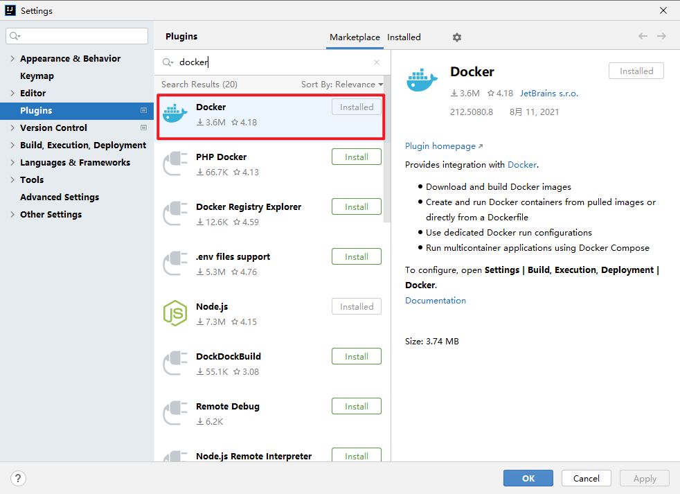
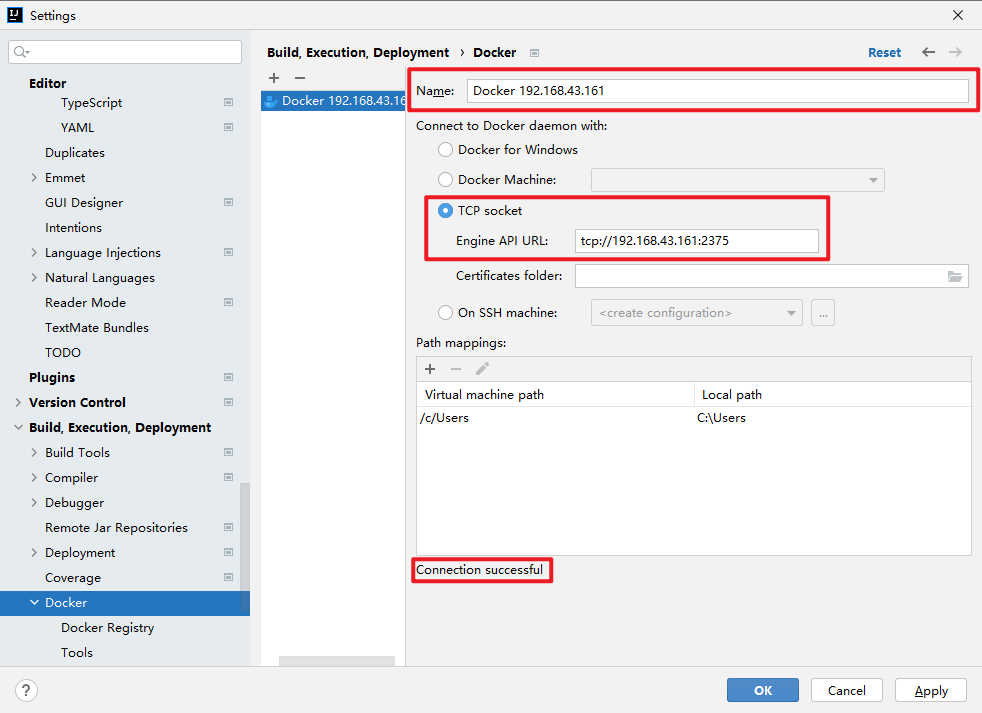
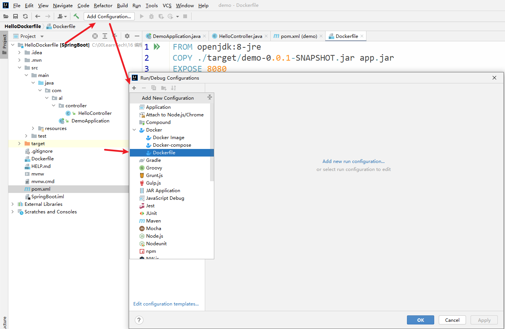
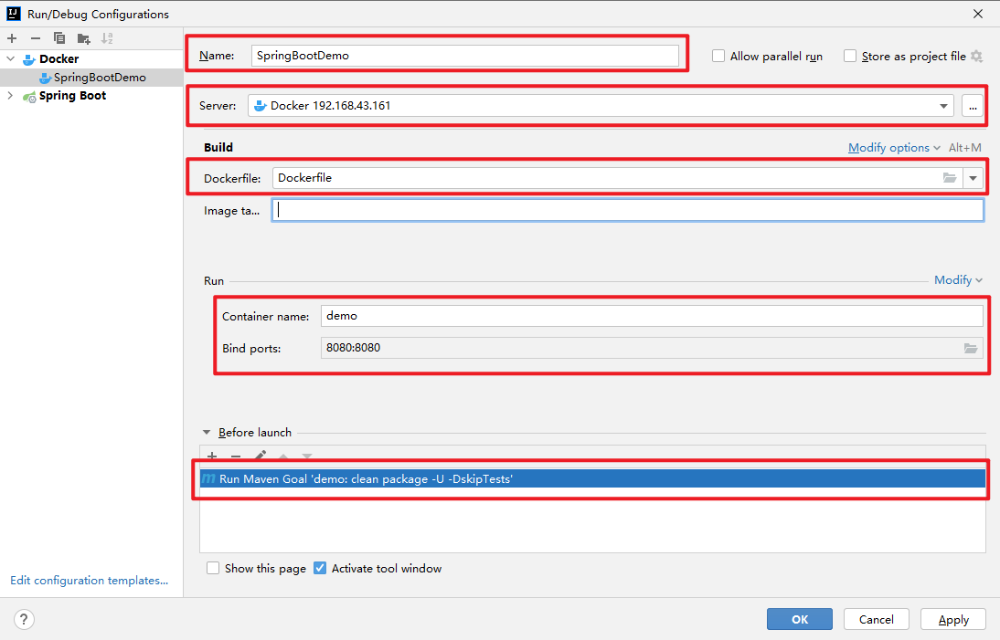
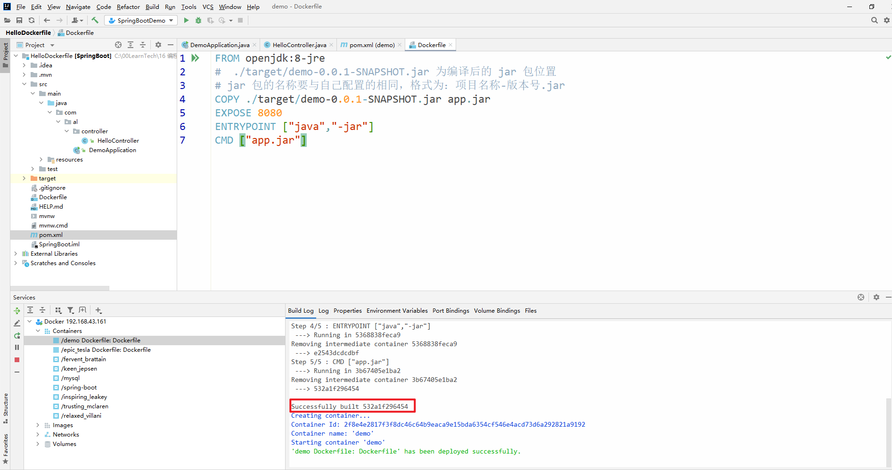

上一节：[Dockerfile 实践及梳理](https://www.cnblogs.com/aaronlinv/p/15213211.html)
下一节：[Docker Compose 实践及梳理](https://www.cnblogs.com/aaronlinv/p/15270704.html)

---
## 准备 SpringBoot 工程
1. 新建 SpringBoot 项目，默认的端口是 8080 ，新建 Controller 和 Mapping
```java
@RestController
public class HelloController {
    @GetMapping("hello")
    public String hello() {
        return "hello world!";
    }
}
```

注意，需要在 pom 中添加 spring-boot-maven-plugin 插件，否则运行 jar 包时会提示：没有主清单属性
```xml
    <build>
        <plugins>
            <plugin>
                <groupId>org.springframework.boot</groupId>
                <artifactId>spring-boot-maven-plugin</artifactId>
            </plugin>
        </plugins>
    </build>
```

启动项目，访问 http://localhost:8080/hello 测试

2. 在项目目录添加 Dockerfile 文件
```dockerfile
FROM openjdk:8-jre
#  ./target/demo-0.0.1-SNAPSHOT.jar 为编译后的 jar 包位置
# jar 包的名称要与自己配置的相同，格式为：项目名称-版本号.jar
COPY ./target/demo-0.0.1-SNAPSHOT.jar app.jar
EXPOSE 8080
ENTRYPOINT ["java","-jar"]
CMD ["app.jar"]
```
3. Docker 远程连接配置
演示使用的 Docker 宿主机是 CentOS 7，修改配置并重启 Docker 服务
```bash
vim /lib/systemd/system/docker.service
```
将 `ExecStar` 这行配置修改为下面这行
```
ExecStart=/usr/bin/dockerd -H unix:///var/run/docker.sock -H tcp://0.0.0.0:2375
```
重启服务
```
systemctl daemon-reload
systemctl restart docker
```
可以通过访问 API 进行测试，IP 需要修改为宿主机对应的 IP，端口设置的为 2375，访问成功会显示 Docker Engine 的相关版本信息

http://192.168.43.161:2375/version

如果是部署在公网或者生产环境，需要配置安全访问，可以参考：[Docker开启远程安全访问](https://cloud.tencent.com/developer/article/1657953)

## IDEA 配置
1. IDEA 安装 Docker 插件


2. 配置 IDEA Docker 连接
在设置中可以找到 Docker，点击加号可以添加新的 Docker 连接，输入名称、Engine API URL，然后就会提示：Connection successful，即连接成功


3. 点击 Run/Debug Configurations

输入名称、添加 Dockerfile（刚刚添加的那个）、容器名称、映射端口号
Before launch选择Maven 并输入命令：`clean package -U -DskipTests`，这个命令在每次编译 Dockerfile 之前都会运行


4. 点击运行就会自动打 jar 包，并在宿主机上构建镜像，运行容器


5. 可以通过 Docker 宿主机进行测试访问，这里演示使用的 `192.168.43.161` 需要替换成自己 Docker 宿主机的 IP

http://192.168.43.161:8080/hello

## 参考资料
[Docker - 远程连接](https://www.jianshu.com/p/8a67950d4879)
[IDEA的Docker插件实战(Dockerfile篇)](https://blog.csdn.net/boling_cavalry/article/details/100051325)

---
上一节：[Dockerfile 实践及梳理](https://www.cnblogs.com/aaronlinv/p/15213211.html)
下一节：[Docker Compose 实践及梳理](https://www.cnblogs.com/aaronlinv/p/15270704.html)