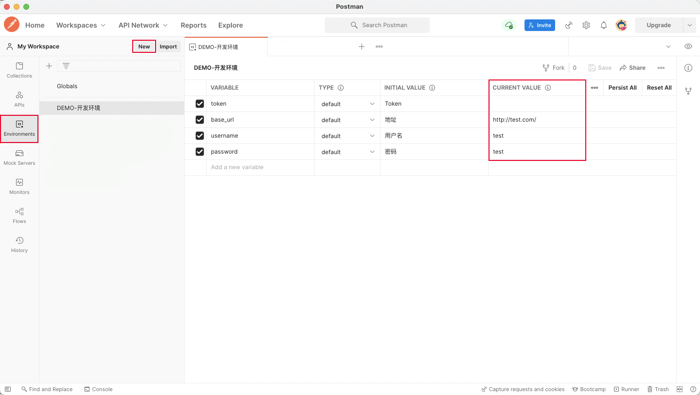
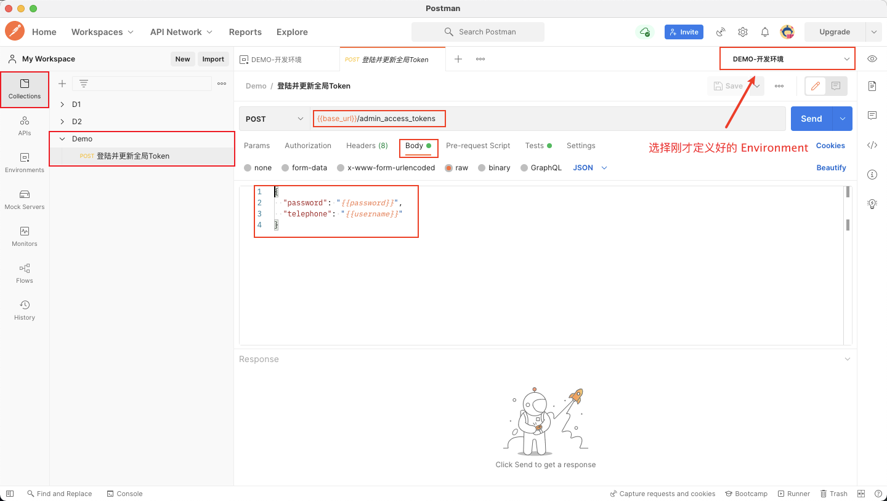
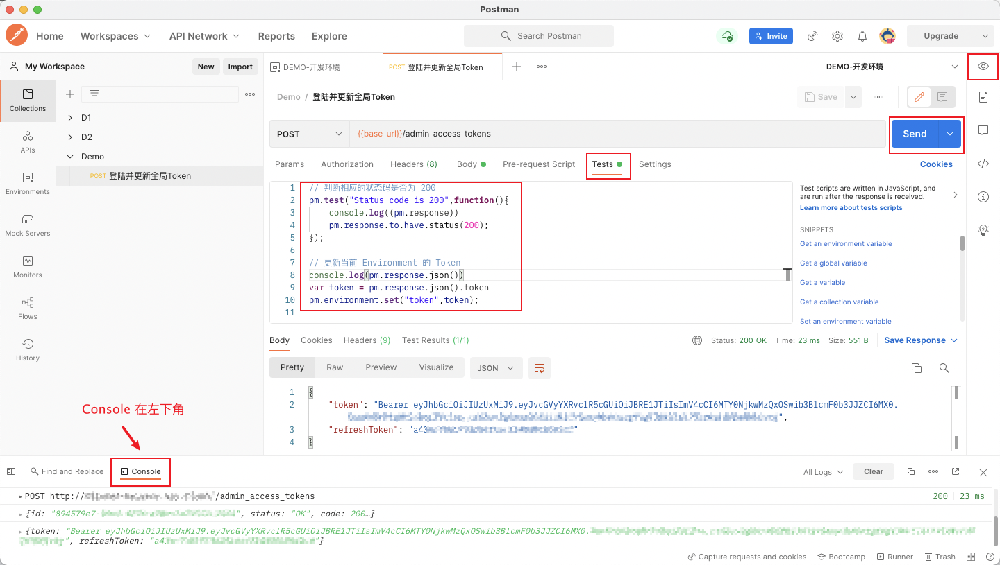
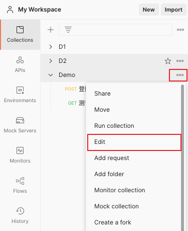
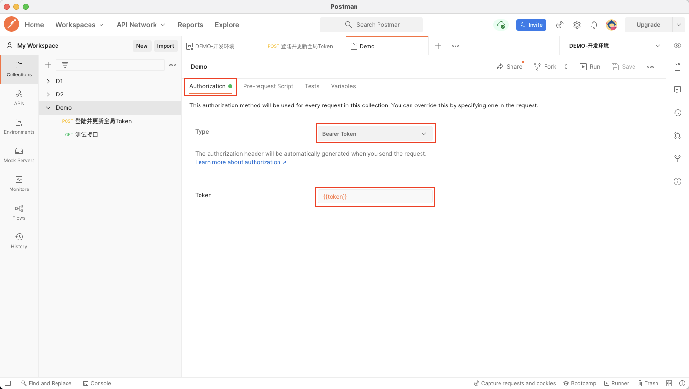
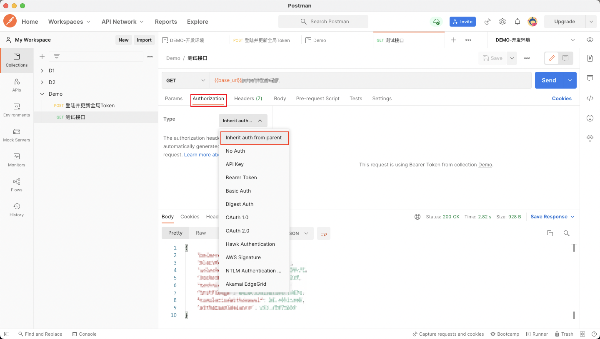
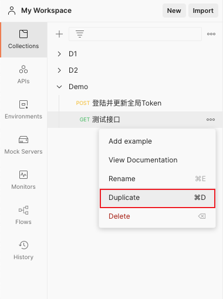
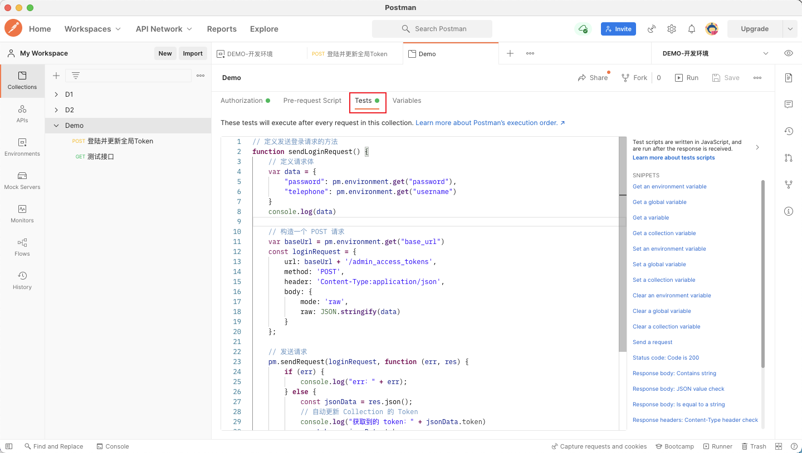

调试 API 的时候，我们需要经常需要在本地、开发、生产来回切换，还需要面临 Token 失效等的问题，让人头大，看到一些教程有介绍用 Postman 来简化流程，但是实践起来还是遇到一些问题，所以就有了这篇细致地介绍使用 Postman 的 `Environments` 和 `Tests` 来简化在不同环境中切换的步骤，无感知地调试 API 的博客

# 手动更新 Token
1. 在 `Environments` 面板中 `new` 一个新的 `Environment` (环境)，用于存储当前环境的：Token、地址、用户名、密码，需要先填上地址、用户名、密码的 `CURRENT VALUE`




2. 在 `Collections` 中添加一个新的 `Collection`（集合），名字为 Demo，点击右键选择 `Add Request` 添加一个获取 Token 的 Request。注意右上角的 Environment 需要选择刚才定义的，这样才可以通过 `{{}}` 获取到 Environment 中变量的值。这里的 base URL、账号、密码都可以根据实际请求的情况进行设置




3. 编写这个 `Request` 的 `Test`（Test会在请求执行后自动运行），编写 `Test` 目的是为了在请求后自动更新当前 Environment 的 Token，写完就点击 `Send` 发送请求。点击右上角的眼睛，可以快速查看当前 Environment 变量



```js
// 判断相应的状态码是否为 200
pm.test("Status code is 200", function () {
    console.log((pm.response))
    pm.response.to.have.status(200);
});

// 更新当前 Environment 的 Token
console.log(pm.response.json())
var token = pm.response.json().token
pm.environment.set("token", token);

```


# 使用 Request
1. 调用获取 Token 的 `Request`，更新全局 Token

2. 选择 `Collection`，然后选择 `Edit`




3. 给整个 `Collection` 都设置上统一的 `Authorization`，Type 设置为 `Bearer Token`，Token 值则设置为 `{{token}}`，就是上面设置进 `Environment` 的变量




4. 新建一个 `Request`，`Authorization` 选择 `Inherit auth from parent` (继承父级的 auth)，这样就可以避免手动填写 Token 了




5. 之后再使用就可以直接点击 `Duplicate`，复制一个新的 `Request` 来使用




# 自动更新 Token
在切换 `Environment` 或者 Token 失效的时候，我们都要手动调用获取 Token 的 `Request`，还是比较麻烦，我们可以进一步自动化，给整个 `Collection` 都设置上统一的 `Test`，`Collection` 的任一 `Request` 的响应体的状态码为 401 (Unauthorized)，就重新去获取并更新 Token

1. 选择 `Collection`，然后选择 `Edit`，编辑 `Tests`
```js
// 定义发送登录请求的方法
function sendLoginRequest() {
    // 定义请求体
    var data = {
        "password": pm.environment.get("password"),
        "telephone": pm.environment.get("username")
    }
    console.log(data)

    // 构造一个 POST 请求
    var baseUrl = pm.environment.get("base_url")
    const loginRequest = {
        url: baseUrl + '/admin_access_tokens',
        method: 'POST',
        header: 'Content-Type:application/json',
        body: {
            mode: 'raw',
            raw: JSON.stringify(data)
        }
    };

    // 发送请求
    pm.sendRequest(loginRequest, function (err, res) {
        if (err) {
            console.log("err：" + err);
        } else {
            const jsonData = res.json();
            // 自动更新 Collection 的 Token
            console.log("获取到的 token：" + jsonData.token)
            var token = jsonData.token
            pm.environment.set("token", token);
            console.log("更新全局变量 token 成功")
        }
    });
}

if (pm.response.code === 401) {
    // 如果当前返回的状态码是 401，就更新 token
    sendLoginRequest()
}
```



2. 这样一来，如果 Token 错误，它会自动重新获取并更新 Token，只需要再点一次 `Send` 就可以正常请求了

原理就是这个样子，如果想在不同环境中自由切换，只需要定义多个 `Environment` 即可，使用时只需要在右上角就可以轻松切换。如果想每次请求都直接去获取新 Token 也可以用 `Pre-request Script`；登录是带验证码的也可以参考：[关于若依需要验证码，PostMan是如何登陆流程](http://www.jianboge.com/d73200)，总而言之，用上了这个 Tips 之后幸福感 up up up

# 参考资料
[Learning Center - Postman](https://learning.postman.com/docs/getting-started/introduction/)
[Postman 使用小技巧/指南](https://segmentfault.com/a/1190000039825314)
[postman 一个也许可以节省你大量时间的小技巧](https://learnku.com/articles/33410)
[Postman设置全局变量token，自动更新token，统一设置headers(Authorization)](https://blog.csdn.net/weixin_42771651/article/details/116533921)
[Postman在pre-request Script中执行登录获取token](https://blog.csdn.net/wqchibingshaonian/article/details/109221060)

---

推荐阅读：
[开源≠免费 常见开源协议介绍](https://www.cnblogs.com/aaronlinv/p/15708052.html)
[简单的 Shell 脚本入门教程](https://www.cnblogs.com/aaronlinv/p/15764053.html)
[Docker 实践及命令梳理](https://www.cnblogs.com/aaronlinv/p/15130730.html)