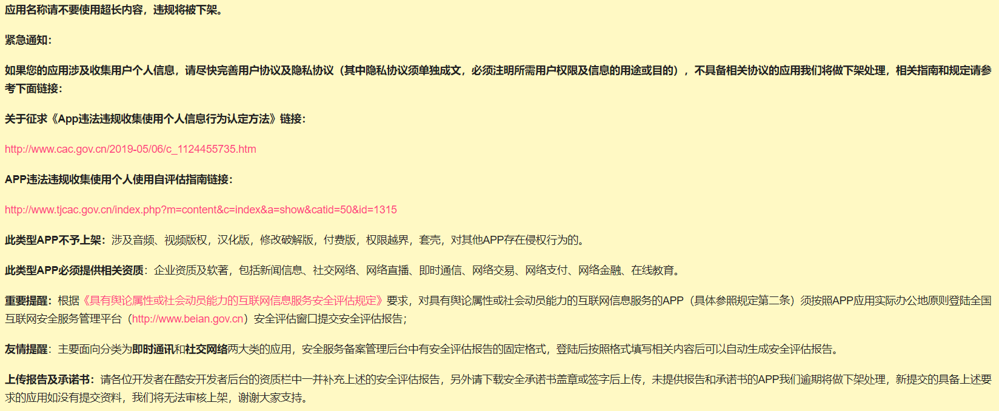

## 初见安卓开发

  
从 [Android开发者官网](https://developer.android.google.cn/) 的导航栏我们可以看得出来Google在安卓开发方面主推Jetpack和Kotlin

 [Android Jetpack](https://developer.android.google.cn/jetpack/) 是一套组件库，其中包含了很多组件，比如：LiveData,Room,ViewModel等等，使用这些组件极大简化了开发，消除样板代码，提高应用质量
 [Kotlin](https://developer.android.google.cn/kotlin) 是JetBrains在2011年发布的静态类型编程语言（这是一个开源项目），虽然语法上不能与Java兼容，但它是面向JVM，所以它可以和Java代码相互运作。在Google I/O 2017中，Google宣布在Android上为Kotlin提供最佳支持，后来Google就把Android开发的官方语言更换为了Kotlin
## Java or Kotlin
选择语言确实比较重要，会极大影响后续的开发工作。目前情况：团队成员有Java基础、无Kotlin基础、无安卓开发经验，项目有时间限制。这里列举几个我们团队比较可感知的影响因素进行对比

#### Java
优点：Java安卓开发的资料相对多、遇到问题搜索到的概率比较大、Github上有大量的Java安卓项目可以学习
缺点：相对Kotlin有很多样板代码、没有Kotlin的一些特性代码写起来会比较麻烦、Jetpack库的资料大多用Kotlin举例
#### Kotlin
优点：有很多语法糖、简化findViewById、简化数据类、空指针安全、函数式编程、协程（解决异步任务处理）...
缺点：Kotlin安卓相关的教程比较少，Kotlin的资料相对没有Java那么多，遇到问题搜索到的概率相对低一点

结合实际情况，我们最终选择了Java，对于在这个时间节点，初学安卓使用Java没什么太大问题，以后转Kotlin也会比较容易，总的来说各有利弊，看取舍

## 实际遇到的困难
1. 虽然JetPack已经发布了比较长的时间（2018年谷歌I/O上发布），但是相关的资料并不很很好找（中文资料就更难找了），因为我们选择了Java，在查JetPack资料的时候很容看到一些文章写的是Kotlin，没有学过Kotlin，看起来一头雾水
2. 因为技术更替速度很快，所以搜索一些问题的时候，会出现很多无效的解决方案。如果发布时间是14、15、16年或是使用Eclipse进行讲解的解决方案，要仔细辨别一下方案的时效性，那如果是讲解思路的话那就没有关系
3. 安卓手机屏幕尺寸多样化，界面需要对不同屏幕进行适配
4. 如果应用上架应用市场，需要考虑平台上架的规范，对于一些类型的应用需要资质才能上架，下面为酷安 2020.6.1 截取的上架规范

## 杂
这段时间都在学习安卓开发，和小组的其他伙伴协作完成项目
第一阶段结束收获颇丰，对于团队协作，Git都有了新的理解
纸上得来终觉浅，绝知此事要躬行，运用一门技术去解决问题才是学会一门技术的最佳途径
 在团队协作中，深刻地体会到了好的代码结构的重要性
通过这次的实践，更加清楚自己缺乏什么，也知道往哪个方向努力