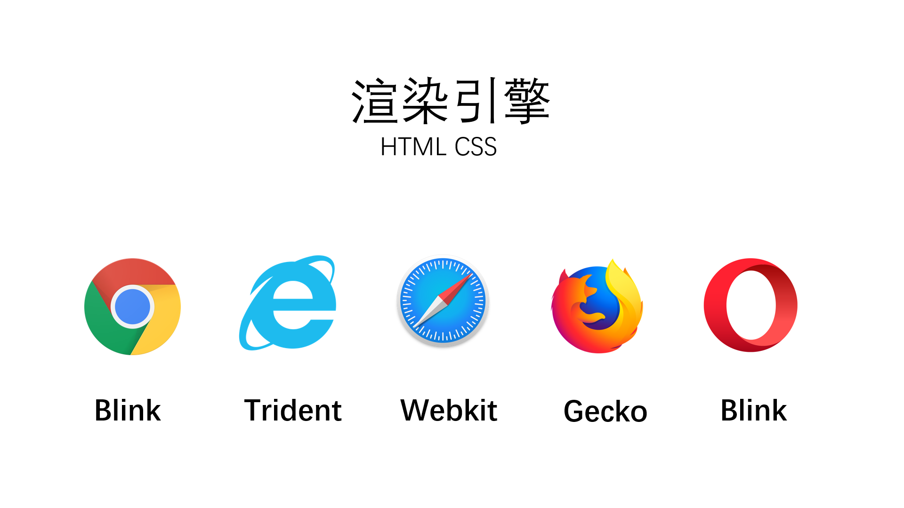
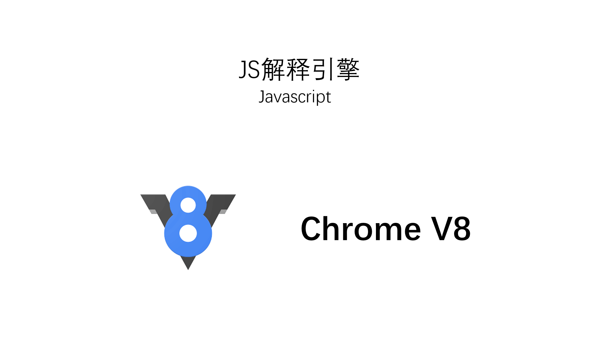
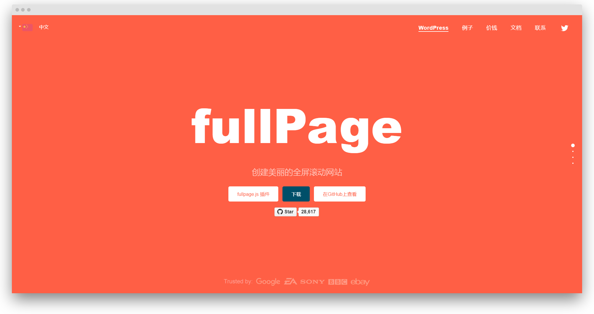
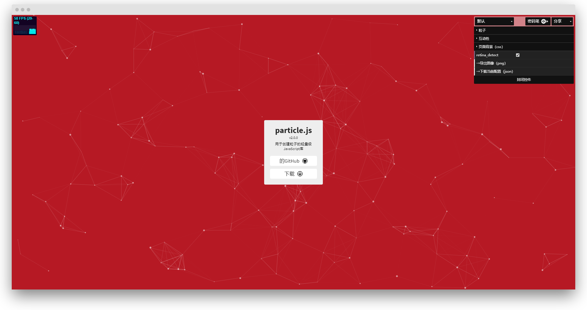
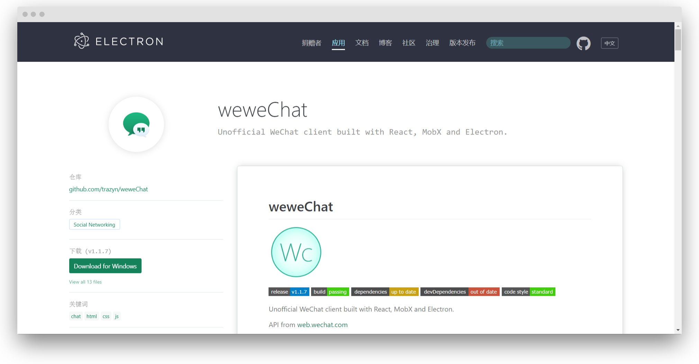

## 故事开始

这篇博客源于我在数据库课堂上的分享。数据库刚开课时候，老师就鼓励我们探索自己感兴趣的计算机方向，再把自己的收获分享给大家

也是因为这个契机，我开始了解前端，通过这段时间的学习，我对前端有了更为具体的认识

数据库老师应该是我遇到最好的专业课老师，他讲的课融入了很多他自己的项目实践经验，他平易近人，很乐意并且有能力解决我们的问题，也鼓励我们主动学习。基本上每个老师都在提倡主动学习，但是真正愿意花时间引导学生去主动学习的老师少之又少


## 写在最前
在我看刚开始尝试去了解前端的时候，这些资料对我理解前端有很大帮助，所以强烈推荐你也看看，或许有不同的收获

[简述前后端分离架构：HTML写的不是网页之 - 前端应用发展简史 ](https://www.bilibili.com/video/av31440465)
[前端入门框架前的几个大坑（小白向） - 汪小黑的文章 - 知乎 ](https://zhuanlan.zhihu.com/p/74546693)

## 前端是做什么的
前端主要的两个重点

* 界面展示
* 用户交互

看到的一个例子比较形象：如果把网页比喻成汽车，那么前端就是看得见摸得着的内饰、方向盘、油门、刹车，而不容易直接看见但对汽车也很重要的则是后端，比如引擎

## 浏览器引擎
既然提到网页，那就不得不说说浏览器，浏览器有两种引擎


 



渲染引擎：负责渲染网页的HTML和CSS，随着JS解释引擎越来越独立，现在一般也把渲染引擎称为 **浏览器内核**

比较值得一提的是：苹果的Webkit是开源的，谷歌的Blink是Webkit的分支，但可能是谷歌Chrome浏览器市场占有率比较高，很多人会误以为Webkit是Chrome的内核

Chromium：是谷歌的一个开源项目（Chromium相当于Chrome的工程版），国内的QQ浏览器、360极速浏览器、搜狗浏览器还有微软新推出的Edge都是基于这个项目开发的



JS解释引擎：负责解释网页的Javascript，不同的浏览器使用的JS解释引擎也不尽相同，这里先提一下大名鼎鼎的 **Chrome V8** 

## 前端发展

不同的参考资料会把前端划分成几个不同的阶段，这里我也简单分了几个阶段，可能不太准确，但是希望能帮助你大概梳理前端的发展过程
* 静态页面配合Jsp等服务端混合开发
* Ajax JQuery等技术诞生
* 前端框架

## 静态页面配合Jsp等服务端混合开发

最开始的网页都是静态的，使用前端三大基础技术（HTML+CSS+JavaScript）开发，但是随着时代的发展，静态网页不能满足需求，网站需要为不同用户显示不同的网页内容

这个时候就需要动态网页，就有了Jsp( Java Server Pages )这类技术，可以对不同的用户动态生成不同的网页，它的原理就是在传统的网页HTML文件中插入Java程序段和JSP标记

虽然可以实现动态页面，但是这项技术也有很明显的缺点，就是在前后端都写好各自的代码之后需要将JSP代码插入到HTML，这就要求整合代码的工程师比必须前后端都懂，而且前后端代码杂糅在一起，也不利于维护

## Ajax JQuery等技术诞生


#### AJAX

Ajax使得不需要刷新网页，就可以实现网页部分内容的更新，最常见的例子就是各种网页划到最后，网页会继续加载后面的内容，而这个过程，网页没有刷新

Ajax的出现，可以让前后端工程师以Ajax接口为分界点进行前后端分离，根据规定好的交互接口，分头工作

#### JQuery
JQuery是一套JavaScript的库，简化了JavaScript开发的复杂性


简化了原生JavaScript代码，举个例获取id为content的值

``` javascript
//原生：
document.getElementById('content').value　　　　　　　　　　

//jQuery：
$('# content').val()
```

同时JQuery也屏蔽了浏览器兼容性问题。在IE678的时代，不同浏览器存在很多兼容问题，其中IE就不识别很多标准的JavaScript方法和对象。但是JQuery屏蔽了这些问题，开发者可以用JQuery开发而不用考虑兼容问题

JQuery还允许开发者定制插件，大量优秀的jQuery插件与UI库不断涌现，使得前端开发者可以直接使用这些插件进行开发，极大提高的开发效率，就比如下面的全屏滚动插件 fullPage.js 和粒子插件，点击图片可以访问对应网站

[](https://alvarotrigo.com/fullPage/zh/#page1)

[](https://vincentgarreau.com/particles.js)


#### 前端框架
2008年Google丹麦开发了 **Chrome V8** ，把JavaScript编译成机器码，还使用了其他方法提高性能，使得JavaScript在V8引擎下运行速度非常快，可以媲美二进制程序

有一个组织：Node，发现既然V8运行效率这么高，那么有没有其他的可能呢，所以他们基于 Chrome V8 引擎，加入系统级API，开发了Node.js，这是一个 JavaScript 运行环境

Noce.js的本质：允许开发者像使用C 或者C++那样程序去使用JS程序，性能还差不多，至此JavaScript已经不仅仅只局限在写网页特性了，还可以写服务器、虚拟机内核等等的，开发者就可以借助node开发各种自动化工具

2010年10月，Google推出 Angular JS ，这是一款 JavaScript 框架，用来开发浏览器应用，但是 Angular JS缺陷挺多，所以谷歌后来推出 Angular 框架(这两个是独立的产品)

基于 Angular 思路成功 就有了 Vue 和 React ，就有了前端框架三足鼎立的局面。前端工程师就可以组件化开发模式利用了JS的智能可编程性来管理HTML和CSS
工程文件结构

有了 node ，我可以调用操作系统的资源，我们就可以规定一些语法和文件，就像定义一些模板，让 node 帮我们去生成 HTML ,CSS 和JavaScript ，我们就可以不必去写这些代码，代码管理性、可复用性、工程性就越来越好

#### 不一样的JavaScript
在了解前端的发展之前，我对于 JavaScript 的理解还停留在只能写写网页特效的层面，但是现在我才意识到得益于 Chrome V8 和Node ，使得 JavaScript 展现出不一样的活力，可以用来写服务器、内核，还有各种跨平台的应用

Cordova：Adobe 发起的项目原名叫 PhoneGap，后来贡献给 Apache 基金会，
Cordova是一个框架，允许开发者用 HTML ,CSS 和JavaScript 开发可以跨平台在安卓,IOS,Windows上的程序

Electron：允许开发者用 HTML ,CSS 和JavaScript 开发运行在Windows,Linux,Mac 上的程序。VScode ,微信Linux , Atom , Github客户端都使用这个框架开发




## 参考资料


[简述前后端分离架构：HTML写的不是网页之 - 前端应用发展简史 ](https://www.bilibili.com/video/av31440465)
[前端入门框架前的几个大坑（小白向） - 汪小黑的文章 - 知乎 ](https://zhuanlan.zhihu.com/p/74546693)
[WEB前端——浏览器内核 ](https://www.bilibili.com/video/av52669035​)
[web的发展](https://cloud.tencent.com/developer/article/1333686​)
[【网页设计】30年发展史1990-2019 （中英字幕1080P）​](https://www.bilibili.com/video/av61920847/)
[erverless——前端的3.0时代 ](https://zhuanlan.zhihu.com/p/84054729​)
[《从零构建前后分离web项目》：开篇 - 纵观WEB历史演变 ](https://segmentfault.com/a/1190000016269636)
[学前端，我们要学的是什么 ](https://cloud.tencent.com/developer/article/1028964​)
[【WEB全能课】第一讲：初识前端  ](https://www.bilibili.com/video/av27151150)
[Web简史 ](https://juejin.im/post/58ed0a938d6d8100580a45b0​)
[到底什么是前端、后端、后台啊？ - 科普小民工的回答 - 知乎 ](https://www.zhihu.com/question/21923056/answer/804820546​​​)
[前端开发 20 年变迁史 ](https://zhuanlan.zhihu.com/p/68030183​)
[程序员和准程序员必看：Web技术的发展历史和未来趋势  ](https://www.itsource.cn/web/news/1892.html​)
[Query真的过时了! ](https://zhuanlan.zhihu.com/p/30704540​)
[MD、CMD规范 ](https://www.cnblogs.com/leftJS/p/11073481.html​)
[涨姿势！写给网页设计师的网页设计简史 ](https://www.uisdc.com/brief-history-of-web-design)
[前端三大框架以及jquery与bootstrap这种框架有什么（概念上、范畴上的）区别？ - 陈龙的回答 - 知乎](https://www.zhihu.com/question/304757674/answer/546374749)