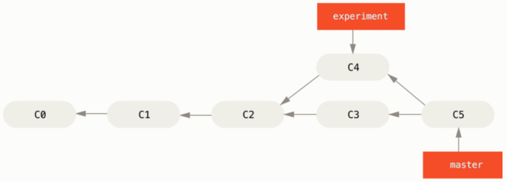
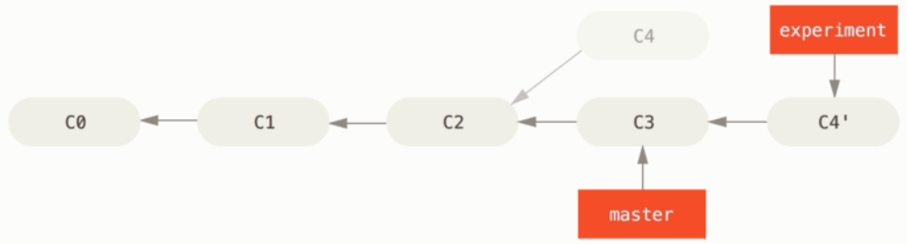
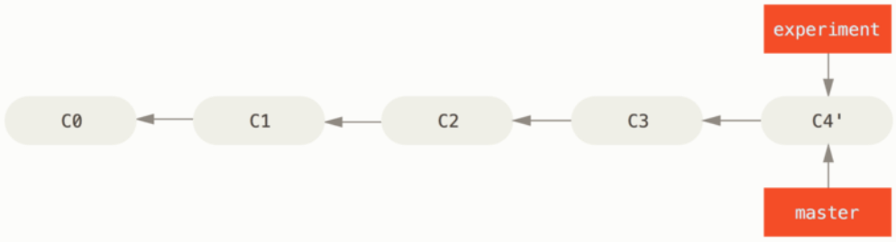

## 学习建议
[廖雪峰Git教程 ](https://www.liaoxuefeng.com/wiki/896043488029600)比较详细，可操作性也比较强，在评论区可以找到勘误
Git官方推荐的[《Pro Git》](https://git-scm.com/book/zh/v2)也很不错，推荐掌握了一定Git基础后再看
对于没有Linux基础，或者文字版学起来比较困难的朋友可以看系列视频教程 [互联网人都该懂点 Git](https://www.bilibili.com/video/BV1HW411f7VJ)
## 注意点
Git 2.23 (2019.8.16) 
git checkout 这个命令被拆分成了两个新命令：git switch 和 git restore
创建并切换到dev分支：git checkout -b dev 现在用git switch -c dev 效果相同

## 初始配置
安装Git Bash后需要做初始配置

1. 用户名邮箱
```bash
# 任意文件夹右键 点击“ Git Bash Here ”
# ""内替换为自己的用户名和邮箱
git config --global user.name "username"
git config --global user.email "email"

# 查看配置是否成功
git config user.name
git config user.email
```
2. SSH 免密登录
```bash
# ssh-keygen 用于生成，管理和转换身份验证密钥
# -t：密钥的类型 
# -C：用于识别这个密钥的注释（不添加注释直接ssh-keygen -t rsa也不影响使用）
ssh-keygen -t rsa -C "邮箱地址"

# 连续按3次回车

# 将用户目录下.ssh文件夹内的id_rsa.pub的内容粘贴到GitHub的SSH Keys中
# 具体位置：GitHub Settings -> SSH and GPG keys -> SSH keys

# 测试是否成功 Github 
# 码云测试命令为：ssh git@gitee.com 反馈的结果与 GitHub 类似

ssh git@github.com

# Are you sure you want to continue connecting (yes/no)? 
# 这时需要输入：yes

#成功会提示成功认证你的账户
# Hi aaronlinv! You've successfully authenticated, but GitHub does not provide shell access.
# Connection to github.com closed.
```

## 场景0：Git 基本使用
```bash 
# 新建文件夹，初始化为Git仓库
mkdir learn-git
cd learn-git
git init

# 在当前目录添加并编辑文件(不熟悉 vim 编辑器可以用其他编辑器新建文件并编辑文件 )
vim test.txt

# 查看文件状态 test.txt现在为Untracked状态
git status

# 添加文件到暂存区
git add test.txt

# 提交commit -m 代表添加一个“提交信息”
git commit -m "add test.txt"

# 推送到 GitHub（在 GitHub 上创建空白仓库，并复制仓库地址）
# "git@github.com:aaronlinv/learn-git.git" 需要替换为自己新建的仓库地址
# 先添加远端仓库
# origin：远端仓库的别名（默认origin）
git remote add origin git@github.com:aaronlinv/learn-git.git

# 查看远端操作（会显示 fetch和push）
git remote -v 

# 推送到远端仓库（使用SSH协议需要配置SSH免密登录）
git push -u origin master
# -u：指定默认远端仓库别名，下一次推送只需使用git push
# origin：远端仓库的别名（默认origin）
# master：分支名称
```
push 是可能会遇到报错：refusing to merge unrelated histories
原因是远程仓库和本地仓库做了不同的改变并commit，导致本地仓库和远程仓库变成了独立的两个仓库，所以不能直接合并，执行以下命令即可推送
```bash
git pull origin master --allow-unrelated-histories
```

## 场景1：克隆仓库
```bash
# 克隆仓库到本地（可以使用HTTPS或者SSH协议）
# "https://github.com/aaronlinv/learn-git.git" 为目标仓库地址
git clone https://github.com/aaronlinv/learn-git.git

# Git会新建一个与仓库名同名的文件夹，进入文件夹
# "learn-git" 为项目名称
cd learn-git

# 如果这个仓库已经克隆很久了，本地和远程可能存在差异了，可以拉取远程仓库最新状态到本地仓库
git pull

```
## 场景2：分支管理
```bash
# 已经克隆仓库到本地
# 开始工作前，先拉取远程最新修改（可能同事已经修改代码并提交了commit）
git pull

# 新建并跳转到dev分支（也可使用git branch -b dev）
git switch -c dev

# 查看分支情况
git branch

# 可以在dev 分支上修改代码做add和commit

# 推送dev分支到远程（需要拥有远端仓库的权限）
git push origin dev
# 如果需要重命名远端分支则加上 :f1
git push origin dev:f1

# 删除远端dev分支
git push origin :dev 

# 合并dev分支到master(需要先切换到master分支，在merge的过程可能需要解决冲突)
git switch master
git merge --no-ff dev 

# 查看分支合并情况
git log --graph --pretty=oneline --abbrev-commit

# 删除本地dev分支
git branch -d dev 
```

## merge 和 rebase
#### 创建冲突场景
```bash
# 新建文件夹，初始化为Git仓库
mkdir learn-git
cd learn-git
git init

# 添加并编辑文件 
vim c2

# 添加文件到暂存区
git add c2

# 提交commit -m 代表添加一个“提交信息”
git commit -m "c2"

# 新建并跳转到experiment分支
git switch -c experiment

# 添加并提交c4
vim c4
git add c4
git commit -m "c4"

# 切换回master分支
git switch master

# 添加并提交c3
vim c3
git add c3
git commit -m "c3"
```
到这c2就产生了分叉，experiment分支推进到了c4，master分支推进到了c3
这个时候如果想把两个分支的修改合并到master分支上，可以使用merge或rebase(变基)，两种方式最后合并的结果是一样的，但rebase不会产生分叉，rebase的提交历史也比merge更线性

#### merge
```bash
# 使用merge方式合并分支
# 先切换到master分支
git switch master

# 合并分支（会弹出commit message的编辑框，:wq 保存退出）
git merge experiment

# 查看分支合并情况
git log --graph --pretty=oneline --abbrev-commit
```

> 
> --- merge示意图 引用自《Git Pro》

使用merge合并分支，相当于三方合并，合并c2,c3,c4（未新建experiment分支前的修改c2、新建分支后master分支的修改c3、experiment分支的修改c4）

直接使用git merge <要被merge的分支名> ，没有冲突的情况下默认使用参数：--f 即：Fast-forward（快进式合并）
推荐使用--no-ff 即：git merge --no-ff <要被merge的分支名>  
这个参数的意思是禁止快进式合并，合并时会自动创建一次commit提交，保证提交链的完整性
而Fast-forward合并分支会丢掉分支信息


#### rebase
```bash
# 使用rebase方式合并分支
# 先切换到experiment分支
git switch experiment

# rebase分支
git rebase experiment

# 先切换到master分支
git switch master

# 将experiment合并到master
git merge experiment

# 查看分支合并情况
git log --graph --pretty=oneline --abbrev-commit
```
> 
> 
> --- rebase示意图 引用自《Git Pro》

rebase的原理是：找到c3和c4共同的祖先c2，暂存共同祖先c2到当前分支(expriment)的修改内容，然后将分支指向master的c3，并应用之前暂存的修改内容
我们可以这么理解：

rebase就是先把其他分支(master)已经提交的代码（c3）放到前面，把当前分支(experiment)提交的修改(c4)放到后面，这样做的好处就是：自己写代码(experiment分支上的)将出现在master最新的一次commit中，一目了然

rebase：黄金法则：绝对不要在公共分支使用rebase，rebase会重写提交历史


## 参考资料
[ssh-keygen的-C后面的邮箱有什么用？](https://blog.csdn.net/u011118321/article/details/78516303)
[Git 合并时 --no-ff 的作用](https://blog.csdn.net/zombres/article/details/82179122)
[记Git报错-refusing to merge unrelated histories](https://blog.csdn.net/u012145252/article/details/80628451)
