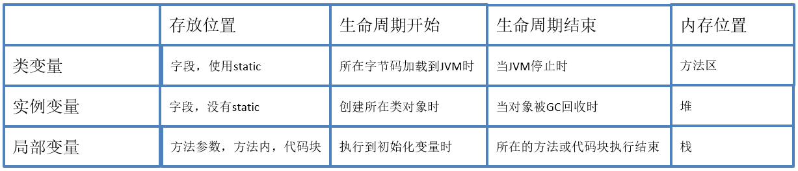

#### 面向过程与面向对象
如果用吃饭举例，面向过程就是把从买菜、洗菜、切菜、烹饪、装盘、吃饭、洗碗等的步骤都写好，而面向对象就像是去饭店吃饭，告诉服务员吃什么就好了，而不用考虑菜是怎么做的，只要吃就好了

面向过程
  -   面向过程性能比面向对象高，面向对象调用类需要实例化，资源开销大，而面向对象则不需要

面向对象
  -   易维护、易复用、易扩展，可以设计出低耦合的系统

面向对象就像是盖浇饭，饭和菜分离可维护性好，耦合程度低，可根据需求更改饭或者菜，而不像蛋炒饭，蛋和饭杂糅在一起，想替换其中某一个都非常困难

#### 面向对象三大特性
封装：去饭店吃饭，你并不知道饭菜的具体做法，但是你可以通过服务员来点菜，得到点的饭菜
继承：父亲有钱，儿子可以继承父亲的财产
多态：亲戚结婚，邀请函上写的是你的父亲的名字，但实际上可以是你或你的妹妹去参加
- 封装：封装是指将对象的实现细节隐藏起来，然后通过公共的方法来向外暴露该对象的功能
- 继承：当子类继承父类后，子类是一种特殊的父类，能直接或间接获得父类里的成员
- 多态：多态是可以直接把子类对象赋给父类变量，但是运行时依然表现出子类的行为特征，这意味着同一类型的对象在运行时可能表现出不同的行为特征

#### 类与对象
对象：可以是一个人，具有特性如：身高、体重，有行为如：跑、跳
类：把具有共同特征的对象抽象出一个类，张三李四都属于人类
实例化：就是根据某一个类的特征去塑造一个该类的对象
- 对象（object）定义：包含特性和行为的一个实体，对象也称为实例（instance）
- 类：把具有相同“特性”和“行为”的多个对象的抽象就是类
- 实例化：把类具体到某一个对象上面，该对象有具体的什么的状态特征和什么行为

#### 类的创建
注意点
1. 若类使用public修饰，则当前所在的文件名必须和类名相同
2. 类型必须符合标识符的命名规范（使用名词，每个单词首字母都大写）

#### JVM内存划分
JVM将内存主要划分为：方法区、虚拟机栈、本地方法栈、堆、程序计数器
- 方法区：存放程序中唯一的元素：class字节码文件、static变量
- 栈：每调用一个函数，就创建一个栈帧，加入虚拟机栈，调用结束就出栈
- 堆：所有new出来的东西

#### 方法栈帧
栈特点：先进后出（类似弹夹） 
写一个sum方法（在main函数外，和main函数在同一个类），再写一个main方法，在main中调用sum方法
执行过程：
- 执行main方法，main方法对应一个栈帧入栈，里面包含main的成员变量
- 调用sum方法，sum方法栈帧入栈，里面包含sum的成员变量
- 调用sum方法结束，sum方法出栈，sum方法成员变量清除
- main方法结束，main方法出栈，程序执行结束

#### 堆与数组初始化

main方法栈帧入栈
1. 声明int类型的数组ages：int[]ages；
2. 在堆中初始化数组： new int[]{10，20，30}；
3. 把被初始数组的地址赋值给ages变量
main方法栈帧出栈

GC垃圾回收机制：Java自动垃圾回收机制
如果给一个数组变量赋了新的数组，就是把新数组的地址赋值给变量
原来堆中的数组，就没被引用，等待被回收

#### 对象堆内存分析
方法区：存放类的class字节码文件（包括方法，常量，static变量类的描述信息）
Person类内存分析
- Person.class 存放在方法区
- main方法栈帧入栈
- new一个具体Person，堆里有了一个Person对象
- 将堆里的Person对象地址值赋值给main方法栈帧中的Person变量
- main方法结束 main方法栈帧出栈

堆里面都有初始值，基本类型为 0 引用类型为 null
- byte short int 0
- long 0L
- float 0.0f
- double 0.0d
- char '/u0000'  空值，打印为空格
- boolean false
  
基本数据类型：
    只有一块存储空间，在栈中，存放的是具体的值
引用数据类型：
    引用数据类型有两块存储空间：一个在栈（Stack）中，一个在堆（heap）中
    5种引用类型：类、接口、数组、枚举、注解

基本数据类型：值传递
引用数据类型：地址传递

#### 匿名对象
匿名对象：创建一个对象，没有把它赋值给任何一个变量，匿名对象只能使用一次
一个对象没有任何人指向时，就会成为垃圾，等待垃圾回收器回收

#### 构造器
构造器：在创建对象时，自动调用的方法
1. 和类名相同
2. 不能定义返回值类型
3. 不能returen（实际上返回的是创建对象的地址）
默认构造器是无参构造，如果类用public修饰，默认构造器也用public修饰

自己定义了构造器，编译器就不会帮你再生成构造器（需要无参构造就要自己写）

构造器重载：和方法重载一样，方法名相同，参数不一样

#### static
在字段和方法前添加了static，那么这个字段或方法它**就属于类**
状态和行为有： **类和对象之分**

| 分类 | 状态 | 行为 |
| :------ | :------: | :------ |
| 对象 | 姓名 | 死亡 |
| 类 | 人口总数 | 毁灭 |

1. static修饰的内容随类的加载而加载，JVM把字节码加载到虚拟机中，static修饰的成员自动被加载到方法区
2. **static修饰的内容优先于对象**
3. static修饰的内容该类所有对象共享
4. static修饰的内容可以通过类名调用(可以通过对象名调用，但编译了本质还是用类名调用)

**类成员**：static修饰的成员
**实例成员**：非static修饰的成员

在static方法中只能调用static成员：例如main方法调用的方法就必须是是static方法
非static方法可以访问静态成员也可以访问非静态成员：static

运行：加载class字节码文件，加载static成员（变量、方法）到方法区

static成员，被所有对象共享时，节省空间，没必须每个对象都存储一份，可以直接使用类名调用，生命周期长，虚拟机停止才消失

总结：
static的作用就是方便在不创建对象的情况下，进行调用方法或变量
static方法不能调用非static成员，因为非static成员必须依赖具体对象才能被调用

#### 成员变量和局部变量
1. 成员变量：直接定义在类中的变量(也称全局变量或字段，不能称为属性)
   
- 类成员变量：static修饰的成员变量
- 实例成员变量：没有static修饰的成员变量，注意：在方法当中不能定义static变量，包括main方法

**有初始值，可以直接用**

2. 局部变量：定义在方法当中的变量（方法的参数，和内部定的变量,代码块）

**必须初始化才能用**

--- 

## 参考资料
[Java零基础到高级JavaEE就业实战](https://study.163.com/course/introduction/1005537028.htm)
[面向对象与面向过程的本质的区别](https://blog.csdn.net/jerry11112/article/details/79027834)
[什么是多态？实现多态的机制是什么？](https://www.jianshu.com/p/68ddb5484ca2)
[Java中的static关键字解析](https://www.cnblogs.com/dolphin0520/p/3799052.html)
