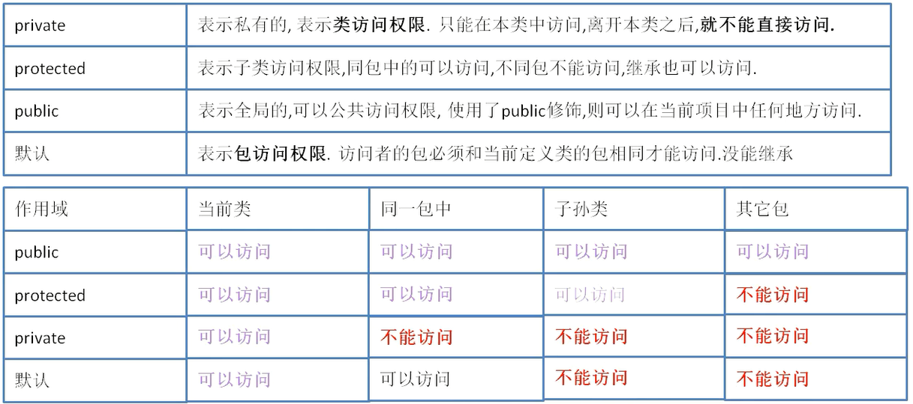

#### 包
规范：
1. 遵循关键字，全部小写
2. 企业开发包名用公司域名倒写 域名倒写.模块名.组件名

类的全限定名称：包名.类名

静态导入：把其他包里面的内容在本类当中使用、不需要使用类名调用，直接使用包里面的方法

import static java.util.Arrays.sort;

不推荐用：1.有些方法不能这么用比如toString，2.不知道是自己写的还是导入的

#### 封装思想
写一个用户注册，有很多信息需要填写，如果写方法，需要传入很多参数，有很多参数是非必要的但是都要写
方法重载写起来麻烦
封装到一个对象里，那就只要传一个参数即可new一个对象，其他用初始值，当成一个整体

优点：
1.参数少了很多，传的是一个对象，把某些信息当成一个整体去使用
2.安全性：变量加private，不允许外部读取或者修改它


#### 访问修饰符


默认和protected的区别：同包下都可以访问，但是只要继承默认权限就不能访问，protected则可以访问
使用不同包的成员需要导入

#### 属性概念
字段或者成员变量 加上get和set方法才能叫属性
Eclipse自动生成右键 -> Source -> Generate Getters and Setters…

#### this关键字
this:  “这个”指向当前正在使用对象的地址

注意点：
1. 帮我们区分成员变量和局部变量的二异性，必须得要使用this
2. 在同类当中，实例方法的调用，前面其实是有this，可以省略
3. 可以把this做为参数传递
4. 可以当做返回值返回
5. **static不能和this一起使用**
6. 构造器的重载互调，this ( )；此时this代表是构造器名，**必须写到第一行**


#### 继承思想
老师、学生、员工这些类都有一些相同的变量：比如姓名、年龄，还有相同的方法比如吃
代码出现重复，可以通过继承来解决这个问题

父类：存放共同的状态和行为被继承的类我们称为父类或超类、基类、拓展类。
子类：存放自己特有的状态和行为

继承是一种从一般到特殊的关系，是一种“is a ”的关系，即子类是对父类的派生，是一种特殊的父类
比如：狗是动物的一种特殊情况，狗属于动物。

一般的，在开发工程中先编写多个自定义类，写完之后，发现多个类之间存在共同的代码，此时可以抽去出一个父类

如果父类中的成员使用protected修饰，子类也继承，不同包也能继承
父类的构造器，子类也不能继承，因为构造器必须和当前的类名相同

#### 继承方法的覆盖
子类你扩展了父类，就获得了父类当中的方法和成员变量，可是父类当中的某一些方法，不适合子类本身
不适合子类的方法，可以覆盖，重新定义这个方法

运行一个方法会在子类中找，有就调用，没有去父类中查找

覆盖方法的原则：
1. 必须得要跟父类当中的方法签名相同（签名：方法的名称+参数）
2. 返回值类型必须得要和父类一样
3. 访问权限不能比父类的还小

判断是否是覆写方法：@Override标签,写在重写方法前一行，如果不是重写的方法编译会报错

#### 方法重载与方法重写
方法重载 Overload
- 作用：解决了同一个类中，相同功能的方法名不同的问题
- 规则：同类中，**方法名相同，方法参数列表不同**


方法重写 Override
- 作用：解决子类继承父类之后，可能父类的某一个方法不满足子类的具体特征，需要重新在子类中定义该方法，并重写方法体
- 规则：**父类和子类的方法签名是相同的**

#### super关键字
代表是父类对象，到父类当中去找指定的方法

内存分析：
在类加载字节码时，会先判断有没有父类，如果有，会先把父类加载成字节码放到内存当中，然后再去把自己加载到内存（方法区）

如果一个类有父类的，会在构造器当中，默认调用父类的构造器（**子类构造器第一句默认super( );** ）

super( ) 调用父类构造方法 必须放在第一行
凡是子类的构造方法当中都会有super( );
this()和super() 构造方法不能一起使用，因为两个都要求放第一行
父类中定义了带参构造（就不会生成无参构造），子类一定要手动调用父类的带参构造器，不调用就报错

super不能直接打印
#### 字段隐藏
1. this.字段或方法先到本类当中去找指定的内容，如果没有，再去到父当中去找
如果父类有，再去看一下父类允不允许继承，如果允许就使用父类的

super直接到父类当中去找，使用super可以访问父类被隐藏的字段

2. **方法的隐藏**：子类和父类当中有相同的静态方法（**不是静态就是方法覆盖**）
因为是静态，所以用对象名调用的本质还是用类名调用
- 用子类对象调用，就是执行子类的静态方法
- 用父类对象调用，就是执行子类的静态方法

3. 本类隐藏：方法参数和本类字段名相同
   用this.字段
```java
    String name="al";
        void test(String name) {
            System.out.println(name);
            System.out.println(this.name);//本类隐藏，用this关键字
    }


```

#### Object类
Object类是Java语言的根类，要么是一个类的直接父类，要么就是一个类的间接父类
Object提供方法
- hasCode( )
- equals( ) //判断两个对象地址是否相等
- getClass() //获取当前对象的真实类型
- toString( )//打印对象地址值
        ```java
        System.out.print(对象名.toString);
        //等价于
        System.out.print(对象名)
        ```
可以用Eclipse自动生成重写这些方法

#### 多态思想
一个对象有多种形态 就称它是多态
一个表示自己的类，一个表示自己父类的类型
```java
Dog dog =new Dog( );
Animal dog =new Dog( );
```
多态特点：把子类对象赋给父类变量，在运行时期会表现出具体的**子类特征**

多态优点
```java
	class Person {
	    
	    //有多种动物，要定义多种feed类
	    void feedCat(Cat cat) {
	        cat.eat();
	    }
	    void feedDog(Dog dog) {
	        dog.eat();
	    }
	    
	    //多态做法
	    void feedAnimal(Animal animal) {
	        animal.eat();
	    }
	    
	}
	
	
	public static void main(String[] args) {
	        Dog dog =new Dog();
	        Cat cat =new Cat();
	        
	        Person p=new Person();
	        //一般做法
	        p.feedCat(cat);
	        p.feedDog(dog);
	        //多态做法
	        p.feedAnimal(cat);
	        p.feedAnimal(dog);
	        
	    }

```

多态作用
- 当把不同的子类对象都当作父类类型来看待，可以屏蔽不同子类对象之间的实现差异
- 从而写出通用的代码达到通用编程，以适应需求的不断变化
- 在这里使用了多态后，只需要写一个方法就能达到相同的功能（子类没有这个方法，会到父类种找）


#### instanceof关键字
类的强制类型转换：把父类对象赋值给子类类型
判断一个对象是否是指定的类，如果是返回true不是，就返回false

```java
//Person类
class Person {

	void feed(Animal animal) {
		if (animal instanceof Dog) {
			Dog dog = (Dog) animal;// 把Animal强制成Dog
			dog.eat();
		} else if (animal instanceof Cat) {
			Cat cat = (Cat) animal;
			cat.eat();
		}
	}
}

//main方法
public static void main(String[] args) {
    Person p = new Person();
    Animal cat =new Cat();
    Animal dog =new Dog();
    p.feed(cat);
    p.feed(dog);
}
```

#### 多态中字段的注意点
**方法存在多态，字段不存在多态**
**字段前面对象是什么类型，就调用谁的**，**在编译的时候，就已经确定要去调用谁的**

--- 

## 参考资料
[Java零基础到高级JavaEE就业实战](https://study.163.com/course/introduction/1005537028.htm)