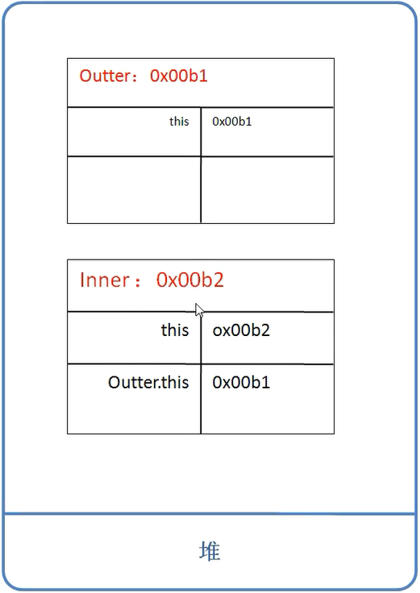
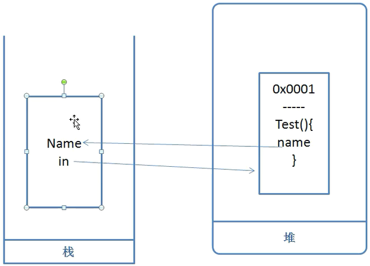
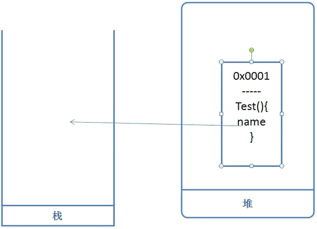

#### 抽象
求不同图形的面积
定义一个Graph类，getArea方法求图形面积，不同的图形求面积算法是不一样，不同图形写不同子类，继承Graph类

1. 每一个图形子类，都必须得要覆盖getArea方法，在每个里面写上自己的方法体
2. 父类不知道方法体里面该怎么写，不需要方法体

抽象方法（在方法前面添加了一个关键字abstract）：
1. 没有方法体（但是有返回值）
2. 必须要定义在抽象类当中或接口（在类前面添加上了一个abstract就成为了抽象类）
3. 不能是私有的**private**（子类就不能访问该方法就不能重写），不能使用**final**修饰（final要求子类不能重写，但是abstract要求必须要重写），不能同时使用**static**（static属于类，方法属于对象）

抽象类
抽象类必须得要有子类才行（抽象类一般都当作父类来继承）

抽象类的注意点：
1. 抽象类是不能直接创建对象的（但**抽象类是有构造器的**）
2. 抽象类当中，可以有抽象方法，也**可以有非抽象方法**（普通方法：给子类调用的）
3. 子类没有去覆盖抽象方法，把子类也变成抽象类（子类没有实现抽象方法，有孙类孙类就要实现，总有人要还的）
4. 构造方法不能定义为私有化（抽象方法必须得要让子类继承之后，才能实现内部的方法体）（子类继承的话，先去调用父类的构造方法）
5. 抽象类不能使用final来去修饰

抽象类和普通类的区别
其实是一个不完整类。需要做为一个父类，子类才能完成对应的功能。
命名：抽象类命令时，都喜欢在前面添加上一个Abstract

抽象类与普通的类有什么区别？
1. 普通类（方法，字段，构造器），抽象类都有
2. 抽象不能创建对象
3. 抽象类可以包含抽象方法，也可以包含非抽象方法
4. 抽象类必须有子类才有意义


#### 接口
接口只定义了类应当遵循的规范，却不关心这些类的内部数据和其功能的实现细节
站在程序角度上说接口只**规定了类里必须提供的方法，从而分离了规范和实现**，增强了系统的可拓展性和可维护性

Java接口也是表示一种规范，使用**抽象方法**来去定义一组功能，必须要实现者给提供方法的实现


接口命名：I+名字+able

接口它其实是一个特殊的抽象类(abstract 可以不写)，接口也会生成对应的字节码

内部方法的abstract可以省略不写，如果没有在方法前面添加abstract会在编译时自动的添加上public abstract
```java
void transData();
//编译自动加上等同于：
public abstract void transData();
```

接口当中的注意点
1. 接口是**没有构造器**，接口是不能创建对象
2. 接口当中定义变量，都是**全局的静态常量**,少用
String name="myxq";
编译后：public static final String name；   //final 修饰的变量必须初始化
3. 接口当中定义的方法都是**公共的抽象方法**
void transData（）;
编译后：**public abstract** void transData（）;
4. 接口可以多继承 (类不能多继承，接口继承的时候，不会去覆盖父接口的方法，因为没有方法体，所以无意义）
```java
    interface Iwalkable {
        public abstract void walk(); // 接口方法默认public abstract ，可以不写
    }

    interface Iswimable {
        void swim();
    }

    interface Iamphibiousable extends Iwalkable, Iswimable {
    //	void swim(); 接口继承的时候，一般都不进行方法覆盖，无意义
    }

```
5. 接口中 可以定义内部类，内部类也是public abstract


#### 接口的实现

实现类 extends 父类（只能继承一个类）implements其它的接口（接口可以实现多个）
例如：class Cat extends Animal implements Iwalkable{}

在实现类当中必须得要去覆盖接口当中定义的方法
实现的方法必须得是public（子类权限不能比父类小）


多态
```java
public static void main(String[] args) {
    
    //(Iamphibiousable接口可以说是forg的父类)
    //多态写法，把子类对象赋值给父类类型
    Iamphibiousable frog = new Frog();//面向接口编程
    frog.swim();//多态运行时表现子类特征（编译看左边，运行看右边）
}
```
运行时看左边的Iamphibiousable又没有swin方法（这里是继承自Iswimable），没有就报错，有的话运行右边的Frog类的的swim方法


#### 接口和抽象类区别
相同点
1. 都是被其它类实现或者被继承
2. 都不能实例化
3. 都可以定义抽象方法，定义的抽象方法子类都必须得要覆盖

不同点
1. 抽象类当中是有构造器，接口是没有构造器
2. 抽象类可以包含普通方法和抽象方法，接口当中只能有抽象方法，不能有普通方法（带有方法体）(Java8开始，接口可以有普通方法)
3. 成员变量：抽象类当中默认的权限，接口当中默认：public static final变量 -> 全局静态常量    
4. 方法：抽象类默认的权限，接口当中默认方法public abstract 方法名；

#### 面向接口编程
把实现类对象赋值给接口类型的变量
好处：蔽了不同类之间实现差异，从而达到通用编程（就是多态的好处）

1. 定义接口
2. 定义接口实现类
3. 创建具体对象
#### 内部类
定义在**类当中的一个类**

为什么要使用内部类
1.增强封装，把内部类隐藏在外部类当中，不允许其它类访问这个内部类
2.增加了代码一个维护性
3.内部类可以直接访问外部类当中的成员

内部类的分类（4种）
1.实例内部类：直接定义在类当中的一个类，在类前面没有任何一个修饰符
2.静态内部类：在内部类前面加上一个static
3.局部内部类：定义在方法的内部类
4.匿名内部类：属于局部内部的一种特殊情况

外部类的修饰符只能有两个：public或者默认修饰符，内部类可以使用很多个修饰符
#### 实例内部类
类当中的成员：
字段
方法
内部类

实例内部类：属于对象的内部类，不属于类的，不使用static修饰
想要使用内部类，必须得要先创建外部类在内部类
当中可以访问外部类中的成员，外部类是不能直接访问内部中的成员

```java
class Outer {
	String name = "Outer";

	class Inner {
		String name = "Inner";

		void test() {
			String name = "Inner test()";
			
			System.out.println(name);
			System.out.println(this.name);
			System.out.println(Outer.this.name); //调用外部类的变量
		}
	}
}

public class Test {
	public static void main(String[] args) {
		Outer outer=new Outer(); //先new 外部类
		Outer.Inner inner=outer.new Inner();//赋值给 Inner inner 会报错
		inner.test();
	}
}
```

创建内部类对象当中，会有一个**外部类的引用**


#### 静态内部类
```java
class Outer {
	String name = "Outer";
	static String sname = "Outer staic";

	static class Inner {
		int i = 10;// 5.可以定义非静态成员
		static String iname = "Inner static";

		void test() {
			System.out.println(sname);
			// System.out.println(name); 报错，非静态变量,可以创建实例对象来访问
			System.out.println(new Outer().name);

		}
	}
}
public class Test {
	public static void main(String[] args) {
		// 1.static 静态的，属于类，就不需要创建外部类
		Outer.Inner inner = new Outer.Inner(); // 类型Outer.Inner 和实例内部类相同
		inner.test();

		// 4.调用静态类中的静态变量
		System.out.println(Outer.Inner.iname);
	}
}
```

静态内部类：在内部类前面加上static
1. 静态内部类是**不需要创建外部对象**（因为是static，所以是属于类）
outter.Inner in=new outter.Inner（）；
2. 在静态内部类中，**没有外部类引用**
3. 静态内部类，可以访问外部类的静态成员
4. 访问静态内部类当中的静态成员Outter.Inner.iname
5. 静态内部当中可以定义静态成员，也可以定义非静态成员


####  局部内部类（少用）
```java
class Outer {

	void myxq() {

		String name = "Outer test()";// 4.本质final 编译自动加
		class Inner {// 局部内部类

			// 局部内部类的方法test
			void test() {
				System.out.println(name);
				//name="test"; 因为是final 所以不能修改
			}

		}
		Inner in = new Inner();
		in.test();
	}

}
public class Test {
	public static void main(String[] args) {
		new Outer().myxq();

	}
}
```
定义在方法中的内部类
1.不能用一些修饰符public private（因为只在方法的局部生效）
2.只能在定义的方法中使用
3.不能包含静态变量（staic是属于类，但是这个变量属于方法）
4.可以包含局部变量，本质是final，编译自动加上（JDK1.8之后可以省略final）（这里的局部变量指的是与局部内部类同级的变量，就是在myxq方法里的局部变量，至于局部内部类里面非final也可以）

内存分析
myxq方法栈帧 入栈 有一个变量name
堆中创建Inner对象，地址0x0001赋值栈的in
Inner对象的test方法引用了name，指向栈里的


myxq方法出栈后
堆中一个对象没有人引用，它并不是直接就销毁
所以name现在空指针
所以引用的必须是final 常量（在方法区）



#### 匿名内部类
```java
interface IUSB {
	void swapData();// public abstract
}

class MotherBoard {
	void PluginIn(IUSB iusb) {
		iusb.swapData();
	}

}

public class Test {
	public static void main(String[] args) {
		MotherBoard board = new MotherBoard();

		// 匿名内部类
		board.PluginIn(new IUSB() { // 这里new的不是接口而是匿名内部类

			@Override
			public void swapData() {
				System.out.println("打印工作");
			}
		}

		);

	}
}
```
就是一个没有名字的局部内部类  安卓用的比较多
匿名内部类是没有构造器
只使用一次的时候,来去使用匿名内部类  

new 父类的构造器 或 接口( ){
内部写的代码（在new时候就会自动执行）
}      

匿名内部类必须得要有父类才,或者是实现了接口

---

## 参考资料
[Java零基础到高级JavaEE就业实战](https://study.163.com/course/introduction/1005537028.htm)
