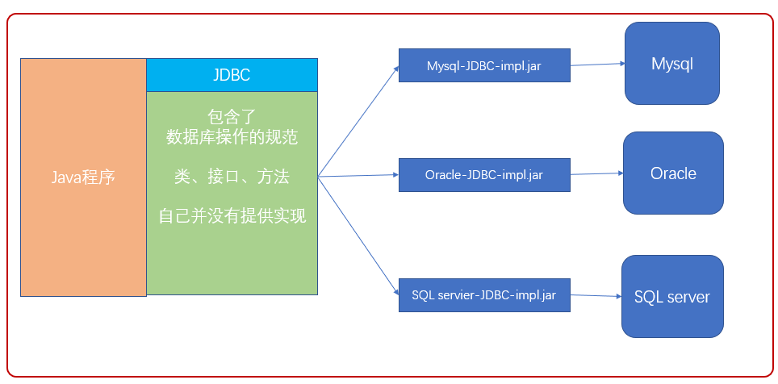
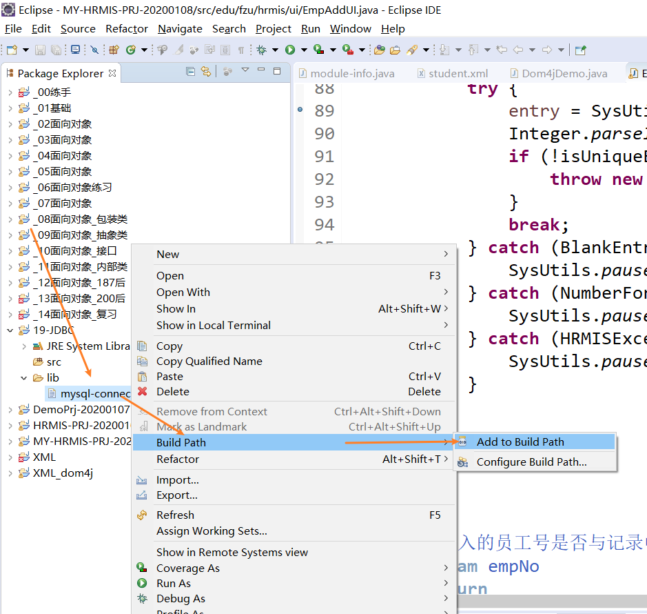
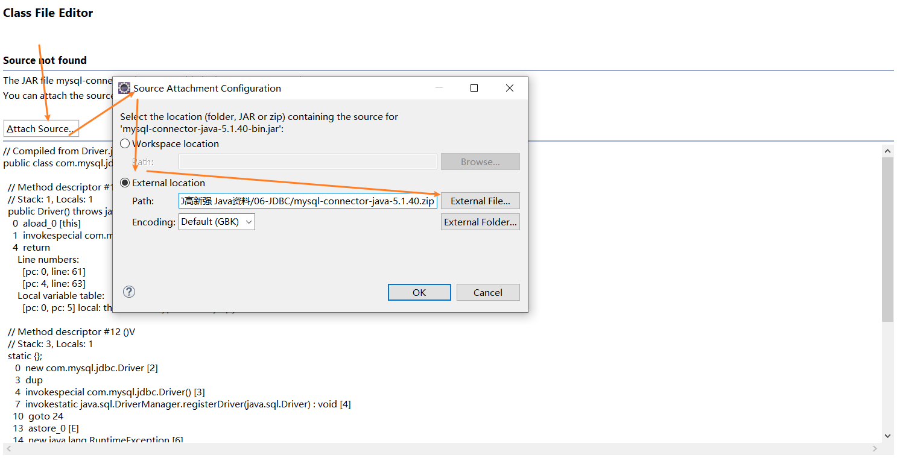
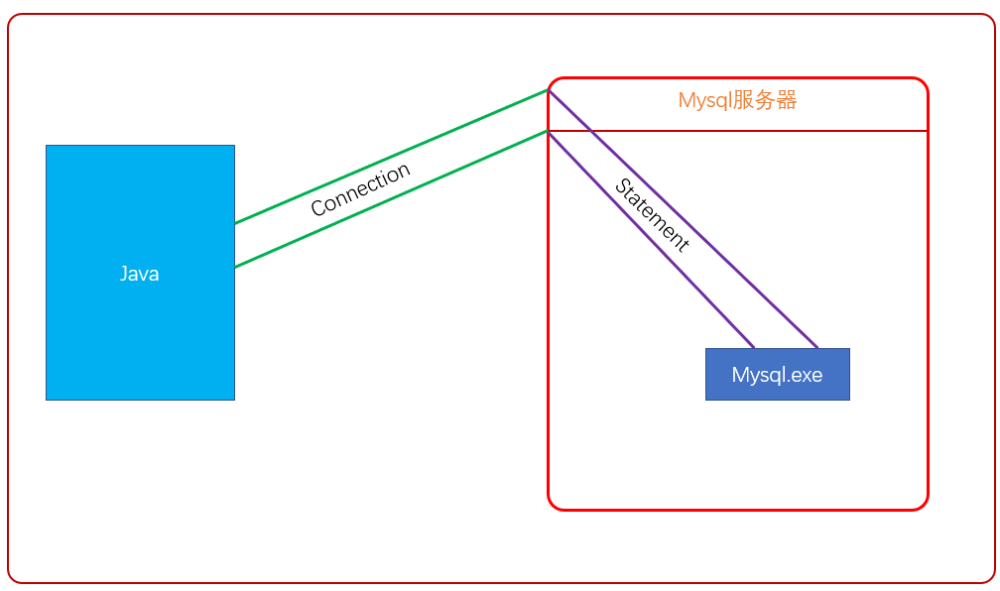
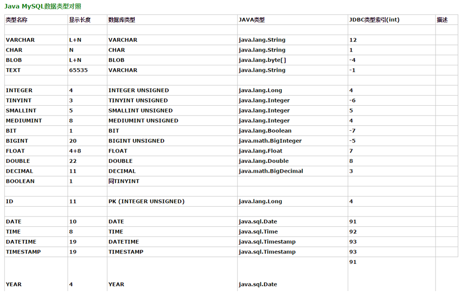
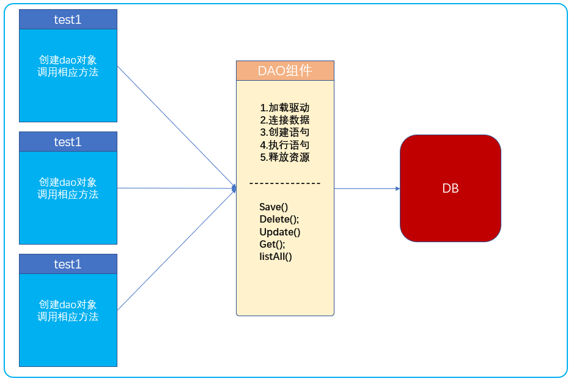
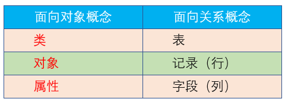
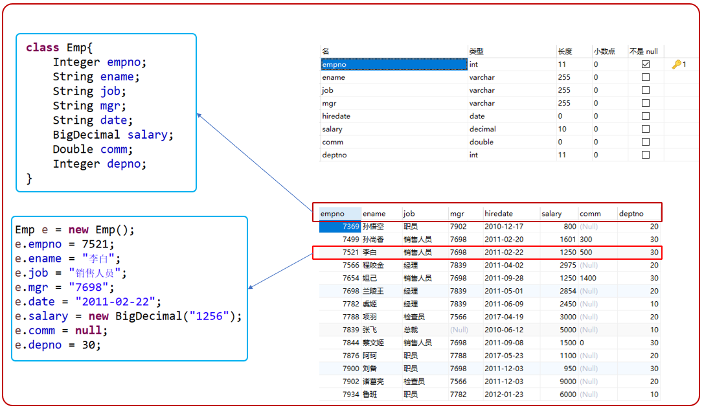

## JDBC 概述
Java数据库连接 (Java Database Connectivity)
用于执行SQL语句的Java API，它由一组用Java语言编写的类和接口组成
JDBC提供了一种操作数据的标准，JDBC的目标是使Java程序员使用JDBC可以连接任何提供了JDBC驱动程序的数据库系统

java.sql包装的就是JDBC的API


## 连接MySQL

新建一个lib文件夹，拖入MySQL驱动，builder path 编译路径


查看驱动相关API：Ctrl+Shift+T 查找driver，关联源码


```java
import java.sql.Connection;
import java.sql.DriverManager;

public class _01Connect {

	public static void main(String[] args) throws Exception {

		// 把com.mysql.jdbc.Driver这份字节码加载进JVM，会执行该字节码中的静态代码块
		Class.forName("com.mysql.jdbc.Driver");// ClassNotFoundException异常

		String url = "jdbc:mysql://localhost:3306/jdbc_db";// 需要创建jdbc_db这个数据库
		String user = "root";
		String password = "1234";
		Connection conn = DriverManager.getConnection(url, user, password);// SQLException异常

	}

}
```

从1.6开始它会自动读这个文件，不用手动加载驱动
在JavaWeb中不支持自动注册，所以以后我们都要自己手动写上

## 操作数据库
用Statement接口执行静态SQL语句对象

把SQL语句发送到数据库中去执行，并返回执行的结果
- 对于DQL返回查询的结果集
- 对于DML返回受影响的行数
- 对于DDL返回0

执行sql后需要释放资源
Connection连接就相当于Java和到Mysql之间建立管道
Statement就相当于从数据库又接了一个管道连接MySQL的执行程序


```java
public static void main(String[] args) {
		String url = "jdbc:mysql://localhost:3306/jdbc_db";
		String user = "root";
		String password = "1234";
		
		Connection conn = null;
		Statement st = null;

		try {
			Class.forName("com.mysql.jdbc.Driver");	
			conn = DriverManager.getConnection(url, user, password);
			st = conn.createStatement();
			
			String sql = "create table jdbc_stu(id int,name varchar(30),age int)";
			int row = st.executeUpdate(sql);
			System.out.println(row);

		} catch (Exception e) {
			e.printStackTrace();
		} finally {
			try {
				if (st != null) {
					st.close();
				}
			} catch (SQLException e) {
				e.printStackTrace();
			}
			
			try {
				if (conn != null) {
					conn.close();
				}
			} catch (SQLException e) {
				e.printStackTrace();
			}
		}
	}
```
执行DML和执行DDL步骤相同，只有sql语句发生了改变

## 查询操作

常用方法
- boolean  next():判断是否有下一行数据,若有,则向下移动一行指针
- getXxx(int columnIndex):获取当前行中,第几列.(从1开始)不推荐
- getXxx(String columnName):获取当前行中的,指定列名的列的值.columnName是列名/列的别名
- 若列的类型是VARCHAR/CHAR/TEXT,都使用getString来获取列的值
- 若列的类型是int/integer/-->getInt来获取列的值


```java
public static void main(String[] args) {
		String url = "jdbc:mysql://localhost:3306/jdbc_db";
		String user = "root";
		String password = "1234";
		
		Connection conn = null;
		Statement st = null;
		// 1.executeQuery(Sql)会得到一个结果集ResultSet，最后也需要释放
		ResultSet rs = null;
		try {
			Class.forName("com.mysql.jdbc.Driver");	
			conn = DriverManager.getConnection(url, user, password);
			st = conn.createStatement();

			// 2.executeQuery执行DQL返回一个结果集
			String sql = "select * from emp where ename = '李白' ";//需要有建emp表，否则会报错
			rs = st.executeQuery(sql);
			if (rs.next()) {
				String ename = rs.getString("ename");
				int salary = rs.getInt("salary");
				System.out.println("姓名："+ename+" 薪水："+salary);
			}
			//

		} catch (Exception e) {
			e.printStackTrace();
		} finally {
			try {
				if (st != null) {
					st.close();
				}
			} catch (SQLException e) {
				e.printStackTrace();
			}
			
			try {
				if (conn != null) {
					conn.close();
				}
			} catch (SQLException e) {
				e.printStackTrace();
			}

			// 3.结果集也要释放
			try {
				if (rs != null) {
					rs.close();
				}
			} catch (SQLException e) {
				e.printStackTrace();
			}
		}
	}
```

## DAO设计
Data Access Object（数据存取对象）
位于业务逻辑和持久化数据之间，实现对持久化数据的访问
解决问题：多个地方都要都同时做CRUD操作时，重复的代码就会很多


## ORM
Object Relational Mapping（对象关系映射）
将关系数据库中表中的记录映射成为对象，以对象的形式展现
方便开发人员以面向对象的思想来实现对数据库的操作



## domain
符合JavaBean规范的类
JavaBean：一个类当中有字段和该字段的getter与Setter方法
作用：是用户与数据库交互的核心中转站

## 参考资料
[Java零基础到高级JDBC连接数据库](https://study.163.com/course/introduction/1005977005.htm)
