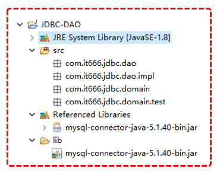
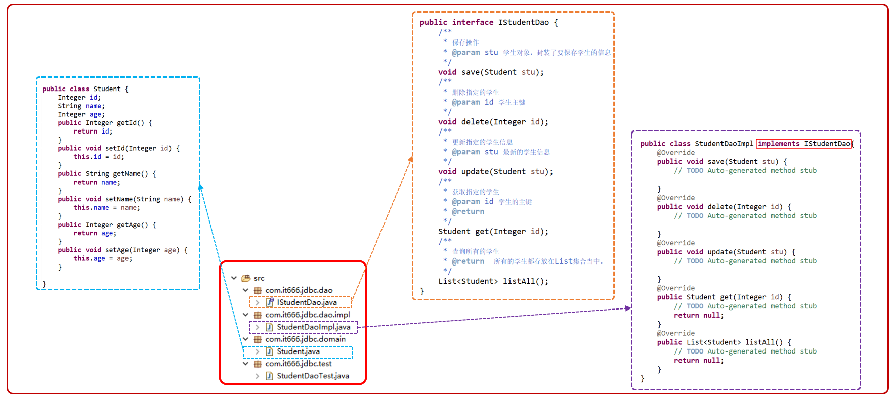
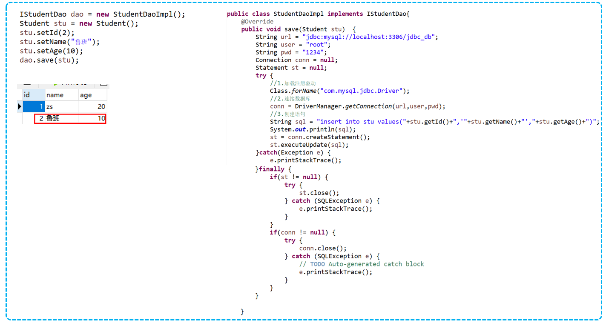
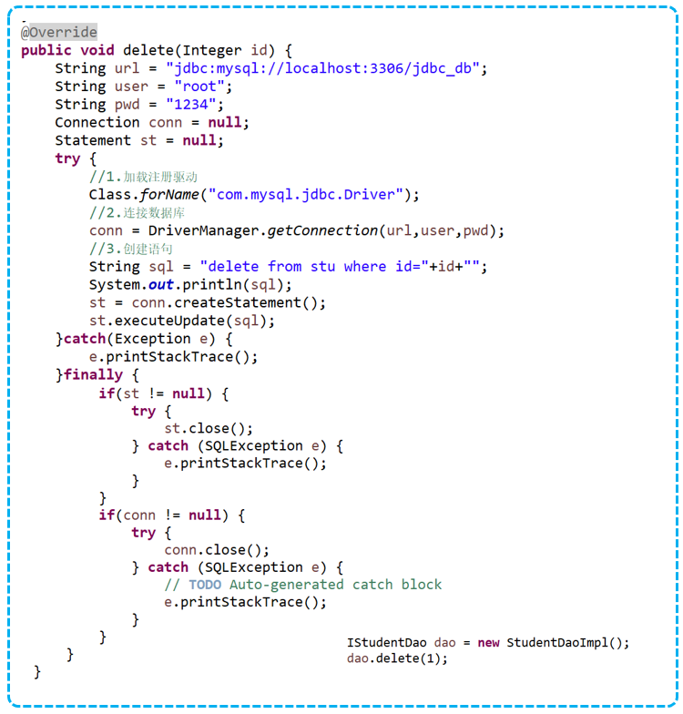
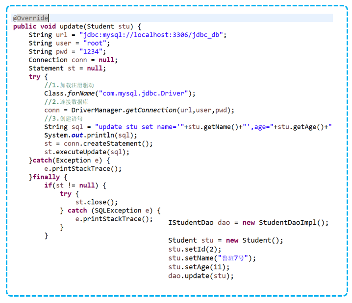
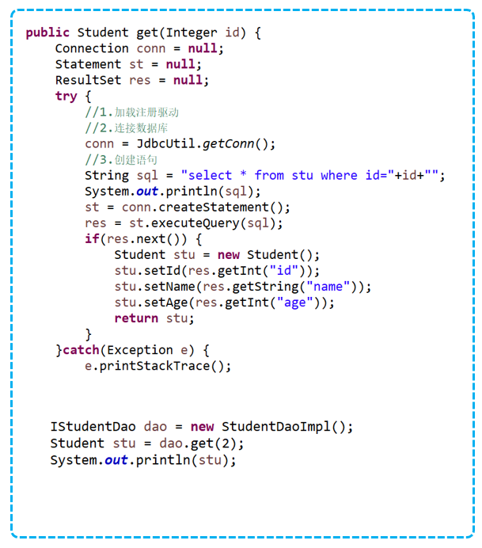
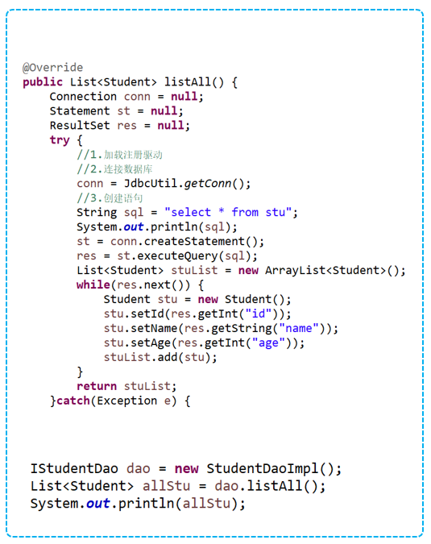
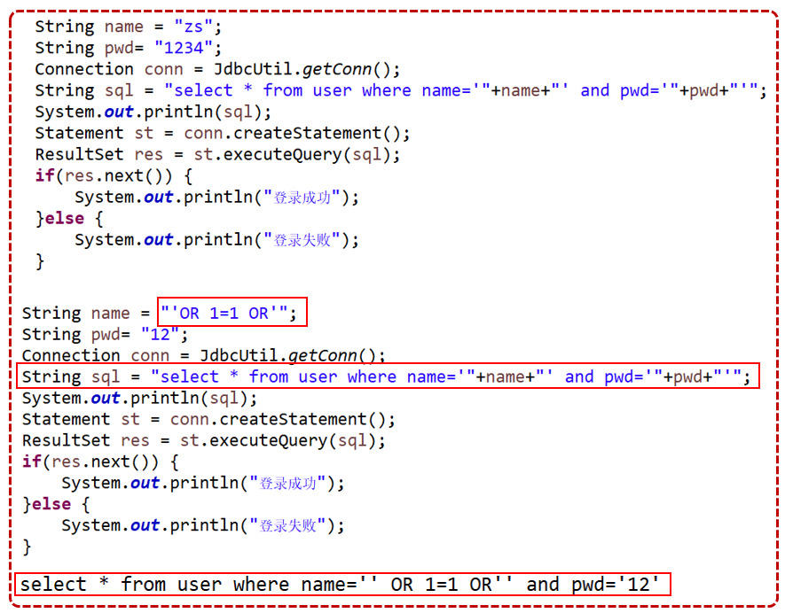

## DAO设计规范
编写DAO组件
1. 定义DAO接口
2. 编写对应DAO实现类
   
面向接口编程
根据客户提出的需求，定义接口，业务具体实现是通过实现类来完成
当客户提出新的需求，只需要编写该业务逻辑新的实现类
好处
- 业务逻辑更加清晰
- 增强代码的扩展性，可维护性
- 接口和实现相分离，适合团队协作开发
- 降低耦合度，便于以后升级扩展

包名的规范

域名倒写.模块名称.组件名称
- 存储所有的domain：package com.it666.jdbc.domain
- 存储所有的dao接口：page com.it666.jdbc.dao
- 存储所有的Dao接口实现类：page com.it666.jdbc.dao.impl
- 存储Dao组件的测试类：page com.it666.jdbc.dao.test

类名规范
- domain类：存储在domain包中，用于描述一个对象，是一个javaBean,写时要见名知意
- dao接口：存储在dao包中，用于表示某一个对象的CRUD声明，起名规范IDomainDao
- dao实现类：存储到dao.impl包中，用于表示DAO接口的实现类，要实现DAO接口

## 开发步骤
1. 创建表
2. 建立domain包和domain类
3. 建立dao包和dao接口
4. 建立dao.impl包和dao实现类
5. 根据dao接口创建dao测试类
6. 编写实现类当中dao的声明的方法体
7. 每编写一个dao方法，进行测试功能是否正确

（放大图片，Chrome浏览器可以用imagus插件，或者按Ctrl和加号键，Ctrl和0 还原网页大小）
建立stu表，设置id,name,age字段，id设置为主键和自动递增




写IStudentDao接口，写类StudentDaoImpl应用接口，重写方法
写完一个方法就在测试类中写测试方法

使用单元测试，在测试StudentDaoTest类中，写一个public方法
在方法上面加@Test，Ctrl+1 选择Adds the JUnit 4 library to the build path.
点想要单元测试的方法，点击运行或者Ctrl+F11

```java
@Test
public void save() {
    Student stu = new Student();
    stu.setName("al");
    stu.setAge(22);

    IStudentDao dao = new StudentDaoImpl();
    dao.save(stu);

}
```

保存方法


删除方法


修改方法


获取一个学生


获取所有学生


## 预编译语句
Statement接口：用于进行Java程序和数据库之间的数据传输
具体类有3个实现
- Statement：用于对数据库进行通用访问，使用的是静态sql
- PreparedStatement：用于预编译模板SQL语句,在运行时接受sql输入参数
- CallableStatement：要访问数据库存储过程时使用，也可以接受运行时输入参数

#### PreparedStatement
没有预编译语句，所有的sql都是进行拼接

PreparedStatement 用于预编译模板SQL语句
在性能和代码灵活性上有显著地提高
PreparedStatement 对象使用 ? 作为占位符，即参数标记
使用 setXXX( index，value) 方法将值绑定到参数中，index是引用顺序从 1 开始

PreparedStatement 对象执行SQL语句（注意，它们都没有参数，不同于Statement要传入sql语句）
- executeQuery()
- executeUpdate()

内部优化：MySql不支持，Oracle支持
预编译语句更安全，防止sql注入（通过把SQL命令插入到Web表单提交或输入域名或页面请求的查询字符串，最终达到欺骗服务器执行恶意的SQL命令）

PreparedStatement能防止注入是因为它把单引号转义了，变成了\'
这样一来，就无法截断SQL语句，进而无法拼接SQL语句 基本上没有办法注入了

		


## 重构1-抽取JDBCUtil
1. 每一个DAO方法当中都会写驱动名称、url、用户名、密码，把公共的这些声明为成员变量，在一个类当中能够共享这些成员变量
2. 不需要每次都注册驱动，把加载驱动放到静态代码块当中，只会在类被加载到JVM时，才会执行一次
3. 每个dao方法每次操作只需要connection对象，至于是怎么样创建的不关心，把创建Connection代码抽取到jdbcUtil当中，并提供一个getConn就能够获得连接对象
4. 每个dao方法都要关闭资源，在util当中提供一个方法专门关闭资源，在方法当中传入要关闭哪些资源
5. DAO方法中，拼接SQL太麻烦，要使用预编译语句对象


6. （代办）DAO方法当中每次都创建一个connection对象，用完就关闭了，创建Connection成本很大，通过数据库连接池来解决
7. （代办）JDBCUtil当中的用户名，密码这些信息都写到了文件当中，不便于维护，给写到一个单独的配置文件当中
		
```java
// package com.it666.jdbc.util;
// 需要import包
public class JDBCUtil {
    // 1.公共成员变量
	public static String url = "jdbc:mysql://localhost:3306/jdbc_db";
	public static String user = "root";
	public static String password = "1234";
	public static String driverName = "com.mysql.jdbc.Driver";

    /*
	注意！！变量这些要写在前面，如果把静态代码块写在静态字段前，会导致这些变量无法初始化（报错：初始化异常）
    因为这些静态变量都是在静态代码块中初始化的
    */
	static {
		try {
        // 2. 加载驱动只执行一次，用静态代码块加载驱动   
			Class.forName(driverName);
		} catch (ClassNotFoundException e) {
			e.printStackTrace();
		}
	}
    // 3.getConn方法
	public static Connection getConn() {
		try {
			return DriverManager.getConnection(url, user, password);
		} catch (SQLException e) {
			e.printStackTrace();
		}
		return null;
	}
    // 4.close方法
	public static void close(Connection conn, Statement st, ResultSet rs) {
		if (st != null) {
			try {
				st.close();
			} catch (SQLException e) {
				e.printStackTrace();
			}
		}

		if (conn != null) {
			try {
				conn.close();
			} catch (SQLException e) {
				e.printStackTrace();
			}
		}
		
		if (rs != null) {
			try {
				rs.close();
			} catch (SQLException e) {
				e.printStackTrace();
			}
		}
	}
}

```

修改StudentDaoImpl类
```java
// package com.it666.jdbc.dao.impl;
public class StudentDaoImpl implements IStudentDao {

	@Override
	public void save(Student stu) {
		Connection conn = null;
        // 5.使用预编译语句
		PreparedStatement ps = null;// 用预编译语句

		try {

			conn = JDBCUtil.getConn();
			String sql = "insert into stu (name,age) values (?,?)"; // 预编译语句用?占位
			ps = conn.prepareStatement(sql);

			ps.setString(1, stu.getName());// 设置第一个占位符?的值
			ps.setInt(2, stu.getAge());

			ps.executeUpdate(); //执行sql语句

		} catch (SQLException e) {
			e.printStackTrace();
		} finally {
			JDBCUtil.close(conn, ps, null); //因为PreparedStatement是Statement的实现类，所以可以传入ps
		}

	}

    //DML语句同理
	@Override
	public void delete(int id) {

	}

	@Override
	public void update(int id, Student stu) {

	}

	@Override
	public Student get(int id) {
		Connection conn = null;
		PreparedStatement ps = null;
		ResultSet rs = null;

		try {
			conn = JDBCUtil.getConn();
			String sql = "select * from stu where id = ?";
			ps = conn.prepareStatement(sql);

			ps.setInt(1, id);

			rs = ps.executeQuery();

			if (rs.next()) {
				Student stu = new Student();
				stu.setName(rs.getString("name"));
				stu.setAge(rs.getInt("age"));
				stu.setId(rs.getInt("id"));
				return stu;
			}

		} catch (SQLException e) {
			e.printStackTrace();
		} finally {
			JDBCUtil.close(conn, ps, rs);
		}

		return null;
	}

	@Override
	public List<Student> getAll() {
		Connection conn = null;
		PreparedStatement ps = null;
		ResultSet rs = null;

		try {
			conn = JDBCUtil.getConn();
			String sql = "select * from stu";
			ps = conn.prepareStatement(sql);

			rs = ps.executeQuery();
			List<Student> list = new ArrayList<>();
			while (rs.next()) {
				Student stu = new Student();
				
				stu.setId(rs.getInt("id"));
				stu.setName(rs.getString("name"));
				stu.setAge(rs.getInt("age"));
				list.add(stu);
			}
			return list;

		} catch (SQLException e) {
			e.printStackTrace();
		} finally {
			JDBCUtil.close(conn, ps, rs);
		}
		return null;
	}

}

```

## 参考资料
[Java零基础到高级JDBC连接数据库](https://study.163.com/course/introduction/1005977005.htm)
