## 存储过程
1. 在数据库当中定义一个存储过程
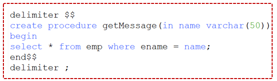
2. JDBC调用一个参数的存储过程
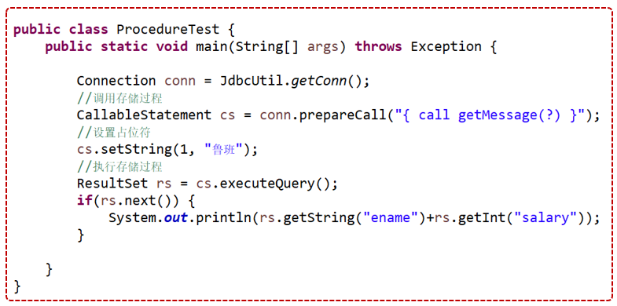
3. 编写输入参数和输出参数的存储过程
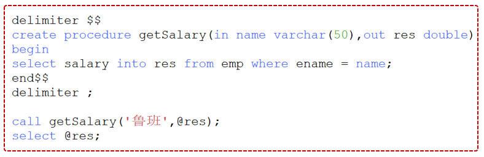
4. JDBC调用二个参数的存储过程
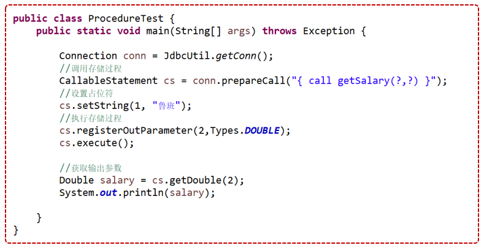

## 事物
模拟zs与ls进行转账
1.检查zs账户余额
2.减少zs账户1000
3.增加ls账户1000
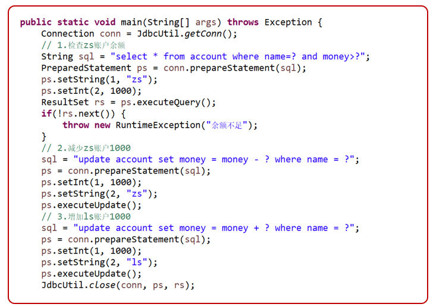

#### 处理事务过程
1. 关闭自动提交 conn.setAutoCommit(false);
2. 没有问题时，提交事务 conn.commit();
3. 出现异常时，进行回滚操作 conn.rollback()


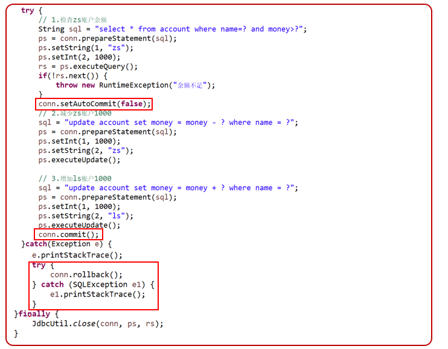

回滚之后，事务结束，释放资源
出现异常，没有提交，也不会更新数据库，但是会占用资源，所以要出现异常时，进行回滚操作
只有增、删、改才需要事务，查询不需要事务

如果代码是正确的，测试也成功，但是数据库当中的数据不变，可能是事务没有提交

InnoDB才支持外键和事务。MyISAM不支持外键和事务
设置事务的隔离级别 conn.setTransactionIsolation(Connection.TRANSACTION_REPATABLE_READ)

## 批处理
一次性执行多条Sql语句，允许多条语句一次性提交给数据库批量处理，比单独提交处理要效率高

批处理方法
- addBatch(String) 添加需要批处理的sql语句
- executeBatch() 最后执批处理

MySQL默认情况下是不支持批处理的，从5.1.13开始，添加了一个rewriteBatchedStatement参数
```java
public static String url = "jdbc:mysql://localhost:3306/jdbc_db?rewriteBatchedStatements=true";
```
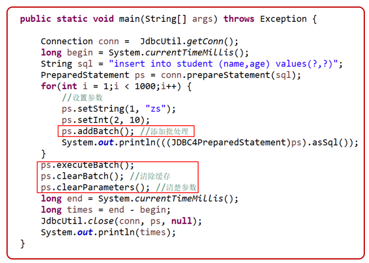
## 存储图片
数据库当中的BLOB：以二进制流的形式存储图片、音频、视频等多媒体信息

真正开发中，不会把二进制的文件存放在数据库当中
而是把文件存储的路径保存在数据库当中，以后再取出路径，到该路径下读取信息

BLOB类型
- TINYBLOB (255个字节)
- BLOB (65535字节)
- MEDIUMBLOB (16M)
- LONGBLOB(4G)

```java
public class BlobTest {

    //写入图片
	void write() throws Exception, SQLException {
		Connection conn = JDBCUtil.getConn();
		String sql = "insert into student (img) values (?)";

		PreparedStatement ps = conn.prepareStatement(sql);

		// 读取文件转换成二进制
		ps.setBlob(1, new FileInputStream("d:/test.jpg"));
		ps.executeUpdate();

		JDBCUtil.close(conn, ps, null);
	}

	// 读取数据库图片
	public static void main(String[] args) throws Exception {
		Connection conn = JDBCUtil.getConn();

		String sql = "select * from student where id=?";
		PreparedStatement ps = conn.prepareStatement(sql);
		ps.setInt(1, 1);

		ResultSet rs = ps.executeQuery();
		if (rs.next()) {
			// 获取图片
			Blob blob = rs.getBlob("img");
			// 获取图片二进制流
			InputStream in = blob.getBinaryStream();
			// 写入磁盘
			Files.copy(in, Paths.get("d:/myxq.jpg"));
		}

		JDBCUtil.close(conn, ps, rs);
	}

}

```

## 获取自动生成的主键
需求场景
用户注册时，添加用户名，密码后，插入到数据库当中
跳转成完善个人信息页，完善信息更新到刚插入的那个记录当中，所以要获取刚插入的那个主键是多少

``` java
public static void main(String[] args) throws Exception {
    Connection conn = JDBCUtil.getConn();
    String sql = "insert into stu (name,age) values (?,?)";
    //PreparedStatement sql参数是在定义的时候设置的，所有与Statement不同的是，这个的RETURN_GENERATED_KEYS 是设置在这定义这里
    PreparedStatement ps = conn.prepareStatement(sql,Statement.RETURN_GENERATED_KEYS);
    
    ps.setString(1, "张三");
    ps.setInt(2, 30);
    // 这里面是空的
    ps.executeUpdate();
    
    ResultSet rs = ps.getGeneratedKeys();
    if (rs.next()) {
        int id =rs.getInt(1);//获取第一列
        System.out.println(id);
    }
    JDBCUtil.close(conn, ps, rs);
    
}


void test() throws Exception {
    Connection conn = JDBCUtil.getConn();
    String sql = "insert into stu (name,age) values ('张三',30)";
    
    Statement st = conn.createStatement();
    // 1.创建语句时，设置可以获取主键
    st.executeUpdate(sql,Statement.RETURN_GENERATED_KEYS);
    // 2.通过语句对象的getGeneratedKeys获取主键
    ResultSet rs = st.getGeneratedKeys();
    if (rs.next()) {
        int id =rs.getInt(1);//获取第一列
        System.out.println(id);
    }
    JDBCUtil.close(conn, st, rs);
}

```

## 连接池

#### 没有连接池的情况
- 每次CRUD操作都要使用数据库的时候，都要创建一个数据库连接对象
- 普通的JDBC数据库连接使用 DriverManager 来获取
- 每次向数据库建立连接的时候都要将 Connection 加载到内存中
- 然后再验证用户名和密码花费时间0.05s～1s左右
- 每次CRUD操作就向数据库要一个连接
- 执行完成后再断开连接，这样的方式将会消耗大量的资源和时间，若同时有几百人甚至几千人在线，频繁的进行数据库连接操作将占用很多的系统资源，严重的甚至会造成服务器的崩溃


#### 数据库连接池
- 池
保存对象的容器
- 连接池
保存数据库连接对象的容器
- 作用
初始化时创建一定数量的对象。需要时直接从池中取出一个空闲对象 
用完后并不直接释放掉对象，而是再放到对象池中以方便下一次对象请求可以直接复用 
池技术的优势是，可以消除对象创建所带来的延迟，从而提高系统的性能 
- 数据库连接池
数据库连接池的基本思想就是为数据库连接建立一个“缓冲池”
预先在缓冲池中放入一定数量的连接，当需要建立数据库连接时
只需从“缓冲池”中取出一个，使用完毕之后再放回去
我们可以通过设定连接池最大连接数来防止系统无尽的与数据库连接
可以通过连接池的管理机制监视数据库的连接的数量﹑使用情况，为系统开发﹑测试及性能调整提供依据

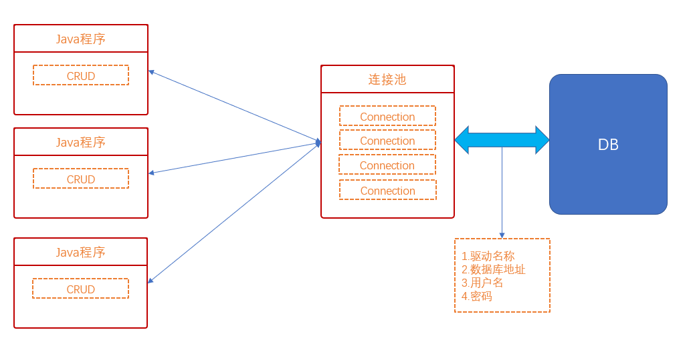
连接对象是以链表形式存放，已释放的连接，放到最后

#### 连接池中的属性
合理的设置连接池的属性，会提高连接池的性能
1. 连接数据库时需要的4个要素
驱动名称，数据库地址，用户名，密码
2. 初始化连接数
初始化时，连接池当中创建多少个Connection对象
3. 最大连接数
连接池当中最多存储多少个Connection对象
4. 最小连接数
连接池当中最少得存多个少Connection对象
5. 最大的空闲时间
如果一个获取了连接对象，在指定时间内没有任何动作，就会自动释放链接
6. 最大等待时间
在指定时间内，尝试获取连接，如果超出了指定时间，就会提示获取失败

#### 连接池使用
连接池是使用javax.sql.DataSource接口来表示连接池
DataSource和jdbc一样，也是只提供一个接口，由第三方组织来提供
DataSource数据源和连接池Connection Pool是同一个东西，只是叫法不一样而已

常见连接池
- DBCP
Spring推荐，Tomcat的数据源使用的就是DBCP
- C3P0
C3P0是一个开放源代码的JDBC连接池，它在lib目录中与Hibernate一起发布
从2007年就没有更新了，性能比较差
- Druid
阿里巴巴提供的连接池-德鲁伊-号称最好的连接池，它里面除了这些， 还有更多的功能

使用连接池与不使用连接池区别
1. 获取方式不同
传统：Connection conn = DriverManager.getConnection(url.userName,pwd);
连接池：Conneciton conn = DataSource对象.getConnection();
2. 释放资源不同
传统：和数据库断开conn.close();
连接池：把数据库连接对象还给连接池，还可以给下一个人来使用

#### 创建DataSource
使用DBCP，DBCP是Apache软件基金组织下的开源连接池实现

1.导入相关的jar包
commons-dbcp-1.4.jar
commons-pool-1.5.6.jar
记得build path

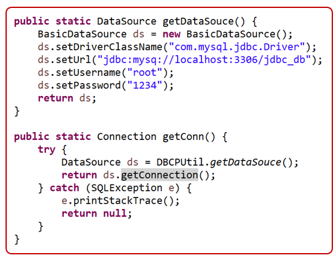

#### 配置文件
以.properties作为扩展名的文件
把库的连接地址，用户名，密码都写在了代码当中，不便于后期的维护
专门为数据库提供一个配置文件，里面就专门存放连接数据库的相关信息

配置文件的书写
- db.properties
- 内部是以key-value的形式存放
userName=root
password=1234
- 在Java中读取配置文件

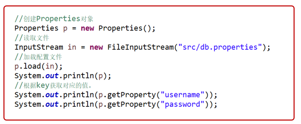

#### 改写配置文件
创建一个Source Folder文件夹，命名为:resource
只有Source Folder才会编译到字节码中，会编译到bin目录中
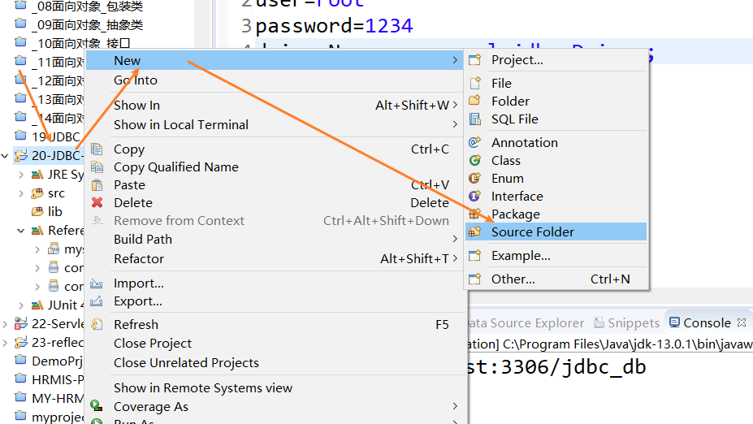

创建db.properties配置文件，注意key值必须和规定的一致
```
url=jdbc:mysql://localhost:3306/jdbc_db
username=root
password=1234
driverClassName=com.mysql.jdbc.Driver
```

修改后的JDBCUtil
```java
// package com.it666.jdbc.util;
public class JDBCUtil {

	public static DataSource ds = null;
	static {
		try {
			Properties p = new Properties();
			FileInputStream in = new FileInputStream("resource/db.properties");
			p.load(in);

			ds = DruidDataSourceFactory.createDataSource(p);

		} catch (Exception e) {
			e.printStackTrace();
		}
	}

	public static Connection getConn() {
		try {
			return ds.getConnection();
		} catch (Exception e) {
			e.printStackTrace();
		}
		return null;
	}

    // close方法没有变化
	public static void close(Connection conn, Statement st, ResultSet rs) {
		if (st != null) {
			try {
				st.close();
			} catch (SQLException e) {
				e.printStackTrace();
			}
		}

		if (conn != null) {
			try {
				conn.close();
			} catch (SQLException e) {
				// TODO Auto-generated catch block
				e.printStackTrace();
			}
		}

		if (rs != null) {
			try {
				rs.close();
			} catch (SQLException e) {
				// TODO Auto-generated catch block
				e.printStackTrace();
			}
		}
	}
}

```

#### 使用Druid
开源地址：https://github.com/alibaba/druid
Druid是一个JDBC组件库，包括数据库连接池、SQL Parser等组件。DruidDataSource是最好的数据库连接池

从DBCP到Druid
DruidDataSource的配置是兼容DBCP的，从DBCP迁移到DruidDataSource，只需要修改数据源的实现类就可以了
只需要导入jar包(druid-1.0.15.jar)，修改代码即可

```java
// 修改创建DataSource的实现类即可，将Basic修改为Druid
ds = BasicDataSourceFactory.createDataSource(p); // DBCP
ds = DruidDataSourceFactory.createDataSource(p); // Druid
```

## 参考资料
[Java零基础到高级JDBC连接数据库](https://study.163.com/course/introduction/1005977005.htm)