## 重构DAO
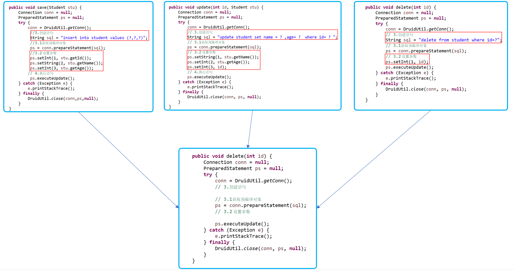

重构代码原则
- 同一个类中
在一个类当中有多个方法当中有太多相同的代码
不同的地方通过参数传递进去
把它们抽到一个方法当中
- 不同类中
不同类当中有共同的代码给抽取到一个新类当中。
大家同时共享该类中的内容


## 抽取DML方法
1. 设计一个方法
2. 要求传入两个参数
第一个参数sql语句模板
第二个参数为可变参数，设置语句参数值
1. 返回值
返回值为int，受影响的行数

抽取代码
1. 用可变参数（可变参数要放在参数的最后一个，可变参数本质是数组
）
2. 在com.it666.jdbc.util中新建一个CRUDTemplate类
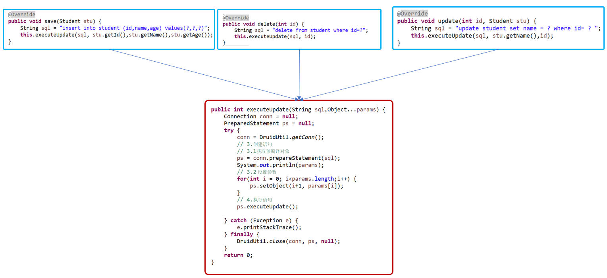
调用代码
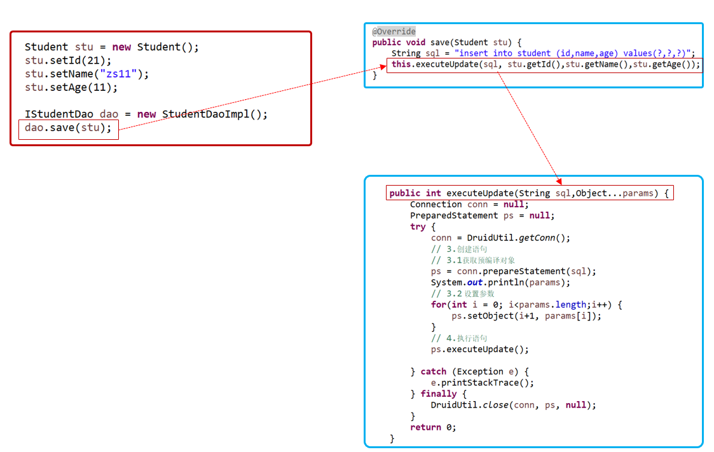

## 抽取DQL
抽取代码前
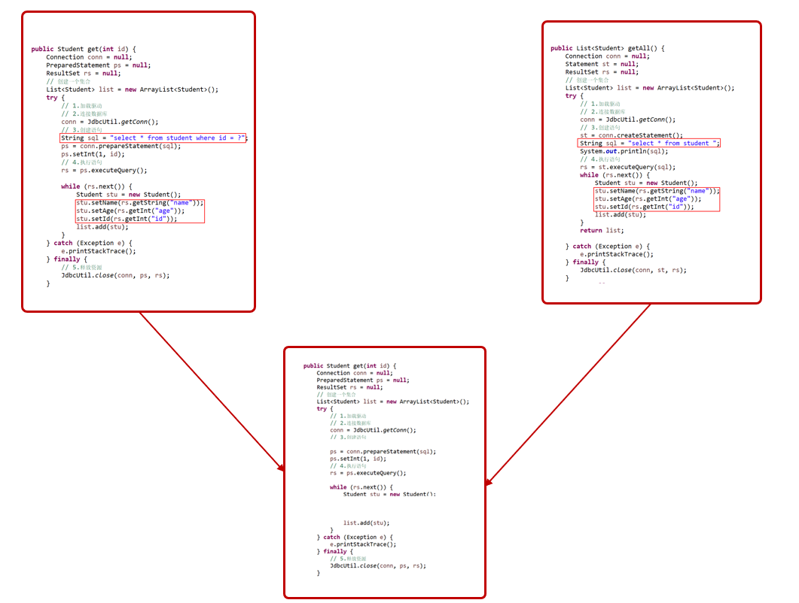
抽取代码，也是写在com.it666.jdbc.util中的CRUDTemplate类中
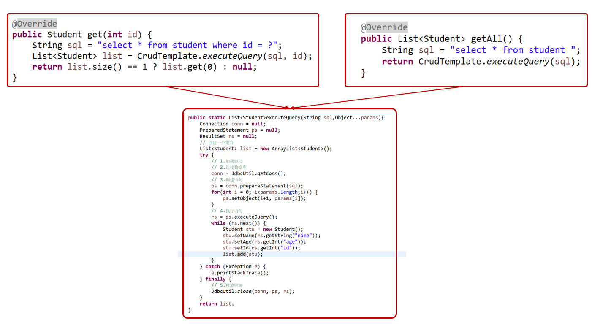


## 用结果集处理器改进DQL
每一个都封装成了student对象，这写死了，只能查询学生，使用泛型改进
不知道封装成什么类型的对象，就不应该处理结果集

解决办法
- 把处理结果集的行为交给每个DAO
- 为了规范每个DAO的处理结果集，大家都叫同样的名字，这样在模板中就可以调用同一个名称
- 定义一个处理结果集的接口

1. 定义一个接口

声明一个处理结果集方法 com.it666.jdbc.handler中的IResultSetHandler
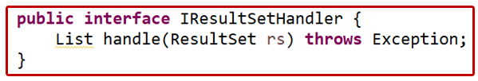
2. 在具体DAO当中实现接口

实现处理结果集方法 com.it666.jdbc.handler中的StudentResHandleImp
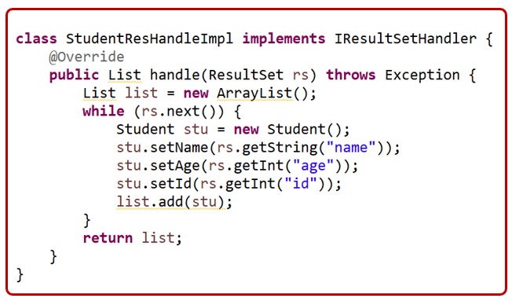

3. 创建一个接口实现对象传给查询方法

com.it666.jdbc.dao.impl中的StudentDaoImpl
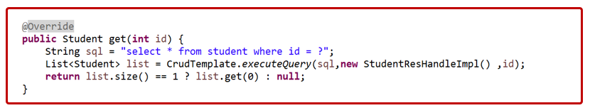

4. 在查询方法当中调用处理结果集方法

com.it666.jdbc.util中的CRUDTemplate
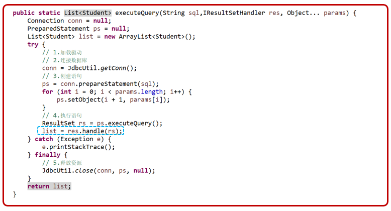

项目结构
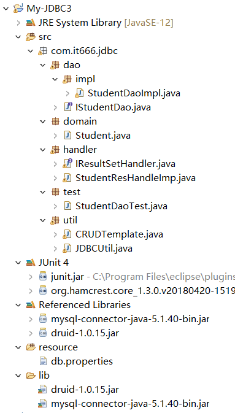

总流程
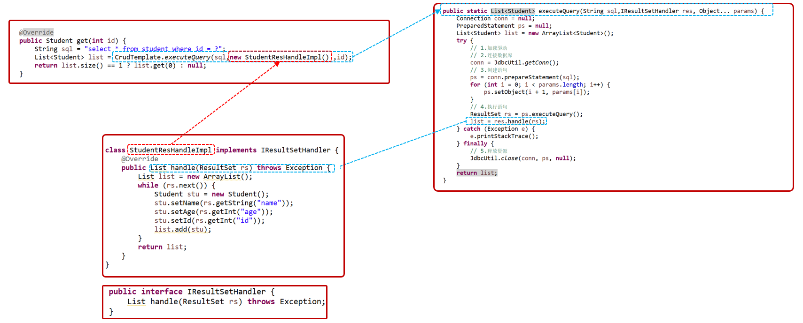

## 用泛型改进结果集处理器
1. 直接定义为T

处理所有结果集都必须得要返回List
有的时候没有必要返回List,想要查询的仅仅是一个结果整数，此时还必须得要从List当中出来

2. 由调用者自己来决定返回什么内容

统一规定返回类型为T类型，调用者使用时去决定是什么类型
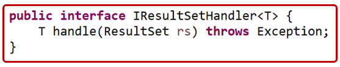

3. 实现类当中实现接口时，要指定返回什么类型
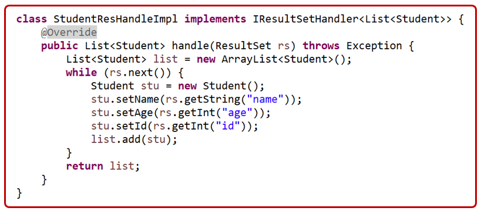

4.声明方法时，声明返回值为一个泛型类型，具体是什么类型，有参数来指定

在方法的参数中标识泛型 必须在方法名前加<T> T 不然报错
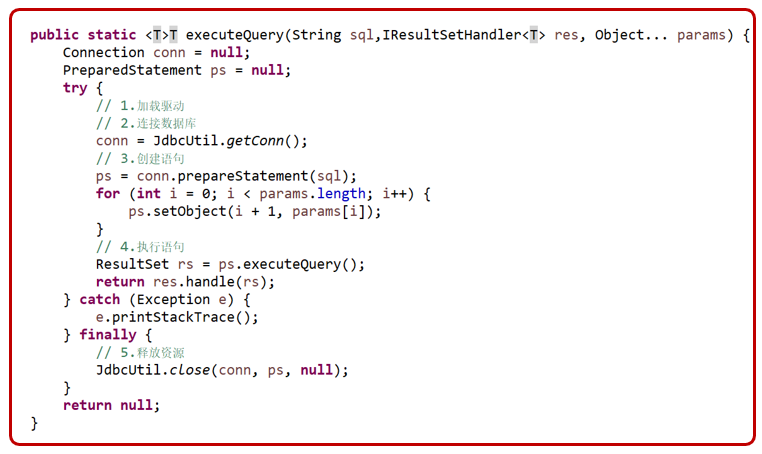


总体结构
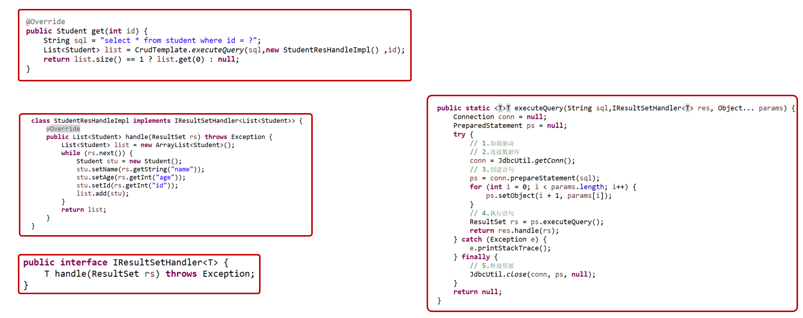

例子：添加获取总人数方法
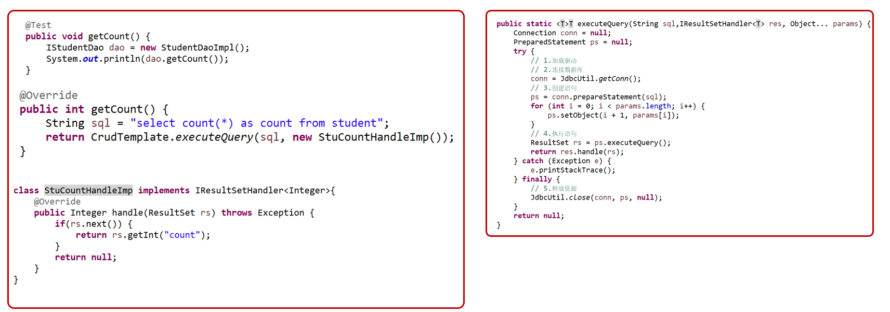

## 结构集处理器

存在的问题
该类只能将结果集中的一行数据封装成一个Student对象
我们如果有多个domain，就得提供多个结果集处理器

自动的把一行行数据封装成对象，自动设置属性，结果集处理器，处理不同表时，干的事都一样
1.给我一个要封装的类
2.自动设置属性

规定
1.表中的列名必须和对象中的属性名相同
2.规定表中的类型必须和Java中的类型匹配
想要完成此项工作，就要使用内省机制

#### 实现步骤
1.创建一个类实现结果集处理器
    实现的时候也不知道是什么类型，所以也可以指定为一个泛型
2.提供一个字段，表示要封装成对象的类型
3.提供一个构造器，在创建时，就指定是什么类型
4.在实现方法当中，通过内省机制获取所有属性名称，做为列名
5.通过传入的类字节码创建对象
6.通过内省获取字节码中所有的信息
7.获取所有的属性描述器
8.遍历属性描述器，获取对象的属性名称 ，规定的属性名和列名相同
9.通过列名获取结果集中的值
10.调用属性的set方法把属性的值设置进去

## 内省
Class类型
- 字节码类型
- 所有的字节码把他们当做一个群体类型
- 通过字节码创建对象
Student stu = Student.class.newInstance();

#### 内省

内省 (Introspector类)
用于查看和操作JavaBean中的属性
    
Introspector.getBeanInfo(A.class,B.class);
- 获取指定类当中的字节码属性信息
- 获取A类及A类父类当中的属性，但是不包括指定的类
- 返回值BeanInfo


BeanInfo

- getPropertyDescriptors()

获取JavaBean中的属性描述器
返回的是一个数组（PropertyDescriptor[]）
每一个属性都有描述器
JavaBean中有多个属性，所以返回了一个数组

- 获取属性名
pd.getName();
- 获取get方法
pd.getReadMethod();
- 获取set方法
pd.getWriteMethod
- 动态调用方法
方法名.invoke(对象名称,"值")
## 内省改进结果集处理器

注意属性必须和数据字段名相同

封装一个对象的通用结果集处理器
```java
// package com.it666.jdbc.handler;
// BeanHandler 封装一个对象
public class BeanHandler<T> implements IResultSetHandler<T> {
	private Class<T> classType;

	public BeanHandler(Class<T> classType) {
		this.classType = classType;
	}

	@Override
	public T handle(ResultSet rs) throws Exception {
		if (rs.next()) {
			// 创建一个对象
			T obj = this.classType.newInstance();
			// 通过内省来拿属性
			BeanInfo bf = Introspector.getBeanInfo(classType,Object.class);//Object.class代表不要获取Object，获取到Object就停止
            
            // 获取所有描述器
			PropertyDescriptor[] pds = bf.getPropertyDescriptors();
			
			for (PropertyDescriptor pd : pds) {
				// 根据属性名去数据库里取值
                Object val = rs.getObject(pd.getName());
				
                // 给创建的对象设置属性值
				pd.getWriteMethod().invoke(obj, val);
			}
			return obj;
		}
		
		return null;
	}

}
```
调用通用结果集处理器
```java
@Override
public Student get(int id) {  
    String sql = "select * from stu where id = ?";
    // 传入new BeanHandler<Student>(Student.class)
    // Student.class代表需要封装一个Student类型
    // <Student>代表返回值为Student类型

    return  CRUDTemplate.executeQuery(sql,new BeanHandler<Student>(Student.class) ,id);
    
}
```

封装多个对象的通用结果集处理器

```java
// package com.it666.jdbc.handler;
// BeanListHandler 封装多条信息的结果集处理器
public class BeanListHandler<T> implements IResultSetHandler<List<T>> {
	private Class<T> classType;
	public BeanListHandler(Class<T> classType) {
		this.classType = classType;
	}
	
	@Override
	public List<T> handle(ResultSet rs) throws Exception {
		List<T> list = new ArrayList<>();
		
		while (rs.next()) {
			T obj = classType.newInstance();
			BeanInfo bf = Introspector.getBeanInfo(this.classType,Object.class);
			PropertyDescriptor [] pds = bf.getPropertyDescriptors();
			
			for (PropertyDescriptor pd : pds) {
				Object val = rs.getObject(pd.getName());
				pd.getWriteMethod().invoke(obj, val);
				
			}
			
			list.add(obj);
		}
		
		return list;
	}

}

```

调用通用结果集处理器

```java
@Override
public List<Student> getAll() {
    String sql = "select * from stu";
    return CRUDTemplate.executeQuery(sql,new BeanListHandler<Student>(Student.class));
}
```
工程结构
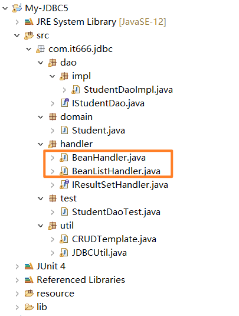


## 整体重构思路
1. 写DAO接口，在实现类中现实各种方法save(),delete(),updata(),get(),getAll();
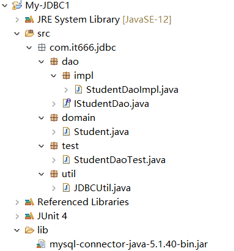
- 声明静态变量：驱动名称、url、用户名、密码
- 静态代码块加载驱动
- JDBCUtil提供获取Connection对象和关闭资源的方法
- 预编译语句对象，解决拼接sql语句太麻烦的问题

2. 用连接池和配置文件改进，创建CRUDTemplate类，DML使用executeUpdate方法，DQL使用executeQuery方法

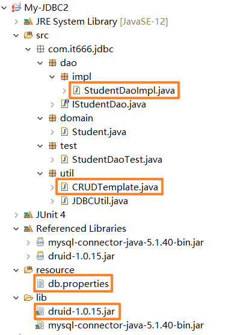

3. 结果集处理器改进

在实现类StudentDaoImpl中添加class StudentResHandleImp implements IResultSetHandler

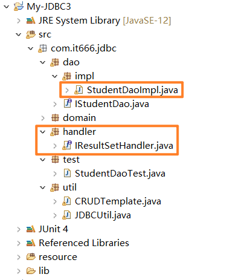


4. 用泛型改进结果集处理器
```java
// 接口
public interface IResultSetHandler<T> {
	T handle (ResultSet rs) throws Exception;
}
// 接口实现类
// package com.it666.jdbc.dao.impl;
// 获取对象List的结果集处理器
class StudentResHandleImp implements IResultSetHandler<List<Student>>{ }
// 获取一个Integer的结果集处理器
class StuCountResultSetImpl implements IResultSetHandler<Integer>{ }

```

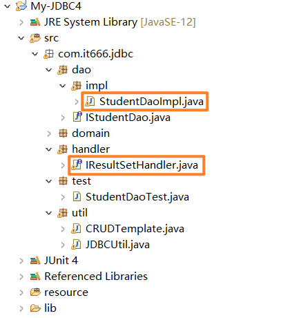

5. 用内省改进
针对DQL，对get()和getAll()的改进代码不同
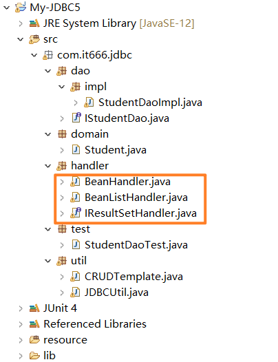

## 参考资料
[Java零基础到高级JDBC连接数据库](https://study.163.com/course/introduction/1005977005.htm)