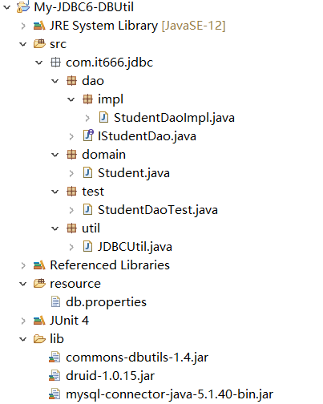

## DBUtils
Apache公司编写的数据库操作实用的工具，小巧，简单，实用
封装了对JDBC的操作，简化了JDBC操作

#### QueryRunner
- QueryRunner(DataSource ds) 提供数据源连接池，会自动帮你创建连接
- Update(String sql,Object...obj) 执行更新数据
- query(String sql, ResultSetHandler<T> rsh,Object...params) 执行查询


#### ResultHandler
- query(sql, new BeanHandler<Student>(Student.class), params) 把查询的结果封装成一个指定对象
- query(sql, new BeanListHandler<Student>(Student.class) 把查询结果封装成一个指定对象集合
- qr.query(sql, new ScalarHandler()) 查询单个值，返回为一个Long类型
- qr.query(sql, new MapListHandler()) 把查询的结果封装成一个Map集合
- query(sql, new ColumnListHandler("列名")) 查询指定的列

## 使用DBUtils

1. 导入jar包，build path

commons-dbutils-1.4.jar
druid-1.0.15.jar
mysql-connector-java-5.1.40-bin.jar

2. 在JDBCUtil中提供一个获取DataSource的方法

```java
// package com.it666.jdbc.util;

public class JDBCUtil {
	
	public static DataSource ds = null; 
	static {
		try {
			Properties p = new Properties();
			FileInputStream in;
			in = new FileInputStream("resource/db.properties");
			p.load(in);

			ds = DruidDataSourceFactory.createDataSource(p);// 这样写的ProPerties必须按照条件写
		} catch (Exception e) {
			e.printStackTrace();
		}
		
	}
	public static DataSource getDataSource() {
		return ds;
	}
}

```

3. 在DAO实现类的方法中创建QueryRunner对象，DML使用update方法执行，DQL使用query方法执行

```java
// package com.it666.jdbc.dao.impl;

public class StudentDaoImpl implements IStudentDao {

	@Override
	public void save(Student stu) {
		String sql = "insert into stu(name,age) values (?,?)";
		QueryRunner qr = new QueryRunner(JDBCUtil.getDataSource());
		try {
			qr.update(sql,stu.getName(),stu.getAge());
		} catch (SQLException e) {
			e.printStackTrace();
		}
		
	}

	@Override
	public Student get(int id) {
		QueryRunner qr = new QueryRunner(JDBCUtil.getDataSource());
		String sql = "select * from stu where id = ?";
		try {
			return qr.query(sql, new BeanHandler<Student>(Student.class),id);
		} catch (SQLException e) {
			e.printStackTrace();
		}
		return null;
	}

	@Override
	public List<Student> getAll() {
		
		QueryRunner qr = new QueryRunner(JDBCUtil.getDataSource());
		String sql = "select * from stu";
		try {
			return qr.query(sql, new BeanListHandler<Student>(Student.class));
		} catch (SQLException e) {
			e.printStackTrace();
		}
		return null;
		
	}

}

```


项目结构


## 参考资料
[Java零基础到高级JDBC连接数据库](https://study.163.com/course/introduction/1005977005.htm)