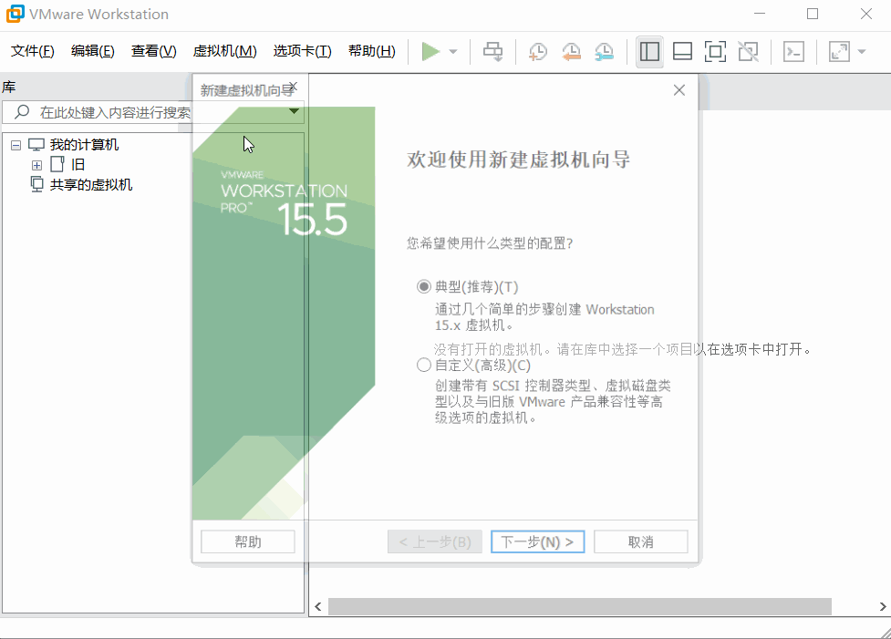
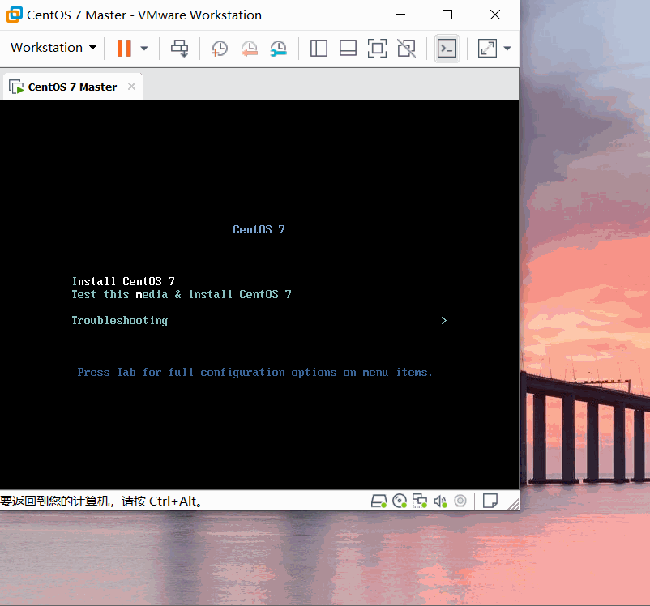
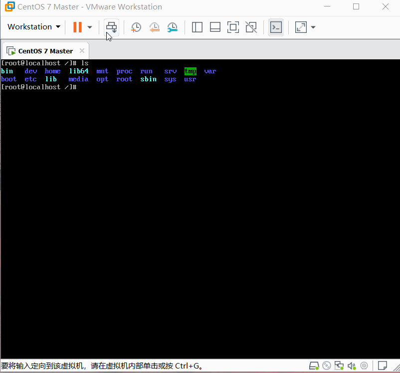
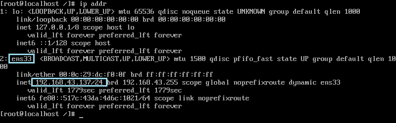
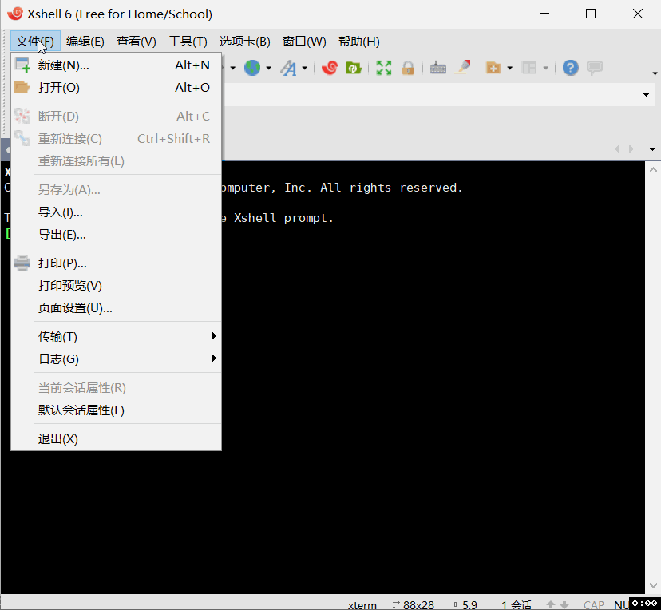
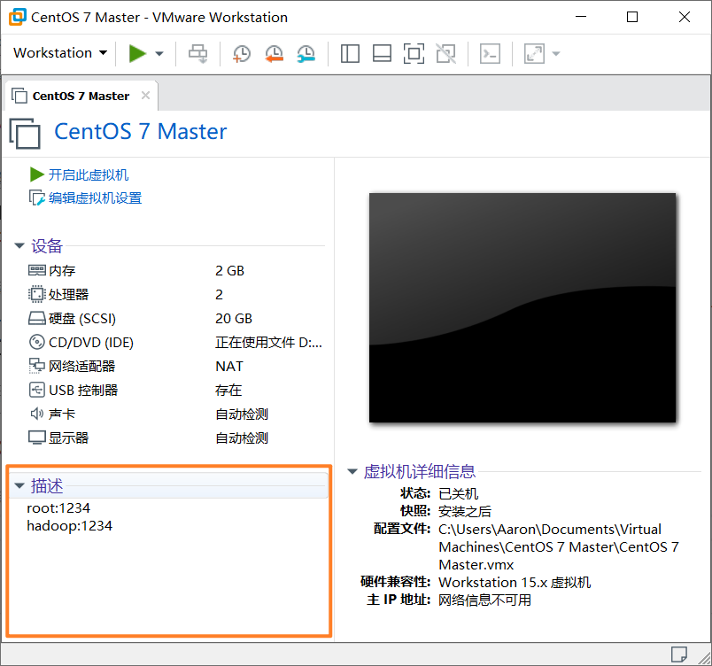

## 环境和软件
宿主机（实体机）：i7 7700HQ（4核8线程 ） 16GB内存 SSD
虚拟机：VMware Workstaion 15 Pro 15.5.0
CentOS7镜像：[CentOS-7-x86_64-Minimal-1908.iso](http://mirrors.oit.uci.edu/centos/7.7.1908/isos/x86_64/CentOS-7-x86_64-Minimal-1908.iso) (Minimal为精简版本，无图形界面)

## 配置虚拟机
1. 点击菜单栏 “文件” - “新建虚拟机” 开始配置虚拟机
2. 大部分选择默认配置即可，依次配置：配置类型-安装来源-操作系统-虚拟机名称与位置-磁盘容量-自定义配置
3. 自定义配置：内存可以根据和处理器根据实际配置，打开处理器的虚拟化引擎；在新CD/DVD(IDE) 选择需要安装的镜像的路径

注意点：
1. 可以可以根据宿主机实际情况配置分给虚拟机的资源（计划开多台虚拟机，要注意虚拟机配置总和不要超过宿主机配置）
2. 进入虚拟机后，鼠标会被困在虚拟机内，同时按下 Ctrl和Alt 释放鼠标
3. 更详细的可以参考这两个教程：[VMware安装Centos7超详细过程（图文）](https://blog.csdn.net/babyxue/article/details/80970526) [Centos7.7安装及配置教程](https://juejin.im/post/6844904101583519752)

## 安装CentOS
1. 大部分配置默认即可，需要特别注意的就是：选择安装磁盘、打开网络连接、配置root账户密码、新建普通用户

2. 配置结束后，等待安装完成，然后按照提示重启即可进入系统

## 安装之后
1. 安装后可以先保存一份快照，左下角的 “正在保存状态” 消失了快照才保存完成

2. 网络设置
通过 ip addr 先查看ip地址，框出来的为本机ip

3. 安装 Xshell 和Xftp
Xshell可以通过网络连接虚拟机，Xftp可以通过网络传输文件到虚拟机，[非商业用途可免费获取这两款软件](https://www.netsarang.com/zh/free-for-home-school/)

4. 使用Xshell连接虚拟机
在“主机” 输入的是刚才虚拟机的ip，然后输入用户名和密码

5. 记录账户信息
账户密码久了容易忘记，可以写在 “描述” （注意信息安全）

