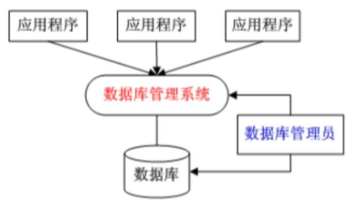

## 数据库概述

#### 数据库系统 Database System DBS
- 数据库 Database, DB
- 数据库管理系统 Database Management System, DBMS
- 应用程序
- 数据库管理员 Database Administrator, DAB

关系：


数据库管理系统属于系统软件，是一种操纵和管理数据库的大型软件，用于建立、使用和维护数据库，简称DBMS
它对数据库进行统一的管理和控制，以保证数据库的**安全性**和**完整性**
用户通过DBMS访问数据库中的数据，数据库管理员也通过DBMS进行数据库的维护工作
数据库管理系统是数据库系统的**核心**，是管理数据库的软件
我们一般说的数据库,就是指的DBMS

#### 常见数据库
- 关系型数据库：Oracle,DB2,MySQL,SQL Server
- 非关系型数据库NoSQL：MongoDB,Redis,HBase

非关系型数据库NoSQL：(NoSQL = Not Only SQL)，意即“不仅仅是SQL”


#### 关系型数据库 RDBMS 
- 表：类似Excel表格，具有固定的列数,和任意的行数
- 数据库：数据库是一些关联表的集合
- 列：一个数据项 Field 字段
- 行：一条记录  row
- 主键：唯一，不为空，可以使用主键来查询数据
- 外键：外键用于关联两个表
- 索引：使用索引可快速访问数据库表中的特定信息，索引是对数据库表中一列或多列的值进行排序的一种结构，类似于书籍的目录
	
## MySQL数据库
MySQL是开源的，由瑞典MySQL AB公司开发，现在属于Oracle旗下产品。
MySQL可以运行在不同系统上，并且支持多种语言，包括C、C++、Python、Java、Perl、PHP、Eiffel、Ruby和Tcl等

MySQL有两种数据库：
系统数据库(4个数据库服务器自带的)
- information_schema：存储数据库对象信息，如用户表信息、列信息、根除、字符、分区
- performance_schema：存储数据库服务器性能参数信息
- mysql：存储数据库用户权限信息
- sys：通过这个库可以快速的了解系统的元数据信息，这个库是通过视图的形式把information_schema和performance_schema结合起来，查询出更加令人容易理解的数据

用户数据库（用户自己创建的数据库,一个项目用一个数据库）

#### 连接
1. 使用命令提示符(cmd) 连接（把MySQL的bin配置到环境变量）
2. 使用Navicat连接MySQL

实际上手
```sql
-- 命令行方式连接
-- 1.连接数据库 -u 表示用户 -p 表示密码
MySQL -u root -p
-- 输入密码 进入mysql命令界面

-- 开始写sql语句，有三点要注意
--    1.每一条sql语句后面都要以分号结尾;
--    2.sql语句的注释是两个减号：--
--    3.sql语句的关键字不区分大小写，非关键字像数据库名、表名这些最好都区分一下大小写，避免出错

-- 2.显示所有数据库	show databases; (注意最后是有s)
show databases;
-- 3.创建数据一个数据库(并设置字符集为UTF-8) create database 数据库名  character set utf8;
create database my_demo character set utf8;
-- 4.选择数据库 use 数据库名;
use my_demo;
-- 5.查看这个数据库里所有表 show tables; (注意最后是有s)
show tables;
-- 6.新建表 create table 表名 (列名 数据类型,类名 数据类型...);
create table my_table (name varchar(20),age int);
-- 7.查看表的字段信息 desc 表名;
desc my_table;
-- 8.删除表 drop table 表名;
drop table my_table;
-- 9.删除数据库 drop database 数据库名；
drop database my_demo;
```

## 参考资料
[Java零基础到高级MySQL数据库](https://study.163.com/course/introduction/1005932016.htm)
