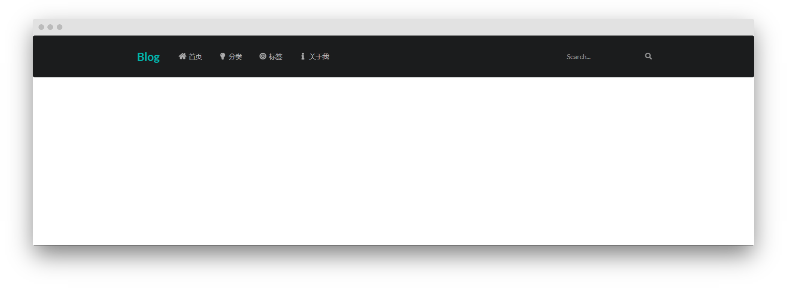
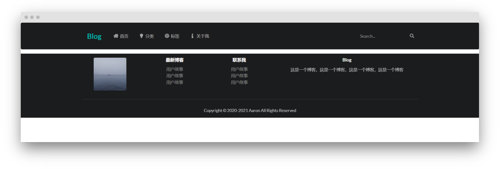
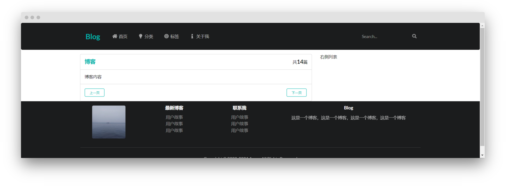
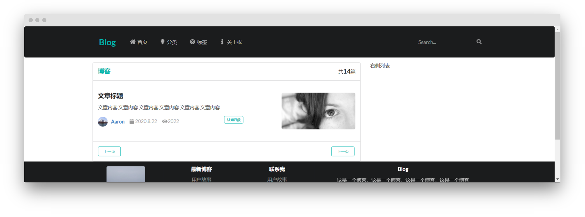
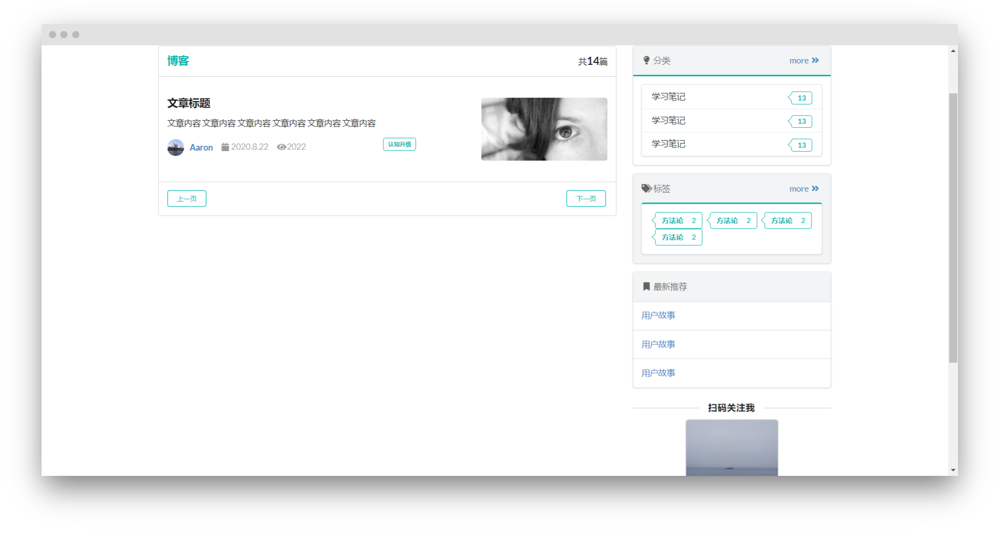

Semanti UI官方文档：https://semantic-ui.com/
## 导入依赖
1. 导入JQuery和Semantic UI

``` html
<script src="https://cdn.jsdelivr.net/npm/jquery@3.2/dist/jquery.min.js"></script>
<script src="https://cdn.jsdelivr.net/npm/semantic-ui@2.4.2/dist/semantic.min.js"></script>
```

2. 在head中导入CSS样式

```html
<link rel="stylesheet" href="https://cdn.jsdelivr.net/npm/semantic-ui@2.4.2/dist/semantic.min.css">
```

3. 优化移动端

```html
<meta name="viewport" content="width=device-width ,initial-scale=1.0">
```

最后是这样
```html
<!DOCTYPE html>
<html lang="en">
<head>
    <meta charset="UTF-8">
    <meta name="viewport" content="width=device-width ,initial-scale=1.0">
    <link rel="stylesheet" href="https://cdn.jsdelivr.net/npm/semantic-ui@2.4.2/dist/semantic.min.css">
    <title>首页</title>
</head>
<body>

<script src="https://cdn.jsdelivr.net/npm/jquery@3.2/dist/jquery.min.js"></script>
<script src="https://cdn.jsdelivr.net/npm/semantic-ui@2.4.2/dist/semantic.min.js"></script>
</body>
</html>
```
## 在body中设计页面
先写大体框架，然后填充每个部分

```html
    <!--导航-->
    <nav>

    </nav>

    <!--内容-->
    <div>

    </div>
    
    <!--尾巴-->
    <footer>
        
    </footer>
```

### 导航
效果：

```html
 <!--segment 代表是一的长条块，默认占满宽度 -->
    <!--inverted 反转颜色使其为黑色-->
    <nav class="ui inverted segment ">
        <div class="ui container">
            <!--secondary menu 横向排列菜单按钮-->
            <div class="ui inverted secondary menu">
                <!--teal 青色-->
                <h2 class="ui teal item header ">Blog </h2>
                <!--home icon 家图标-->
                <a href="#" class="ui item"><i class="home icon"></i>首页</a>
                <a href="#" class="ui item"><i class="idea icon"></i>分类</a>
                <a href="#" class="ui item"><i class="target icon"></i>标签</a>
                <a href="#" class="ui item"><i class="info icon"></i>关于我</a>

                <!--right 排列在右侧-->
                <div class="right item">
                    <!--ui input 美化输入框-->
                    <!--transparent 使搜索框内透明-->
                    <!--inverted 反转文字和图标颜色否则和背景同为黑色-->
                    <div class="ui icon inverted transparent input">
                        <input type="text" placeholder="Search...">
                        <i class="search link icon"></i>
                    </div>
                </div>
            </div>
        </div>
    </nav>
```
导航布局可以通过在 secondary menu 中嵌套 header item 和 item 实现

## 尾部
效果图：

添加me.css自定义样式

```css
/*------opacity------*/
.m-opacity-mini {
    opacity: 0.8 !important;
}

.m-inline-block {
    display: inline-block;
}

.m-padded-tb-big {
    padding-top: 3em !important;
    padding-bottom: 3em !important;
}

.m-container {
    max-width: 72em !important;
    margin: auto !important;
}
```

在head中引入

```html
<link rel="stylesheet" href="../static/css/me.css">
```

```html
    <!--尾巴-->
    <footer>
        <!--vertical 隐藏segment上下的线-->
        <div class="ui inverted vertical segment">
            <!--使得每个column中的元素 左右居中-->
            <div class="ui center aligned container">
                <!--divided grid 分块 共16块-->
                <div class="ui divided grid">
                    <div class="three wide column">
                        <div class="ui list">
                            <div class="item">
                                <!--ui rounded image 圆角图片-->
                                
                            </div>
                        </div>
                    </div>

                    <div class="three wide column">
                        <h4 class="ui inverted header">最新博客</h4>
                        <!--link 显示灰色-->
                        <div class="ui inverted link list">
                            <div class="item">用户故事</div>
                            <div class="item">用户故事</div>
                            <div class="item">用户故事</div>
                        </div>
                    </div>

                    <div class="three wide column">
                        <h4 class="ui inverted header">联系我</h4>
                        <div class="ui inverted link list">
                            <div class="item">用户故事</div>
                            <div class="item">用户故事</div>
                            <div class="item">用户故事</div>
                        </div>
                    </div>

                    <div class="seven wide column">
                        <h4 class="ui inverted header">Blog</h4>
                        <p class="m-opacity-mini">这是一个博客，这是一个博客，这是一个博客，这是一个博客</p>

                    </div>


                </div>
                <!--divider 分割线-->
                <div class="ui inverted section divider"></div>

                <!--版权声明-->
                <p class="m-opacity-mini">Copyright © 2020-2021 Aaron All Rights Reserved</p>
            </div>
        </div>
    </footer>
```
水平布局可以通过 divided grid ,将水平空间分割开来，竖直显示文字可以通过 list 内部嵌套item


## 博客主体


```html
    <!--内容-->
    <div>
        <div class="ui container">

            <div class="ui grid">
                <!--分割成11和5-->

                <!--左侧-->
                <div class="eleven wide column">
                    <!--top 头部-->
                    <!--attached 可拼接-->
                    <div class="ui top attached segment">
                        <div class="ui middle aligned two column grid">
                            <div class="column">
                                <div class="ui teal header">博客</div>
                            </div>
                            <div class="right aligned column">
                                共<h3 class="orange header m-inline-block">14</h3>篇
                            </div>
                        </div>
                    </div>

                    <!--博客内容-->
                    <div class="ui attached segment">
                        博客内容
                    </div>

                    <div class="ui bottom attached segment">
                        <div class="ui two column grid">
                            <div class="column">
                                <a href="#" class="ui teal basic mini button">上一页</a>
                            </div>

                            <div class="right aligned column">
                                <a href="#" class="ui teal basic mini button">下一页</a>
                            </div>
                        </div>
                    </div>

                </div>

                <!--右侧-->
                <div class="five wide column">
                    右侧列表
                </div>
            </div>
        </div>
    </div>
```

使用grid实现左右分栏的布局，左侧每一块都是一个segment，用attached连接

博客简介

```html
                <!--博客内容-->
                <div class="ui attached segment">
                    <!--padded 增加内边距-->
                    <!--vertical 去除segment四周的边框线-->
                    <div class="ui padded vertical segment">
                        <div class="ui grid">
                            <!--11 5 分割-->
                            <div class="eleven wide column">
                                <h3 class="ui header">文章标题</h3>
                                <p class="">文章内容 文章内容 文章内容 文章内容 文章内容 文章内容 </p>
                                <!--horizontal 使内部元素竖直居中-->
                                <!--list 使得文字与头像同行-->
                                <div class="ui grid">
                                    <div class="eleven wide column">
                                        <!--horizontal 水平摆放内部元素-->
                                        <div class="ui  link horizontal list">
                                            <div class="item">
                                                <!--ui avatar image 小圆头像-->
                                                
                                                <!--content 使得文字不会换行 能与图片同行-->
                                                <div class="content"><a href="#" class="header">Aaron</a></div>
                                            </div>
                                            <div class="item">
                                                <i class="calendar icon"></i>2020.8.22
                                            </div>
                                            <div class="item">
                                                <i class="eye icon"></i>2022
                                            </div>

                                        </div>
                                    </div>
                                    <div class="five wide column">
                                        <div class="right aligned column">
                                            <a href="#" target="_blank">
                                                <div class="ui basic teal mini label">认知升级</div>
                                            </a>

                                        </div>
                                    </div>

                                </div>

                            </div>
                            <div class="five wide column">
                                <a href="#" target="_blank">
                                    
                                </a>
                            </div>
                        </div>
                    </div>

                </div>
```
先通过grid划分左右分栏比例11:5，左侧再分11:5
水平摆放可以使用horizontal list 内部嵌套item


右侧菜单：

```html
<!--内容-->
<div class="m-container m-padded-tb-big ">
    <div class="ui container">

        <div class="ui grid">
            <!--分割成11和5-->

            <!--左侧-->
            <div class="eleven wide column">
                <!--top 头部-->
                <!--attached 可拼接-->
                <div class="ui top attached segment">
                    <div class="ui middle aligned two column grid">
                        <div class="column">
                            <div class="ui teal header">博客</div>
                        </div>
                        <div class="right aligned column">
                            共<h3 class="orange header m-inline-block">14</h3>篇
                        </div>
                    </div>
                </div>

                <!--博客内容-->
                <div class="ui attached segment">
                    <!--padded 增加内边距-->
                    <!--vertical 去除segment四周的边框线-->
                    <div class="ui padded vertical segment">
                        <div class="ui grid">
                            <!--11 5 分割-->
                            <div class="eleven wide column">
                                <h3 class="ui header">文章标题</h3>
                                <p class="">文章内容 文章内容 文章内容 文章内容 文章内容 文章内容 </p>
                                <!--horizontal 使内部元素竖直居中-->
                                <!--list 使得文字与头像同行-->
                                <div class="ui grid">
                                    <div class="eleven wide column">
                                        <!--horizontal 水平摆放内部元素-->
                                        <div class="ui  horizontal link list">
                                            <div class="item">
                                                <!--ui avatar image 小圆头像-->
                                                
                                                <!--content 使得文字不会换行 能与图片同行-->
                                                <div class="content"><a href="#" class="header">Aaron</a></div>
                                            </div>
                                            <div class="item">
                                                <i class="calendar icon"></i>2020.8.22
                                            </div>
                                            <div class="item">
                                                <i class="eye icon"></i>2022
                                            </div>

                                        </div>
                                    </div>
                                    <div class="five wide column">
                                        <div class="right aligned column">
                                            <a href="#" target="_blank">
                                                <div class="ui basic teal mini label">认知升级</div>
                                            </a>

                                        </div>
                                    </div>

                                </div>

                            </div>
                            <div class="five wide column">
                                <a href="#" target="_blank">
                                    
                                </a>
                            </div>
                        </div>
                    </div>

                </div>

                <div class="ui bottom attached segment">
                    <div class="ui two column grid">
                        <div class="column">
                            <a href="#" class="ui teal basic mini button">上一页</a>
                        </div>

                        <div class="right aligned column">
                            <a href="#" class="ui teal basic mini button">下一页</a>
                        </div>
                    </div>
                </div>

            </div>

            <!--右侧-->
            <div class="five wide column">
                <div class="ui segments">
                    <!--secondary segment 是浅灰色背景-->
                    <div class="ui secondary segment">
                        <div class="ui two column grid">
                            <div class="column">
                                <i class="idea icon"></i>分类
                            </div>
                            <div class="right aligned column">
                                <a href="#" target="_blank">more <i class="angle double right icon"></i></a>
                            </div>
                        </div>
                    </div>
                    <!--teal 间隔线青色-->
                    <div class="ui teal segment">
                        <!--vertical 合并两个单元 fluid填充满宽度-->
                        <div class="ui vertical fluid menu">
                            <a href="#" class="item">
                                学习笔记
                                <div class="ui teal basic left pointing label">13</div>
                            </a>
                            <a href="#" class="item">
                                学习笔记
                                <div class="ui teal basic left pointing label">13</div>
                            </a>
                            <a href="#" class="item">
                                学习笔记
                                <div class="ui teal basic left pointing label">13</div>
                            </a>
                        </div>


                    </div>
                </div>

                <div class="ui segments">
                    <div class="ui secondary segment">
                        <div class="ui two column grid">
                            <div class="column">
                                <i class="tags icon"></i>标签
                            </div>
                            <div class="right aligned column">
                                <a href="#" target="_blank">more <i class="angle double right icon"></i></a>
                            </div>
                        </div>
                        <div class="ui teal segment">
                            <a href="#" target="_blank" class="ui teal basic left pointing label">
                                方法论 <div class="detail">2</div>
                            </a>
                            <a href="#" target="_blank" class="ui teal basic left pointing label">
                                方法论 <div class="detail">2</div>
                            </a>
                            <a href="#" target="_blank" class="ui teal basic left pointing label">
                                方法论 <div class="detail">2</div>
                            </a>
                            <a href="#" target="_blank" class="ui teal basic left pointing label">
                                方法论 <div class="detail">2</div>
                            </a>
                        </div>
                    </div>
                </div>
                <div class="ui segments">
                    <div class="ui secondary segment">
                        <i class="bookmark icon"></i>最新推荐
                    </div>

                    <div class="ui segment">
                        <a href="#" target="_blank" >用户故事</a>
                    </div>
                    <div class="ui segment">
                        <a href="#" target="_blank" >用户故事</a>
                    </div>
                    <div class="ui segment">
                        <a href="#" target="_blank" >用户故事</a>
                    </div>
                </div>

                <!--二维码-->
                <!--horizontal divider 左右线中间字-->
                <h4 class="ui horizontal divider header">
                    扫码关注我
                </h4>

                <div class="ui centered card" style="width: 11em">
                    
                </div>

            </div>

        </div>


    </div>


</div>

```
同列左右布局可以采用：two column grid 内嵌column和right aligned column的方式
一个segments内可以嵌套多个segment