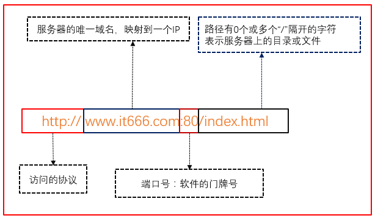
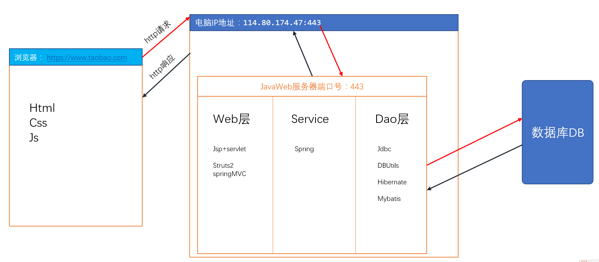
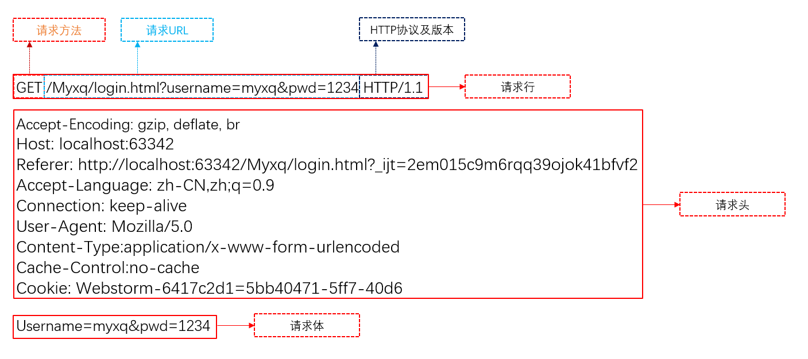
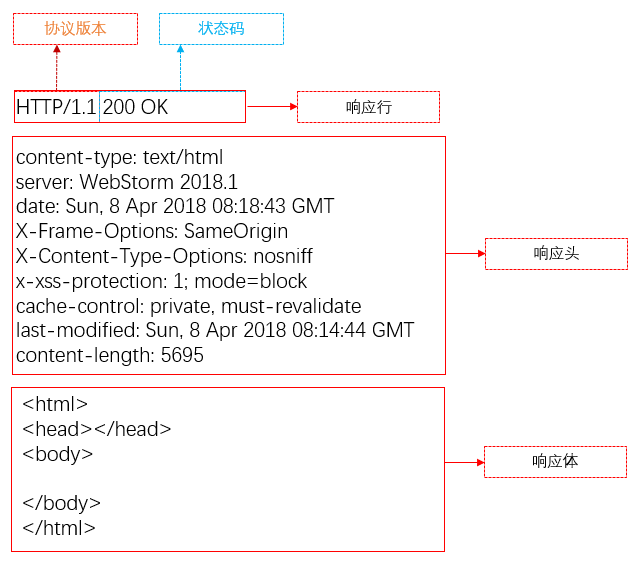

## CS与BS
软件使用方式上两种划分
#### C/S:Client/Server PC客户端、服务器架构
特点：在服务器当中就主要是一个数据库，把所有的业务逻辑以及界面都交给客户端完成
优点：较为安全，用户界面丰富，用户体验好
缺点：每次升级都要重新安装，针对于不同的操作系统开发，可移植性差

#### B/S：Browser/Server 浏览器/服务器架构
特点：
- 基于浏览器访问的应用
- 把业务层交给服务器来完成，客户端仅仅做界面的渲染和数据的交换

优点：只开发服务器端，可以跨平台、移植性很强
缺点：安全性比较低，用户体验较差

## Web资源
WEB网页，它用于表示网络主机上供外界访问的资源
Web资源分类
- 静态Web资源：指web页面中供人们浏览的数据始终是不变
- 动态Web资源：指web页面中供人们浏览的数据是由程序产生的，不同时间点访问web页面看到的内容各不相同

web资源存放在哪里
所有的web资源都放在一个web服务器当中
web服务器就是可以供外界访问web资源的一个软件
web资源放到指定的目录当中，就可以通过对应的端口在浏览器当中访问到

URL地址
协议：//主机地址：端口号/资源地址

资源访问流程
客户端：浏览器、Android程序、iOS程序、微信小程序
服务器：php服务器、tomcat服务器、nodeJS服务器等

http请求的过程
浏览器通过网址（就是IP地址）找到对应的电脑，电脑当中安装的有web服务器，通过端口号找到对应服务器，服务器把页面返回给你

BS结构流程图

#### 请求与响应
请求：把客户端请求发送给服务器
响应：服务器把你要的数据发送给客户端

请求与响应都要一定的格式
- 约定好客户端以什么样的格式把数据给服务器
- 约定好服务器以什么样的格式把数据给客户端
- 这个约定使用的就是HTTP协议

## HTTP协议
HTTP，超文本传输协议 (HyperText Transfer Protocol) 是互联网上应用最为广泛的一种网络协议
所有的WWW文件都必须遵守这个标准
设计HTTP最初的目的是为了提供一种发布和接收HTML页面的方法
约束请求与响应的规则

HTTP组成部分：请求、响应
请求与响应都是成对存在的

请求的发送方式
1. 通过浏览器的地址栏
2. 通过html当中的form表单
3. 通过a链接的href
4. src属性		

## Http请求
#### 1.请求行
请求方式
POST
GET

协议版本
HTTP/1.0，发送请求，创建一次连接，获得一个web资源，连接断开
HTTP/1.1，发送请求，创建一次连接，获得**多个web资源，保持连接**
#### 2.请求头
请求头是客户端发送给服务器端的一些信息
使用键值对表示key：value
自动的把客户端的信息发送给服务器

#### 3.常见请求头
Referer：    浏览器通知服务器，当前请求来自何处。如果是直接访问，则不会有这个头。常用于：防盗链
If-Modified-Since：浏览器通知服务器，本地缓存的最后变更时间
Cookie：用于存放浏览器缓存的cookie信息
User-Agent：浏览器通知服务器，客户端浏览器与操作系统相关信息
Connection：保持连接状态。Keep-Alive 连接中，close 已关闭
Host：请求的服务器主机名
Content-Length：请求体的长度
Content-Type：如果是POST请求，会有这个头，默认值为application/x-www-form-urlencoded，表示请求体内容使用url编码

Accept：浏览器可支持的MIME类型，文件类型的一种描述方式
- text/html ，html文件
- text/css，css文件
- text/javascript，js文件
- image/*，所有图片文件

Accept-Encoding：浏览器通知服务器，浏览器支持的数据压缩格式。如：GZIP压缩
Accept-Language：浏览器通知服务器，浏览器支持的语言

#### 4.请求体
当请求方式是post，请求体会有请求的参数
如果请求方式为get，请求参数不会出现在请求体中，会拼接在url地址后面

## Http响应
#### 1.状态码
200 ：请求成功
302 ：请求重定向
304 ：请求资源没有改变，访问本地缓存
404 ：请求资源不存在，通常是用户路径编写错误，也可能是服务器资源已删除
500 ：服务器内部错误，通常程序抛异常

#### 2.响应头
服务器端将信息以键值对的形式返回给客户端
自动的把服务器端的信息传给客户端

#### 3.常见响应头
Location：指定响应的路径，需要与状态码302配合使用，完成跳转
Content-Type：响应正文的类型（MIME类型）
Content-Disposition：通过浏览器以下载方式解析正文
Set-Cookie：服务器向浏览器写入cookie
Content-Encoding：服务器使用的压缩格式
Content-length：响应正文的长度
Refresh：定时刷新
Server：服务器名称，默认值：Apache-Coyote/1.1。可以通过conf/server.xml配置进行修改
Last-Modified：服务器通知浏览器，文件的最后修改时间

#### 4.响应体
响应体是服务器回写给客户端的页面正文
浏览器将正文加载到内存
然后解析渲染显示页面内容

## 请求方式

8种请求类型
1. OPTIONS：返回服务器针对特定资源所支持的HTTP请求方法，也可以利用向web服务器发送‘*’的请求来测试服务器的功能性
2. HEAD：请求指定的页面信息，并返回头部信息
3. GET：请求指定的页面信息，并返回实体主体
4. POST：向指定资源提交数据进行处理请求
5. PUT：向指定资源位置上传其最新内容
6. DELETE：请求服务器删除Request-URL所标识的资源
7. TRACE：回显服务器收到的请求，主要用于测试或诊断
8. CONNECT：HTTP/1.1协议中预留给能够将连接改为管道方式的代理服务器
	
## 常用两种请求
#### GET
GET 方法向页面请求发送参数
地址和参数信息中间用 ? 字符分隔
    http://www.it666.com/hello?key1=value1&key2=value2
查询字符串会显示在地址栏的URL中，不安全，请不要使用GET请求提交敏感数据
GET 方法有大小限制：请求字符串中最多只能有 1024 个字符
GET请求能够被缓存
GET请求会保存在浏览器的浏览记录中
可以添加书签
编码类型为application/x-www-form-urlencoded
只允许ASCII字符类型，不能用二进制流
点击刷新时，不会有反应
GET请求主要用以获取数据

#### POST
POST 方法向页面请求发送参数
使用POST方法时，查询字符串在POST信息中单独存在，和HTTP请求一起发送到服务器
编码类型为：application/x-www-form-urlencoded or multipart/form-data. 请为二进制数据使用multipart编码
没有历史记录
参数类型没有限制，可以是字符串也可以是二进制流
数据不会显示在地址栏中，也不会缓存下来或保存在浏览记录中，所以看POST求情比GET请求安全，但也不是最安全的方式。如需要传送敏感数据，请使用加密方式传输
查询字符串不会显示在地址栏中
POST传输的数据量大，可以达到2M，而Get方法由于受到URL长度限制,只能传递大约1024字节. 
POST就是为了将数据传送到服务器段，Get就是为了从服务器段取得数据

## 参考资料
[Java零基础到高级JavaWeb与项目](https://study.163.com/course/introduction/1005981003.htm)