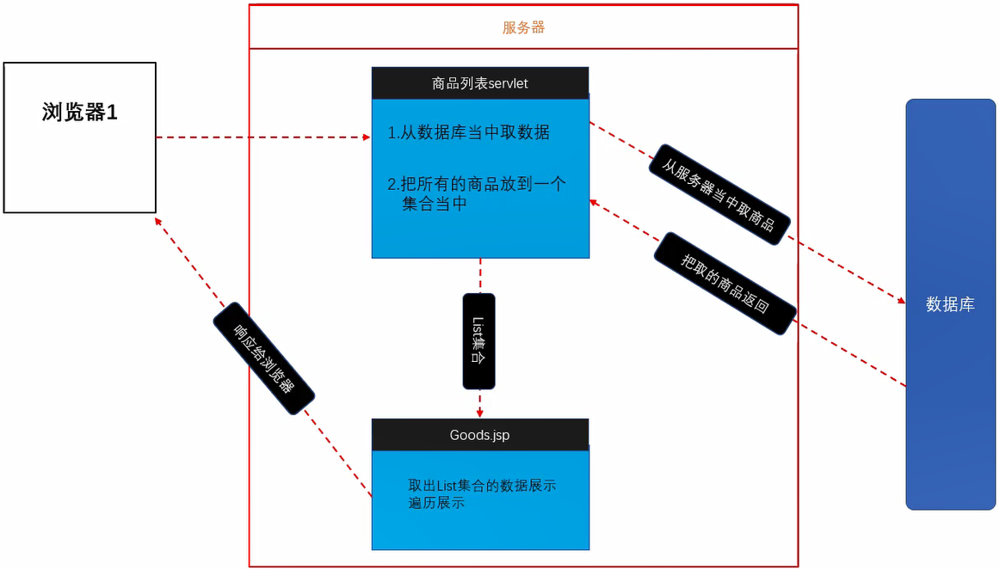

## 准备
复制工程，右键工程-Properties-Web Project Settings-修改项目名
修改.html为.jsp 右键修改文件编码为UTF-8
在每个jsp头部加入
```jsp
<%@ page language="java" contentType="text/html; charset=UTF-8"
    pageEncoding="UTF-8"%>
```
修改网页代码中写死的项目名
修改网页中写死的跳转html为jsp

## 头部尾部分离
新建header.jsp和footer.jsp (仅保留开头的配置，删除html代码)
各自复制header和footer代码，(不需要body)去除不需要的css样式
删除index中的header和footer代码和不需要的css样式 (index只留index.css,header保留common,footer,header)
修改登录和注册页面尾部

## 商品列表思路

从数据库当中取出对应商品展示到页面当中
		
建表
建立ORM
把相关jar拷贝到工程当中
建立servlet
1.连接数据库
2.从数据库当中获取数据
3.把从数据库中取出的数据存放到request域当中
4.转发到商品列表页面，转发时把request对象传入

转发到jsp
1.从请求域当中把数据获取出来
2.从集合当中取出每一个商品，展示到页面当中
商品列表
## 获取数据

导入goods表到数据库，根据表新建domain，设置好字段和bean，提供toString
```java
package com.it666.servlet;

@WebServlet("/GoodsServlet")
public class GoodsServlet extends HttpServlet {
	private static final long serialVersionUID = 1L;

	protected void service(HttpServletRequest request, HttpServletResponse response) throws ServletException, IOException {
		// 1.连接数据库
		QueryRunner qr = new QueryRunner(JDBCUtil.getDataSource());
		String sql = "select * from goods";
		// 2.获取数据
		List<Goods> allGoods = null;
		try {
			allGoods = qr.query(sql, new BeanListHandler<Goods>(Goods.class));
		} catch (SQLException e) {
			e.printStackTrace();
		}
		System.out.println(allGoods);
		// 3. 把数据存到equest域
		request.setAttribute("allGoods", allGoods);
		// 4.转发到商品列表，转发时把request对象传入
		request.getRequestDispatcher("/goods_list.jsp").forward(request, response);	
	}
}
```
## 数据展示
GoodsServlet
```java
package com.it666.servlet;

@WebServlet("/GoodsServlet")
public class GoodsServlet extends HttpServlet {
	private static final long serialVersionUID = 1L;

	protected void service(HttpServletRequest request, HttpServletResponse response) throws ServletException, IOException {
		// 1.连接数据库
		QueryRunner qr = new QueryRunner(JDBCUtil.getDataSource());
		String sql = "select * from goods";
		// 2.获取数据
		List<Goods> allGoods = null;
		try {
			allGoods = qr.query(sql, new BeanListHandler<Goods>(Goods.class));
		} catch (SQLException e) {
			e.printStackTrace();
		}
		System.out.println(allGoods);
		// 3. 把数据存到equest域
		request.setAttribute("allGoods", allGoods);
		// 4.转发到商品列表，转发时把request对象传入
		request.getRequestDispatcher("/goods_list.jsp").forward(request, response);	
	}
}
```
修改goodList.jsp
(前端改成单引号，防止和Java冲突)
```jsp
<!-- 热卖商品 -->
<div id="hot_goods">
    <h3>热卖商品</h3>
    <div class="hot_goods_body">
        <ul>
            <%
                //从域中取数据
                List<Goods> allGoods = (List<Goods>) request.getAttribute("allGoods");
                System.out.print(allGoods);
                if (allGoods != null) {
                    // 取出每一个商品
                    for (Goods pro : allGoods) {
                        out.write("<li>");
                        out.write("<a href='#'>");
                        out.write("");
                        out.write("<p>"+pro.getName()+"</p>");
                        out.write("<i id='yuan'>￥</i> <span");
                        out.write("id='price'>"+pro.getPrice()+"</span>");
                        out.write("</a>");
                        out.write("</li>");
                    }
                } else {
                    out.write("没有商品");
                }
            %>

        </ul>
    </div>
</div>
```
修改头部商品页面的入口地址，注意要加项目名称

## 参考资料

[Java零基础到高级JavaWeb与项目](https://study.163.com/course/introduction/1005981003.htm)