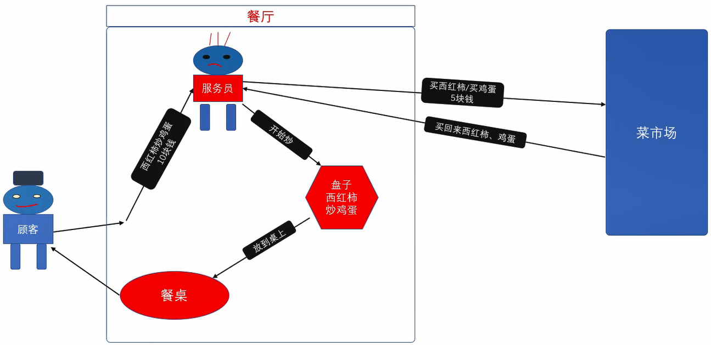
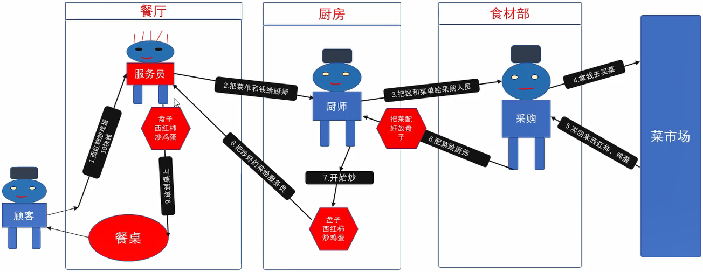
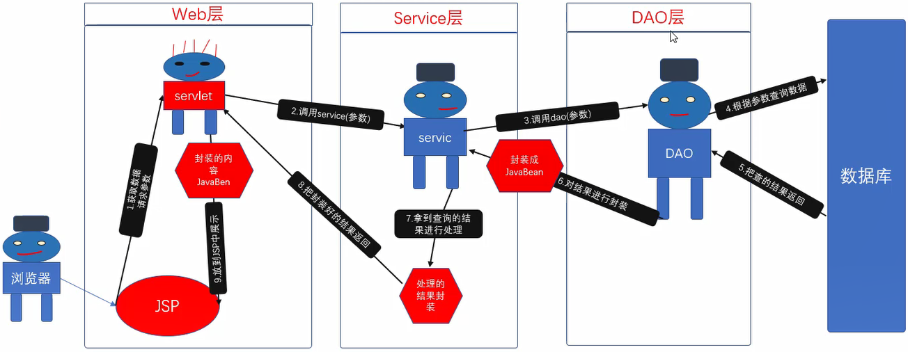
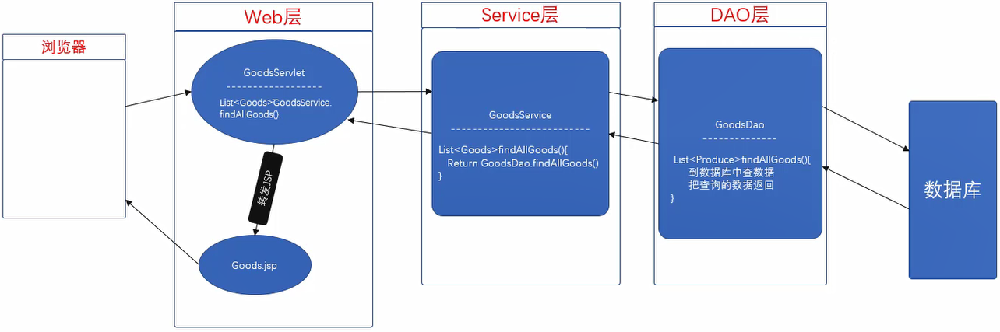

## JavaEE开发模式
模式在开发过程中总结出的“套路”，总结出的一套约定俗成的设计模式

- model1模式
技术组成：JSP+JavaBean
弊端：
业务多时，导致JSP页面容易混乱
- model2模式 
技术组成：JSP+Servlet+JavaBean
优点：
开发中使用各个技术擅长的方面
Servlet擅长Java的业务代码
JSP擅长页面的展示
MVC：
Model:JavaBean 封装数据
View:JSP 页面展示
Controller:Servlet 获取数据，对数据进行封装，传递数据、指定页面显示


- 三层架构
Web层 与客户端交互
Service层 复杂业务逻辑
DAO层 与数据库进行交互



## 商品列表改写
根据包来分层
- com.it666.web GoodsServlet.java
- com.it666.service GoodsService.java
- com.it666.dao GoodsDao.java
原来GoodsServlet
```java
package com.it666.servlet;

@WebServlet("/GoodsServlet")
public class GoodsServlet extends HttpServlet {
	private static final long serialVersionUID = 1L;

	protected void service(HttpServletRequest request, HttpServletResponse response) throws ServletException, IOException {
		
		// 1.连接数据库
		QueryRunner qr = new QueryRunner(JDBCUtil.getDataSource());
		String sql = "select * from goods";
		// 2.获取数据
		List<Goods> allGoods = null;
		try {
			allGoods = qr.query(sql, new BeanListHandler<Goods>(Goods.class));
		} catch (SQLException e) {
			e.printStackTrace();
		}
		System.out.println(allGoods);
		// 3. 把数据存到equest域
		request.setAttribute("allGoods", allGoods);
		// 4.转发到商品列表，转发时把request对象传入
		request.getRequestDispatcher("/goods_list.jsp").forward(request, response);	
	}
}
```

GoodsServlet
```java
GoodsService goodsService = new GoodsService();
List<Goods> allGoods = goodsService.findAllGoods();
```

GoodsService
```java
package com.it666.service;

public class GoodsService {

	public List<Goods> findAllGoods() {
		GoodsDao goodsDao = new GoodsDao();
		return goodsDao.findAllGoods();
	}

}
```

GoodsDao
```java
package com.it666.dao;

public class GoodsDao {

	public List<Goods> findAllGoods() {
		// 1.连接数据库
		QueryRunner qr = new QueryRunner(JDBCUtil.getDataSource());
		String sql = "select * from goods";
		// 2.获取数据
		List<Goods> allGoods = null;
		try {
			allGoods = qr.query(sql, new BeanListHandler<Goods>(Goods.class));
		} catch (SQLException e) {
			e.printStackTrace();
		}
		return allGoods;
	}

}
```

在GoodsServlet最后加上
```java
// 3. 把数据存到equest域
request.setAttribute("allGoods", allGoods);
// 4.转发到商品列表，转发时把request对象传入
request.getRequestDispatcher("/goods_list.jsp").forward(request, response);
```
对GoodServlet进行测试

## 参考资料

[Java零基础到高级JavaWeb与项目](https://study.163.com/course/introduction/1005981003.htm)