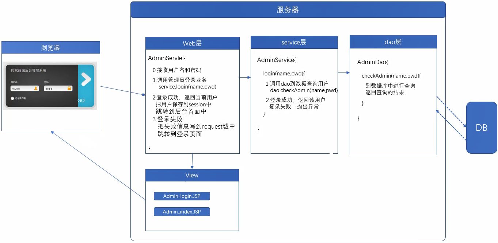
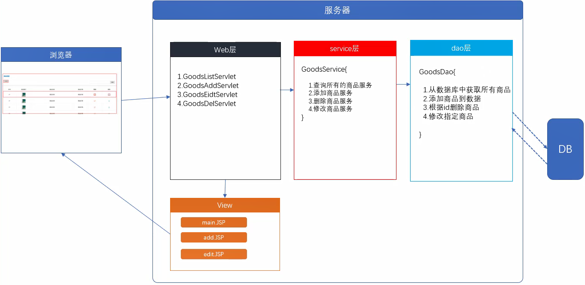
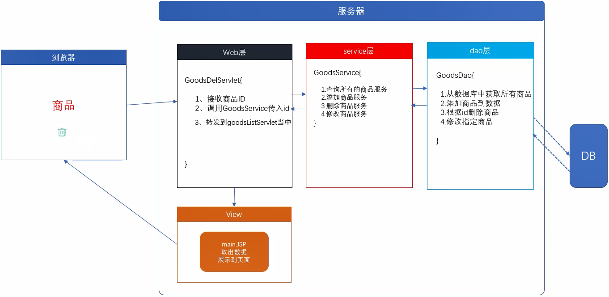
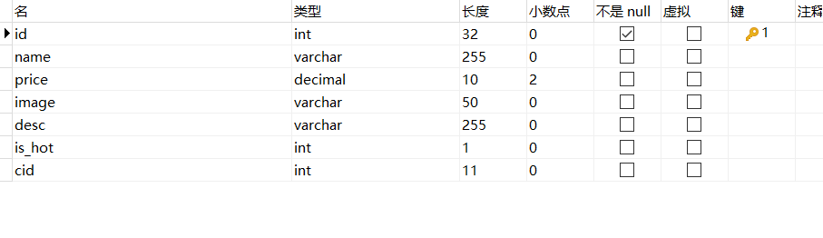
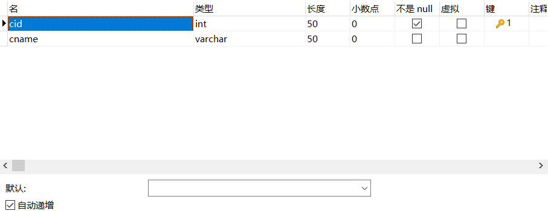
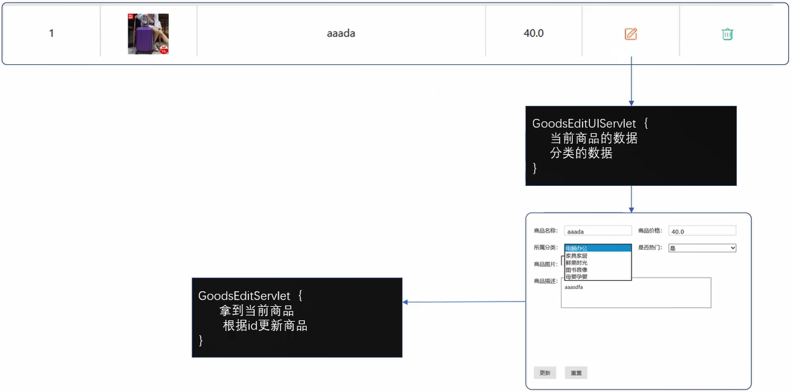

## 后台管理系统登录
JSP凡是action src href都要写绝对路径，需要加上工程名称
获取当前项目名
```java
${pageContext.request.contextPath }
```



Web层 AdminServlet类
```java
package com.myxq.web;

@WebServlet("/AdminServlet")
public class AdminServlet extends HttpServlet {
	private static final long serialVersionUID = 1L;

	protected void service(HttpServletRequest request, HttpServletResponse response) throws ServletException, IOException {
		String name = request.getParameter("username");
		String pwd = request.getParameter("password");
		System.out.println("name:"+name+" pwd:"+pwd);
	}
}
```
新建一个Service层 AdminService类
在AdminServlet中调用登录业务
```java
		// 调用 登录业务
		AdminService adminService = new AdminService();
		adminService.login(name,pwd);
```
自动创建login方法

```java
package com.myxq.service;

public class AdminService {
	public void login(String name, String pwd) {
		// 调用Dao层到数据库查询

	}
}
```
新建一个DAO层 AdminService类
在AdminService中调用Dao层到数据库查询
```java
		// 调用Dao层到数据库查询
		AdminDao adminDao = new AdminDao();
		adminDao.checkAdmin(name,pwd);
```
自动创建checkAdmin方法
导入数据库相关Jar包，创建util包，写JdbcUtil，创建db.properties
```java
package com.myxq.dao;

public class AdminDao {

	public Admin checkAdmin(String name, String pwd) throws SQLException {
		// 到数据库中查询 返回查询结果

		// 1.连接数据库
		QueryRunner qr = new QueryRunner(JDBCUtil.getDataSource());
		String sql = "select * from admin where username= ?and password = ?";
		// 2.获取数据
		Admin admin = null;
		admin = qr.query(sql, new BeanHandler<Admin>(Admin.class), name, pwd);

		return admin;

	}
}
抛出异常

修改AdminService，继续抛出SQLException
```java
package com.myxq.service;

public class AdminService {

	public Admin login(String name, String pwd) throws Exception {
		// 调用Dao层到数据库查询
		AdminDao adminDao = new AdminDao();
		Admin admin = adminDao.checkAdmin(name,pwd);
		if (admin != null) {
			return admin;
		}else {
			throw new Exception("用户名或密码错误");
		}
	}	
}
```
修改AdminServlet，最终调用者，必须处理异常
如果项目修改了重启服务器还是报错，可以尝试Project-Clean 清除缓存
```java
package com.myxq.web;

@WebServlet("/AdminServlet")
public class AdminServlet extends HttpServlet {
	private static final long serialVersionUID = 1L;

	protected void service(HttpServletRequest request, HttpServletResponse response) throws ServletException, IOException {
		String name = request.getParameter("username");
		String pwd = request.getParameter("password");
		System.out.println("name:"+name+" pwd:"+pwd);
		// 调用 登录业务
		AdminService adminService = new AdminService();
		try {
			adminService.login(name,pwd);
			System.out.println("登录成功");
		} catch (Exception e) {
			System.out.println("登录失败");
			e.printStackTrace();
		}
	}

}

```
服务器跳转时，路径相对的是服务器WebContent
浏览器请求跳转时，路径相对的当前的JSP
这两个是冲突的，所以JSP凡是action src href都要写绝对路径
```html
	<link rel="stylesheet" href="${pageContext.request.contextPath }/admin/css/style.css" type="text/css" />
```
对网页进行测试

登录成功重定向后台首页
```java
	protected void service(HttpServletRequest request, HttpServletResponse response) throws ServletException, IOException {
		String name = request.getParameter("username");
		String pwd = request.getParameter("password");
		System.out.println("name:"+name+" pwd:"+pwd);
		// 调用 登录业务
		AdminService adminService = new AdminService();
		try {
			Admin admin = adminService.login(name,pwd);
			System.out.println("登录成功");
			// 把用户保存到Session
			HttpSession session = request.getSession();
			session.setAttribute("admin", admin);
			// 跳转到后台首页
			// 使用重定向，地址栏需要变化
			response.sendRedirect(request.getContextPath()+"/admin/admin_index.jsp");
		} catch (Exception e) {
			if (e.getMessage().equals("用户名或密码错误")){
				System.out.println("登录失败");
				// 跳转回登录页面，回显错误信息
				request.setAttribute("err", e.getMessage());
				// 转发
				request.getRequestDispatcher("admin/admin_login.jsp").forward(request,response);
			}else {
				e.printStackTrace();
				
			}
		}
	}
```
因为是重定向，所以需要修改admin_index的src为绝对路径
重定向：浏览器的跳转，相对JSP路径
```html
<frameset rows="70,*" frameborder=0 border="0" framespacing="0">
    <frame src="${pageContext.request.contextPath }/admin/top.jsp" name="topFrame" scrolling="NO" noresize>
    <frameset cols="250,*" frameborder="0" border="0"  framespacing="10">
        <frame src="${pageContext.request.contextPath }/admin/left.jsp" name="leftFrame"  scrolling="NO">
        <frame src="${pageContext.request.contextPath }/admin/main.jsp" name="mainFrame" >
    </frameset>
</frameset>
```
修改后天显示的用户名
```html
<div class="admin_top">
    <div class="top_left">
        码蚁商城
    </div>
    <div class="h_top_right">
        
		<!-- 从Session域中取数据 -->
        <span>${admin.username }</span>
    </div>
</div>
```
## 商品管理业务


#### 商品显示
DAO层 GoodsDao类
暂时不用面向接口，面向接口编程，需求变更，用其他数据库，就只需要变更实现类
新建domain
```java
package com.myxq.domain;

@Setter@Getter
public class Goods {
	private Integer id;
	private String name;
	private Double price;
	private String image;
	@Override
	public String toString() {
		return "Goods [id=" + id + ", name=" + name + ", price=" + price + ", image=" + image + ", getClass()="
				+ getClass() + ", hashCode()=" + hashCode() + ", toString()=" + super.toString() + "]";
	}	
}
```
jar包，db.properties,Util包JdbcUtil
单元测试initialization Error，无代码无关，单元测试初始化错误，Clean工程就好了
写一个方法，就马上测试

```java
package com.myxq.dao;

public class GoodsDao {
	QueryRunner qr = new QueryRunner(JDBCUtil.getDataSource());

	// 增删改查
	// 1.从数据库中获取所有商品
	public List<Goods> getAllGoods() throws SQLException {
		String sql = "select * from goods";
		List<Goods> allGoods = qr.query(sql, new BeanListHandler<Goods>(Goods.class));
		return allGoods;
	}

	// 2.添加商品到数据
	public void addGoods(Goods goods) throws SQLException {
		String sql = "insert into goods (name,price,image)value(?,?,?)";
		qr.update(sql, goods.getName(), goods.getPrice(), goods.getImage());
	}

	// 3.根据id删除商品
	public void delGoods(int id) throws SQLException {
		String sql = "delete from goods where id = ?";
		qr.update(sql, id);
	}
	// 4.修改指定商品
	public void updateGoods(Goods goods) throws SQLException {
		String sql = "update goods set name=?,price=?,image=? where id = ?";
		qr.update(sql,goods.getName(),goods.getPrice(),goods.getImage(),goods.getId());
	}	
}
```
测试类
```java
package com.myxq.test;

public class GoodsDaoTest {
	@Test
	public void testGetAllGoods() throws SQLException {
		GoodsDao goodsDao = new GoodsDao();
		List<Goods> allGoods = goodsDao.getAllGoods();
		System.out.println(allGoods);
	}

	@Test
	public void testAddGoods() throws SQLException {
		GoodsDao goodsDao = new GoodsDao();
		Goods goods = new Goods();
		goods.setName("测试");
		goods.setPrice(200.0);
		goods.setImage("goods_10.png");
		goodsDao.addGoods(goods);
	}

	@Test
	public void testDelGoods() throws SQLException {
		GoodsDao goodsDao = new GoodsDao();
		goodsDao.delGoods(17);
	}
	@Test 
	public void testUpdateGoods() throws SQLException {
		Goods goods = new Goods();
		goods.setId(17);
		goods.setName("update");
		goods.setPrice(17.0);
		goods.setImage("goods_11.png");
		
		GoodsDao goodsDao = new GoodsDao();
		goodsDao.updateGoods(goods);
	}
}


```
Web层 GoodsListServlet类

创建GoodsListServlet类，写一句输出语句
修改admin_index.jsp的mainFrame
```jsp
 <frame src="${pageContext.request.contextPath }/GoodsListServlet" name="mainFrame" >
```
测试是否跳转到Servlet

创建Service层 GoodsService类
```java
package com.myxq.service;

public class GoodsService {	
}
```
在GoodsListServlet中调用服务层
```java
protected void service(HttpServletRequest request, HttpServletResponse response)
			throws ServletException, IOException {
		System.out.println("GoodsListServlet");
		// 调用服务层
		GoodsService goodsService = new GoodsService();
		goodsService.getAllGoods();
	}
```
自动生成getAllGoods方法，抛出异常
```java
package com.myxq.service;

public class GoodsService {
	public List<Goods> getAllGoods() throws SQLException {
		GoodsDao goodsDao = new GoodsDao();
		List<Goods> allGoods = goodsDao.getAllGoods();
		return allGoods;
	}	
}
```
继续写Servlet
```java
protected void service(HttpServletRequest request, HttpServletResponse response)
			throws ServletException, IOException {
		System.out.println("GoodsListServlet");
		// 调用服务层
		GoodsService goodsService = new GoodsService();
		try {
			List<Goods> allGoods = goodsService.getAllGoods();
			// System.out.println(allGoods);
			// 把数据写到request域
			request.setAttribute("allGoods", allGoods);
			// 转发
			request.getRequestDispatcher("admin/main.jsp").forward(request, response);
		} catch (SQLException e) {
			e.printStackTrace();
		}
	}
```
修改main.jsp的css路径
```jsp
<%
	String ctx = request.getContextPath();
	pageContext.setAttribute("ctx", ctx);
%>

<head>
    <meta charset="UTF-8">
    <title>Title</title>

    <link rel="stylesheet" href="${ctx}/admin/css/style.css" type="text/css" />
    <link rel="stylesheet" href="${ctx}/admin/css/amazeui.min.css" />
    <link rel="stylesheet" href="${ctx}/admin/css/pageStyle.css">

</head>
```
测试网页

```jsp
<%@ taglib uri="http://java.sun.com/jsp/jstl/core" prefix="c" %>

<c:forEach items="${allGoods }" var="goods" varStatus="status">
			<ul class="list_goods_ul">
				<!-- status是一个对象for循环状态 index就是取当前for循环角标 -->
				<li>${status.index+1 }</li>
				<li></li>
				<li>${goods.name }</li>
				<li>${goods.price }</li>
				<li><a href="#"></a></li>
				<li><a href="#"></a></li>
			</ul>
		</c:forEach>


	<script src="${ctx }/admin/js/jquery.min.js"></script>
	<script type="text/javascript" src="${ctx }/admin/js/paging.js"></script>
```



## 删除商品

步骤同上

创建GoodsDelServlet类，测试连通
修改jsp的删除按钮的href，修改后可以用Chrome浏览器鼠标悬停，查看连接地址是否正确
在Servlet中接受参数，调用服务，服务中调用DAO，删除数据
Servlet中转发

```jsp
		<c:forEach items="${allGoods }" var="goods" varStatus="status">
			<ul class="list_goods_ul">
				<!-- status是一个对象for循环状态 index就是取当前for循环角标 -->
				<li>${status.index+1 }</li>
				<li></li>
				<li>${goods.name }</li>
				<li>${goods.price }</li>
				<li><a href=""></a></li>
				<li><a href="${ctx }/GoodsDelServlet?id=${goods.id}"></a></li>
			</ul>
		</c:forEach>

```

GoodsDelServlet类
```java
package com.myxq.web;

@WebServlet("/GoodsDelServlet")
public class GoodsDelServlet extends HttpServlet {
	private static final long serialVersionUID = 1L;

	protected void service(HttpServletRequest request, HttpServletResponse response)
			throws ServletException, IOException {
		// System.out.println("GoodsDelServlet");
		// 1. 接收参数
		String id = request.getParameter("id");
		// System.out.println(id);
		// 2. 调用服务层
		GoodsService goodsService = new GoodsService();
		try {
			goodsService.deleteGoods(id);
		} catch (Exception e) {
			// TODO Auto-generated catch block
			e.printStackTrace();
		}
		request.getRequestDispatcher("GoodsListServlet").forward(request, response);
	}
}
```

GoodsService类
```java
package com.myxq.service;

public class GoodsService {

	GoodsDao goodsDao = new GoodsDao();
	public List<Goods> getAllGoods() throws SQLException {
		List<Goods> allGoods = goodsDao.getAllGoods();
		return allGoods;
	}

	public void deleteGoods(String id) throws Exception {
		goodsDao.delGoods(Integer.parseInt(id));
	}	
}
```
## 添加商品
修改goods表，增加描述、是否热门、cid

增加分类表catogory

添加数据
为goods表的cid做外键约束
**修改了表JavaBean也要修改**，数据库需要对应
**对应的插入数据库操作也要更新**


创建GoodsAddUIServlet类
创建CategoryService类
GoodsAddUIServlet调用CategoryService中的findCategory方法
创建CategoryDao类 


GoodsAddUIServlet类
```java
package com.myxq.web;

@WebServlet("/GoodsAddUIServlet")
public class GoodsAddUIServlet extends HttpServlet {
	private static final long serialVersionUID = 1L;

	protected void service(HttpServletRequest request, HttpServletResponse response)
			throws ServletException, IOException {
		// 1.取出所有分类
		List<Category> allCategory = null;
		CategoryService categoryService = new CategoryService();
		try {
			allCategory = categoryService.findCategory();
			System.out.println(allCategory);
		} catch (Exception e) {
			e.printStackTrace();
		}
		// 2.把分类存到域中
		request.setAttribute("allCategory", allCategory);
		// 3.转发edit.jsp
		request.getRequestDispatcher("admin/add.jsp").forward(request, response);
	}
}
```

CategoryService类
```java
package com.myxq.service;

public class CategoryService {

	public List<Category> findCategory() throws Exception {
		CategoryDao categoryDao = new CategoryDao();
		List<Category> allCategory = categoryDao.getAllCategory();
		return allCategory;
	}
}

```

CategoryDao类
```java
package com.myxq.dao;

public class CategoryDao {

	public List<Category> getAllCategory() throws Exception {
		QueryRunner qr = new QueryRunner(JDBCUtil.getDataSource());
		String sql = "select * from category";
		List<Category> allCategory  = qr.query(sql, new BeanListHandler<Category>(Category.class));
		return allCategory;
	}
}
```
修改add.jsp
添加foreach，转发所以需要修改一些路径为绝对路径
```jsp
<%@ page language="java" contentType="text/html; charset=UTF-8"
    pageEncoding="UTF-8"%>
<%@ taglib uri="http://java.sun.com/jsp/jstl/core" prefix="c" %>
<%
	String ctx = request.getContextPath();
	pageContext.setAttribute("ctx", ctx);
%>

    <link rel="stylesheet" href="${ctx }/admin/css/style.css" type="text/css" />
    <link rel="stylesheet" href="${ctx }/admin/css/amazeui.min.css" />
        <div class="item1">
                <span>所属分类：</span>
                 <select id="category_select">&nbsp;&nbsp;
                 
                 <c:forEach items="${allCategory }" var="category">
                 	<option value="${category.cid }">${category.cname }</option>
                 </c:forEach>
                    
                     
                 </select>
        </div>

   
<script src="${ctx }/admin/js/jquery.min.js"></script>

<script>
    $("#add").click(function () {
        $(window).attr('location','main.jsp');
    });
    
    $("#reset").click(function () {
       $(window).attr('location','add.jsp');
    });
</script>
</body>
</html>
```
修改main.jsp链接为GoodsAddUIServlet
```jsp

	<script src="${ctx }/admin/js/jquery.min.js"></script>
	<script type="text/javascript" src="${ctx }/admin/js/paging.js"></script>
	<script>
		//分页
		$("#page").paging({
			pageNo : 5,
			totalPage : 10,
			totalSize : 300,
			callback : function(num) {
				alert(num);
			}
		});

		$("#add").click(function() {
			$(window).attr('location', '${ctx}/GoodsAddUIServlet');
		});
	</script>

```

添加商品接收参数
创建GoodsAddServlet类
修改add.jsp的form表达的各个name属性和表单地址等
测试在Servlet获取所有参数的Map，使用BeanUtils封装，测试封装结果
调用服务层方法
服务处调用DAO
**字段介绍用desc，desc是数据库关键字，所以开发一般是gdesc**
修改类名为gdesc修改对应映射

GoodsAddServlet类
```java
package com.myxq.web;

@WebServlet("/GoodsAddServlet")
public class GoodsAddServlet extends HttpServlet {
	private static final long serialVersionUID = 1L;

	protected void service(HttpServletRequest request, HttpServletResponse response)
			throws ServletException, IOException {
		// System.out.println("GoodsAddServlet");
		// 1.获取所有参数
		request.setCharacterEncoding("utf-8");
		Map<String, String[]> map = request.getParameterMap();
		// System.out.println(map);
		Goods goods = new Goods();
		BeanUtils beanUtils = new BeanUtils();
		try {
			BeanUtils.populate(goods, map);
			goods.setImage("goods_11.png");
			System.out.println(goods);
			// 调用服务层
			GoodsService goodsService = new GoodsService();
			goodsService.addGoods(goods);
			
			// 跳转列表 取最新数据
			request.getRequestDispatcher("GoodsListServlet").forward(request, response);
		} catch (Exception e) {
			e.printStackTrace();
		}
	}
}
```

GoodsService类
```java
package com.myxq.service;

public class GoodsService {
	// 保护DAO
	private GoodsDao goodsDao = new GoodsDao();

	public List<Goods> getAllGoods() throws SQLException {
		List<Goods> allGoods = goodsDao.getAllGoods();
		return allGoods;
	}

	public void deleteGoods(String id) throws Exception {
		goodsDao.delGoods(Integer.parseInt(id));
	}

	public void addGoods(Goods goods) throws SQLException {
		// 调用DAO
		goodsDao.addGoods(goods);
	}
}
```

GoodsDao类
```java
package com.myxq.dao;

public class GoodsDao {
	QueryRunner qr = new QueryRunner(JDBCUtil.getDataSource());

	// 增删改查
	// 1.从数据库中获取所有商品
	public List<Goods> getAllGoods() throws SQLException {
		String sql = "select * from goods";
		List<Goods> allGoods = qr.query(sql, new BeanListHandler<Goods>(Goods.class));
		return allGoods;
	}

	// 2.添加商品到数据
	public void addGoods(Goods goods) throws SQLException {
		String sql = "insert into goods (name,price,image,gdesc,is_hot,cid) value (?,?,?,?,?,?)";
		qr.update(sql, goods.getName(), goods.getPrice(), goods.getImage(),goods.getGdesc(),goods.getIs_hot(),goods.getCid());
	}

	// 3.根据id删除商品
	public void delGoods(int id) throws SQLException {
		String sql = "delete from goods where id = ?";
		qr.update(sql, id);
	}
	// 4.修改指定商品
	public void updateGoods(Goods goods) throws SQLException {
		String sql = "update goods set name=?,price=?,image=? where id = ?";
		qr.update(sql,goods.getName(),goods.getPrice(),goods.getImage(),goods.getId());
	}	
}
```

add.jsp
```jsp
		<div class="edit_content">
			<form action="${ctx }/GoodsAddServlet" method="post" id="add_form"
				style="background: none; width: 700px">
				<div class="item1">
					<div>
						<span>商品名称：</span> <input type="text" class="am-form-field"
							name="name">&nbsp;&nbsp;
					</div>
					<div>
						<span>商品价格：</span> <input type="text" class="am-form-field" name="price">
					</div>

				</div>

				<div class="item1">
					<span>所属分类：</span> <select id="category_select" name="cid">

						<c:forEach items="${allCategory }" var="category">
							<option value="${category.cid }">${category.cname }</option>
						</c:forEach>


					</select>
				</div>
				
				<div>
					<span>是否热门</span>
					<select id="category_select" name="is_hot">
						<option value="0">否</option>
						<option value="1">是</option>
					</select>
				</div>

				<div class="item1">
					<span>商品图片：</span> <input type="file" name="image" id="upload" />
				</div>

				<div class="item1 item_desc" >
					<span>商品描述：</span>
					<textarea id="desc" name="gdesc" rows="4" cols="50"></textarea>
				</div>
				<button class="am-btn am-btn-default" type="button" id="add">添加</button>
				&nbsp;&nbsp;&nbsp;&nbsp;
				<button class="am-btn am-btn-default" type="button" id="reset">重置</button>
			</form>
		</div>


	</div>

	<script src="${ctx }/admin/js/jquery.min.js"></script>

	<script>
		$("#add").click(function() {
			$("#add_form").submit();
		});

		$("#reset").click(function() {
			$(window).attr('location', 'add.jsp');
		});
	</script>
```

## 问题解决
解决写入数据库乱码问题，编辑db.properties文件
```properties
url=jdbc:mysql://localhost:3306/mystore?useUnicode=true&characterEncoding=utf-8
```
反转集合（使得最后添加的显示到最开头）
```java
package com.myxq.web;

@WebServlet("/GoodsListServlet")
public class GoodsListServlet extends HttpServlet {
	private static final long serialVersionUID = 1L;

	protected void service(HttpServletRequest request, HttpServletResponse response)
			throws ServletException, IOException {
		System.out.println("GoodsListServlet");
		// 调用服务层
		GoodsService goodsService = new GoodsService();
		try {
			List<Goods> allGoods = goodsService.getAllGoods();
			
			// 反转集合
			Collections.reverse(allGoods);
			
			// System.out.println(allGoods);
			// 把数据写到request域
			request.setAttribute("allGoods", allGoods);
			// 转发
			request.getRequestDispatcher("admin/main.jsp").forward(request, response);
		} catch (SQLException e) {
			e.printStackTrace();
		}
	}
}

```
## 编辑商品


创建GoodsEditUIServlet
```java
package com.myxq.web;

@WebServlet("/GoodsEditUIServlet")
public class GoodsEditUIServlet extends HttpServlet {
	private static final long serialVersionUID = 1L;

	protected void service(HttpServletRequest request, HttpServletResponse response) throws ServletException, IOException {
		System.out.println("GoodsEditUIServlet");
	}
}
```
修改main.jsp
```jsp
<li><a href="${ctx }/GoodsEditUIServlet?id=${goods.id}"></a></li>
```
用Chrome查看地址是否包含了id参数

GoodsEditUIServlet
```java
package com.myxq.web;

@WebServlet("/GoodsEditUIServlet")
public class GoodsEditUIServlet extends HttpServlet {
	private static final long serialVersionUID = 1L;

	protected void service(HttpServletRequest request, HttpServletResponse response)
			throws ServletException, IOException {
		// 接收id
		String id = request.getParameter("id");
		// System.out.println("GoodsEditUIServlet"+id);
		try {
			// 1.获取当前商品
			GoodsService goodsService = new GoodsService();
			Goods goods = goodsService.getGoodsWithId(id);
			System.out.println(goods);
			// 把商品写入request域中
			request.setAttribute("goods", goods);

			// 2.获取所有分类
			CategoryService categoryService = new CategoryService();
			List<Category> allCategory = categoryService.findCategory();
			request.setAttribute("allCategory", allCategory);
			// 3.转发到JSP页面
			request.getRequestDispatcher("/admin/edit.jsp").forward(request, response);
		} catch (Exception e) {
			e.printStackTrace();
		}

	}
}
```

修改edit.jsp
```jsp
<div class="item1">
        	<div>
        		<span>所属分类：</span>
                 <select id="categorySel" name="cid">
                 	<c:forEach items="${allCategory }" var="category">
                 	 <option value="${category.cid }">${category.cname }</option>
                 	</c:forEach>
                 </select>
                 &nbsp;
        	</div>
        	
        	<div>
        		<span>是否热门：</span>
                 <select id="isHotSel" name="is_hot">
                    <!-- 让value的值等于商品is_hot的option成为选中状态 -->
                    <option value="0">否</option>
                    <option value="1">是</option>
                 </select>
        	</div>        
                 
        </div>

        <div class="item1">
                <span>商品图片：</span>
                <input type="file" name="image" />
        </div>
        
        <div class="item1 item_desc">
            <span>商品描述：</span>
         <textarea  id="desc" name="gdesc" rows="4" cols="50">${goods.gdesc }</textarea>
        </div>
        <button class="am-btn am-btn-default" type="button" id="edit">更新</button>
        &nbsp;&nbsp;&nbsp;&nbsp;
        <button class="am-btn am-btn-default" type="button" id="reset">重置</button>
		</form>
   </div>
```

创建GoodsEditServlet
修改edit.jsp 关联提交表单
```jsp
<form action="${ctx }/GoodsEditServlet" method="post" id="edit_form" style="background: none; width: 700px;">
```

edit.jsp的form表单时提交获取id的技巧
```jsp
<input type="text"  name="id" value="${goods.id }" style="display:none">
```

GoodsEditServlet
```java
package com.myxq.web;

@WebServlet("/GoodsEditServlet")
public class GoodsEditServlet extends HttpServlet {
	private static final long serialVersionUID = 1L;

	protected void service(HttpServletRequest request, HttpServletResponse response) throws ServletException, IOException {
		// 设置字符集 post
		request.setCharacterEncoding("utf-8");
		// System.out.println("GoodsEditServlet");
		// 1.获取所有参数
		Map<String, String[]> parameterMap = request.getParameterMap();
		// 2.封装成Goods对象
		Goods goods = new Goods();
		try {
			BeanUtils.populate(goods, parameterMap);
			System.out.println(goods);
			// 3.根据id更新数据
			// 4.调用服务层 更新数据
			GoodsService goodsService = new GoodsService();
			goods.setImage("goods_10.png");
			goodsService.updateGoods(goods);
			
			// 5.跳转mian.jsp
			request.getRequestDispatcher("GoodsListServlet").forward(request, response);
		} catch (Exception e) {
			// TODO Auto-generated catch block
			e.printStackTrace();
		}	
	}
}

```

GoodsService
```java
	public void updateGoods(Goods goods) throws Exception {
		goodsDao.updateGoods(goods);
	}
```

GoodsDao
```java
	// 4.修改指定商品
	public void updateGoods(Goods goods) throws SQLException {
		String sql = "update goods set name=?,price=?,image=? ,gdesc=?,is_hot=?,cid=? where id = ?";
		qr.update(sql,goods.getName(),goods.getPrice(),goods.getImage(),goods.getGdesc(),goods.getIs_hot(),goods.getCid(),goods.getId());
	}
```
修改更新商品页面（读取当前商品的信息）
edit.jsp
```js
	$(function () {
        
		 $("#edit").click(function () {
		        //让表单提交 GoodsEditServlet
		        //获取表单  让其提交
		        $("#edit_form").submit();
		  });
		 
		 //让value的值等于商品is_hot的option成为选中状态
		 $("#isHotSel option[value=${goods.is_hot}]").prop("selected",true);
		 $("#categorySel option[value=${goods.cid}]").prop("selected",true);
		 
    });
```
外层套一层$(function() 的原因是：等所有标签加载完毕，再去做执行里面的JQuery

## 参考资料

[Java零基础到高级JavaWeb与项目](https://study.163.com/course/introduction/1005981003.htm)