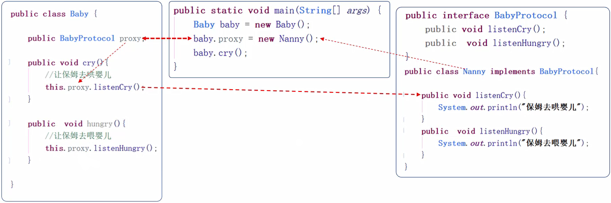

## 代理设计模式
当某一个对象发生某一个事件时，通知另一个对象，让另一个对象做某事

代理设计模式步骤
1. 定义好协议（写接口）
2. 遵守协议（代理对象实现接口）
3. 成为代理（创建代理对象并赋值）
4. 调用代理方法

保姆婴儿案例


## 监听器
能监听某个对象的状态变化的组件，监听域对象的变化
监听器的内部使用的就是代理模式

#### 监听器相关的概念
事件源：被监听的对象
- request
- session
- servletContext
监听器：监听事件源的对象
- 8个监听器
注册监听器：监听器与事件源相绑定
响应行为：监听到事件源变化时，去做什么事情

#### 监听器划分
三个监听域对象的创建与销毁
- ServletContextListener
- HttpSessionListener
- ServletRequestListener
三个监听域对象当中属性变化
- ServletContextAttributeListener
- HttpSessionAttributeListener
- ServletRequestAttributeListener	

## 域监听器
监听器的编写步骤
1. 编写一个监听器类去实现监听器接口
2. 覆盖监听器的方法
3. 需要在web.xml中进行配置

#### ServletContextListener
监听ServletContext域的创建与销毁的监听
    
ServletContext域生命周期
服务器启动创建
服务器关闭销毁

作用
初始化的工作：初始化对象 初始化数据  加载数据库驱动  连接池的初始化
加载一些初始化的配置文件
任务调度


IDEA新建JavaEE工程
1. 需要配置Tomcat的部署目录
2. 依赖需要导入Tomcat jar包（第一次需要导入）
3. 开启注解
4. 在使用JRebel之前，在Panel中打勾
```java
package com.myxq.listener;

public class ServletContextListenerTest implements ServletContextListener {
    @Override
    public void contextInitialized(ServletContextEvent servletContextEvent) {
        // 获取当前监听的对象
        // ServletContext servletContext = servletContextEvent.getServletContext();
        // 方法2
        ServletContext servletContext = (ServletContext) servletContextEvent.getSource();
        System.out.println("服务器启动");
    }

    @Override
    public void contextDestroyed(ServletContextEvent servletContextEvent) {
        System.out.println("服务器关闭");
    }
}
```
web.xml 
用copy Reference
```xml
<?xml version="1.0" encoding="UTF-8"?>
<web-app xmlns="http://xmlns.jcp.org/xml/ns/javaee"
         xmlns:xsi="http://www.w3.org/2001/XMLSchema-instance"
         xsi:schemaLocation="http://xmlns.jcp.org/xml/ns/javaee http://xmlns.jcp.org/xml/ns/javaee/web-app_4_0.xsd"
         version="4.0">
    <listener>
        <listener-class>com.myxq.listener.ServletContextListenerTest</listener-class>
    </listener>
</web-app>
```


#### HttpSessionListener
监听HttpSession域的创建与销毁

HttpSession的生命周期
第一次调用request.getSession时创建
服务器关闭 Session过期 手动销毁

运用场景
记录访问人数

```java
package com.myxq.listener;

public class HttpSessionListenerTest implements HttpSessionListener {

    @Override
    public void sessionCreated(HttpSessionEvent httpSessionEvent) {
        // 获取监听对象
        // HttpSession session = httpSessionEvent.getSession();
        // 方法2
        HttpSession session = (HttpSession) httpSessionEvent.getSource();
        System.out.println("session created");
    }

    @Override
    public void sessionDestroyed(HttpSessionEvent httpSessionEvent) {
        System.out.println("session destroyed");
    }
}
```

```xml
    <listener>
        <listener-class>com.myxq.listener.HttpSessionListenerTest</listener-class>
    </listener>
```
需要删除默认的index.jsp
因为page里面有一个session="true"默认情况是true
一访问index就创建一个Session对象，就不是访问时候创建的Session对象了

```java
package com.myxq.servlet;

@WebServlet("/TestServlet")
public class TestServlet extends HttpServlet {
    @Override
    protected void service(HttpServletRequest req, HttpServletResponse resp) throws ServletException, IOException {
        System.out.println(req.getSession().getId());
    }
}
```
访问TestServlet进行测试：http://localhost/TestServlet
浏览器关掉Session对象没有销毁，而是浏览器中保存的session id没了，到服务器发现没有响应的session id，就创建新的session id（会调用sessionCreated方法）

Tomcat6 开始默认Session持久化，保存起来，然后启动时候复活
配置在apache-tomcat-7.0.85\conf\context.xml
```xml
    <!-- Uncomment this to disable session persistence across Tomcat restarts -->
    <!--
    <Manager pathname="" />
    -->
```
放开Manager pathname="" / Tomcat就不会持久化

#### ServletRequestListener
监听ServletRequest域创建与销毁的监听器

ServletRequest的生命周期
创建：每一次请求都会创建request
销毁：请求结束

因为请求太频繁，开发中没有实际应用场景

#### ServletContextAttributeListener
属性发生变化的时候执行对应方法
也需要添加到配置里
```java
package com.myxq.listener;

public class AtrributeListenerTest implements ServletContextAttributeListener {

    @Override
    public void attributeAdded(ServletContextAttributeEvent servletContextAttributeEvent) {
        System.out.println("add:"+servletContextAttributeEvent.getName());
        System.out.println("add:"+servletContextAttributeEvent.getValue());
    }

    @Override
    public void attributeRemoved(ServletContextAttributeEvent servletContextAttributeEvent) {
        System.out.println("remove:"+servletContextAttributeEvent.getName());
        System.out.println("remove:"+servletContextAttributeEvent.getValue());
    }

    @Override
    public void attributeReplaced(ServletContextAttributeEvent servletContextAttributeEvent) {
        System.out.println("replace:"+servletContextAttributeEvent.getName());
        System.out.println("replace:"+servletContextAttributeEvent.getValue());
    }
}
```

```java
@WebServlet("/TestServlet")
public class TestServlet extends HttpServlet {
    @Override
    protected void service(HttpServletRequest req, HttpServletResponse resp) throws ServletException, IOException {
        // System.out.println(req.getSession().getId());
        // this.getServletContext().setAttribute("name1","myxq12");
         this.getServletContext().removeAttribute("name1");
    }
}
```


HttpSessionAttributeListener
ServletRequestAttributeListener	


## Session中对象存储监听
一个对象存储到session当中的几种状态

绑定状态
就一个对象被放到session域中

解绑状态
就是这个对象从session域中移除了

钝化状态
是将session内存中的对象持久化（序列化）到磁盘

活化状态
就是将磁盘上的对象再次恢复到session内存中

## 参考资料

[Java零基础到高级JavaWeb与项目](https://study.163.com/course/introduction/1005981003.htm)