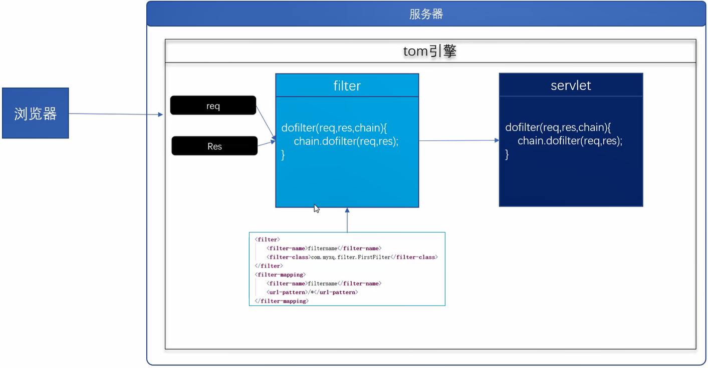
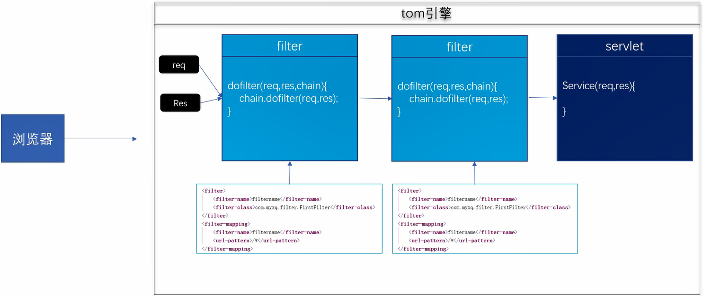

## 过滤器
filter是对客户端访问资源的过滤，符合条件放行，不符合条件不放行
并且可以对目标资源访问前后进行逻辑处理




过滤器编写步骤
1. 编写一个过滤器的类实现Filter接口
2. 实现接口中尚未实现的方法(着重实现doFilter方法)
3. 在web.xml中进行配置(主要是配置要对哪些资源进行过滤)
4. 配置filter-class
5. 配置filter-mapping，对哪些资源进行过滤

```java
package com.itlike.web.filter;

public class FirstFilter implements Filter {
    @Override
    public void init(FilterConfig filterConfig) throws ServletException {

    }

    // 是否对请求进行放行
    @Override
    public void doFilter(ServletRequest servletRequest, ServletResponse servletResponse, FilterChain filterChain) throws IOException, ServletException {
        System.out.println("this is Filter ");
        // 放行
        filterChain.doFilter(servletRequest,servletResponse);
    }

    @Override
    public void destroy() {
    }
}
```

```java
package com.itlike.web;

@WebServlet("/MyServlet")
public class MyServlet extends HttpServlet {
    @Override
    protected void service(HttpServletRequest req, HttpServletResponse resp) throws ServletException, IOException {
        System.out.println("MyServlet");
    }
}
```

```xml
<?xml version="1.0" encoding="UTF-8"?>
<web-app xmlns="http://xmlns.jcp.org/xml/ns/javaee"
         xmlns:xsi="http://www.w3.org/2001/XMLSchema-instance"
         xsi:schemaLocation="http://xmlns.jcp.org/xml/ns/javaee http://xmlns.jcp.org/xml/ns/javaee/web-app_4_0.xsd"
         version="4.0">
    <filter>
        <filter-name>myfliter</filter-name>
        <filter-class>com.itlike.web.filter.FirstFilter</filter-class>
    </filter>

    <filter-mapping>
        <filter-name>myfliter</filter-name>
    <!-- 发送MySerlvet请求的时候，就会到myfliter-->
        <url-pattern>/MyServlet</url-pattern>
    </filter-mapping>
</web-app>
```
Filter选择javax.servlet.Filter
注意：更改了Web.xml 要重启服务器
    
访问一个资源的时候，会被过滤器拦截
要在过滤器当中进行放行之后， 才能够访问到对应的servlet
chain.doFilter(req,res)

## 过滤器的访问流程
在发送一个请求时， web容器会先到filter当中，创建三个参数，res,req,chain
在过滤器当中，放行之后，才能够访问到对应的资源
中间的过滤器可能有多个，在一个过滤器当中，可以调用另外一个过滤器
也有可能过滤器没有拦截所有的资源，有些资源可以直接被访问

## filter生命周期
#### init方法
当filter对象创建时调用
当服务器启动时创建
因为有可能一个filter对应多个servlet
启动时， 先把filter准备好， 访问资源时就可以进行过滤了

filterconfig
当前filter对象的配置信息
和servletConfig差不多， 获取名称，参数
获取servletContext对象
先有的ServletContext

#### dofitter方法
当匹配到mapping时调用dofilter
参数：res req FilterChain

FilterChain 过滤器链对象
内部维护着各个filter的索引，并且知道所有filter的顺序
是根据mapping的顺序来执行的

#### destroy方法
当filter对象销毁时调用
关闭服务器时销毁对象
和servletContext的生命周期是一样


## 配置
#### mapping
完全匹配 
目录匹配
扩展名匹配

#### servlet_name
可以把路径直接指定**某一个**Servlet，可以有多个servlet_name
开发中基本上使用的都是mapping

#### dispatcher
配置请求的形式，不是请求方式，是页面跳转的形式
形式分类
- REQUEST
默认值，代表直接访问某个资源时执行filter
- ERROR
发生错误时 进行跳转是执行filter
- INCLUDE
包含资源时执行filter
- FORWARD
转发之后才去执行filter


                        
## 参考资料

[Java零基础到高级JavaWeb与项目](https://study.163.com/course/introduction/1005981003.htm)