## Java分类

#### JavaSE
Java的标准版，一般用来开发桌面应用程序，但是在开发桌面应用程序上相对VB，Delphi，VC++并没有什么优势

#### JavaEE
也就是Java Enterprise Edition，Java的企业版
开发JavaWeb应用程序，初级的一般是用JSP(Java Server Pages) + Servlet + Javabean来开发的
大型的网站一般是使用框架来开发: struts , hibernate , spring , Mybatis

#### JavaME
JavaME,Java Micro Edition,Java的微型版
诺基亚手机上运行的Java程序就是指用这个版本开发的程序

## JavaEE规范
JavaEE的共有13个技术规范
Sun公司定义了这么多标准，其它公司的人都可以来去根据这些标准来做JavaEE程序

JDBC
Java数据连接，是一种用于执行SQL语句的Java API

JNDI
Java命名和目录接口

EJB
EJB是sun的JavaEE服务器端组件模型，设计目标与核心应用是部署分布式应用程序

RMI
远程方法调用，能够让在某个Java虚拟机上的对象调用本地对象一样的
调用另一个Java虚拟机中高的对象上的方法

JSP
Java服务器页面，是一个动态内容模板，实现了Html语法中的Java扩展

Servlet
Servlet是一种小型的Java程序，它扩展了Web服务器的功能

XML
是一种可扩展的标记语言

JMS
是一个Java平台中关于面向消息中间件（MOM）的API
用于在两个应用程序之间，或分布式系统中发送消息，进行异步通信

Java IDL
Java IDL支持的是一个瞬间的CORBA对象，即在对象服务器处理过程中有效

JTS
子主题 1组件事务监视器，TPM 是一个程序，它代表应用程序协调分布式事务的执行

JTA
JTA允许应用程序执行分布式事务处理——在两个或多个网络计算机资源上访问并且更新数据

JavaMail
提供给开发者处理电子邮件相关的编程接口

JAF
JAF是一个专用的数据处理框架，它用于封装数据，并为应用程序提供访问和操作数据的接口

## 常见JavaWeb应用服务器
WebLogic
oracle公司的大型收费Web服务器 支持全部JavaEE规范

WebSphere
IBM公司的大型收费Web服务器 支持全部的JavaEE规范

Tomcat
Apache开源组织下的开源免费的中小型的Web应用服务器
支持JavaEE中的Servlet和JSP规范


## Tomcat安装
企业老项目一般使用Tomcat7
解压到

##### 目录介绍
bin
脚本程序
可执行的命令

conf
配置目录
内部有一个server.xml核心配置文件

lib
依赖库目录 

logs
日志目录

temps
临时文件目录

webapps
web应用发布目录
把开发的项目放到该目录当中运行

work
tomcat处理jsp的工作目录


#### 启动Tomcat
1. 进入到解压目录
2. 找到bin目录
3. 找到startup.bat双击启动脚本

- 没有配置JAVA_HOME

在启动过程当中如果没有配置JAVA_HOME，就会一闪没了
JAVA_HOME配置的就是JDK bin的上级目录
        
- 端口冲突,默认的端口是8080(两种解决方法)

把占用的端口杀死
netstat -aov  查看端口占用情况  记下占用端口的pid
到任务管理器当中查看任务详细信息，把对应pid给关掉

到config目录当中修改核心配置文件server.xml，修改port
```xml
<Connector connectionTimeout="20000" port="8080" protocol="HTTP/1.1" redirectPort="8443"/>
```
            
4. 通过浏览器访问：http://localhost:8080
看到以下界面
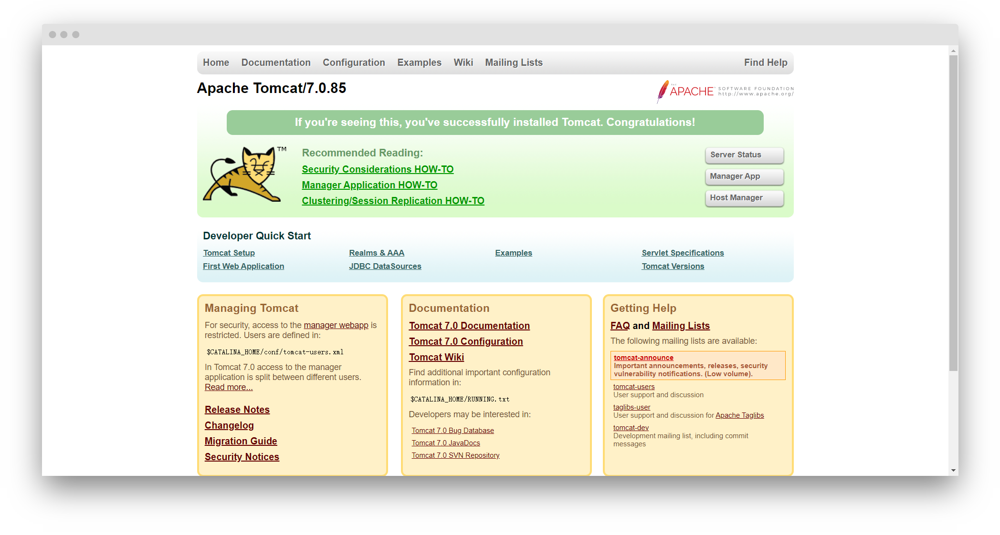
返回的就是一个页面
这个页面可以在webapps目录当中的ROOT文件夹当中找到
5. shutdown.bat停止脚本

## 手动创建项目
1. 在webapps目录下，新建一个文件夹mytest
2. 在mytest文件夹里放置html、jsp、js文件
3. 在mytest内新建WEB-INF目录，在WEB-INF目录内新建：classes目录和lib目录、web.xml文件

classes目录：Java类字节码文件
lib目录：Java类运行时需要的jar包
web.xml文件：当前整个web应用的核心配置文件，可以到ROOT当中复制一个过来
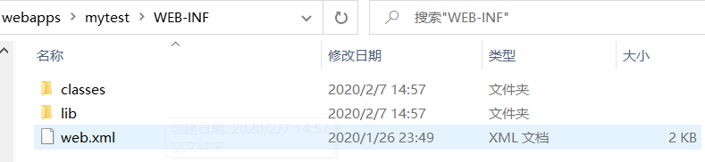

WEB-INF目录下当前的资源不能直接通过浏览器访问，是保护的， 外界不能直接访问

## 使用开发工具构建web工程
#### 创建工程
创建一个名为myproject的工程
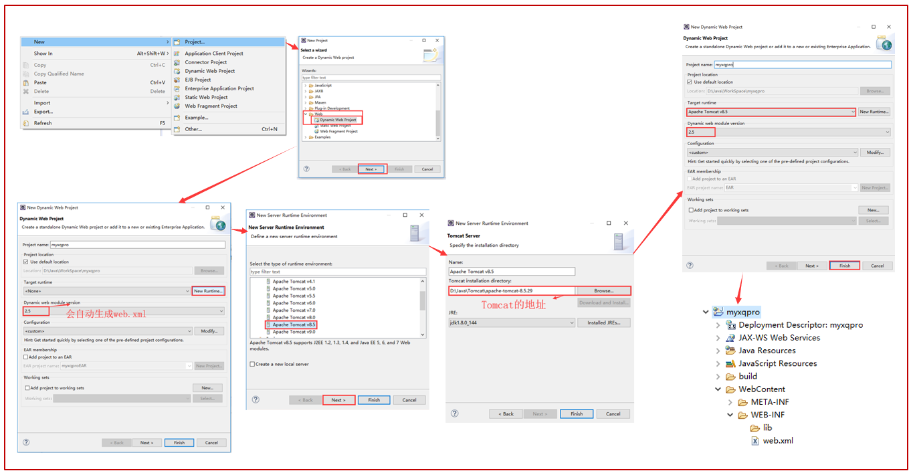
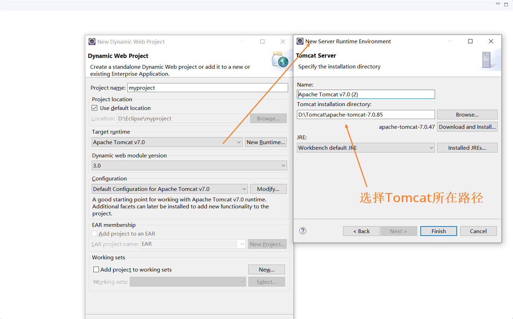
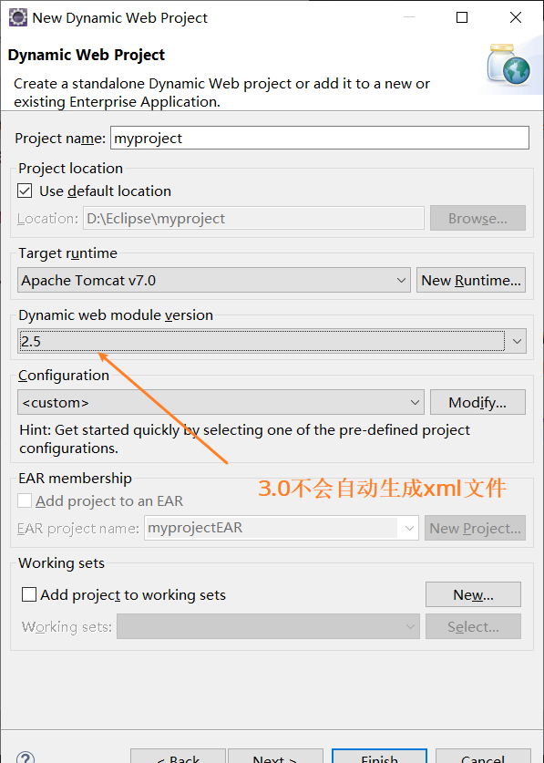
3.0不会在WEB_INF 里生成xml文件

#### 切换JavaEE视图
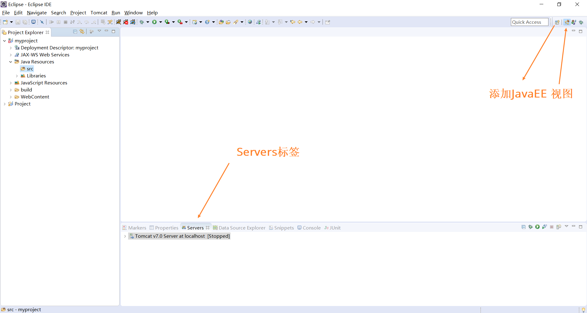

#### 配置服务器
在创建项目的时候已经添加好了服务器
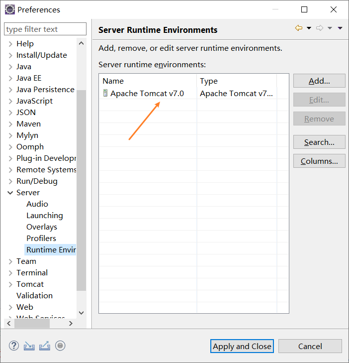

在Servers标签创建Server
右键-new-Server-选择对应Tomcat版本-下面Next-添加已有的项目-Finish
也可通过右键已创建的Server-Add and Remove-添加已有项目

双击Server，修改配置
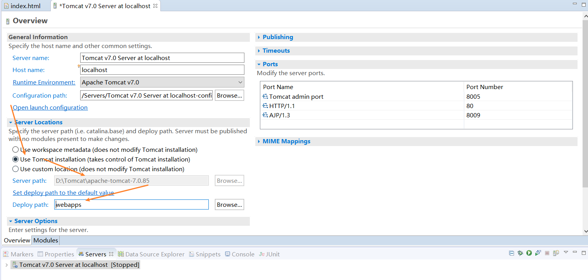
设置目录，发布时候就会把WebContent和字节码部署到设置好的目录里（我设置的是D:\Tomcat\apache-tomcat-7.0.85\webapps）

#### 发布项目
新建index.html文件
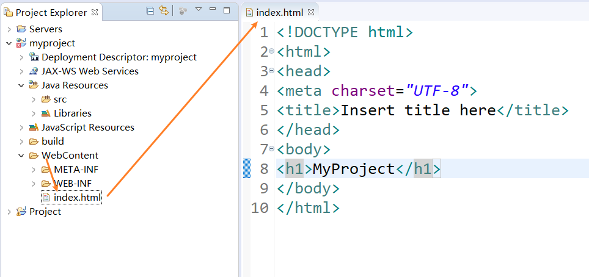

右键项目-run Server 或者 是在Server右键-Start
1. 将未发布的工程，发布到webapps下面
2. 启动tomcat（如果用startup.bat打开了Tomcat，要先关闭）

在发布时
会在Tomcat的webapps目录下创建一个名称myproject的目录
并且把WebContent当中的所有内容放入到webapps目录下当中的myproject目录中
不会把写的Java代码给放到webapps当中，运行时，只需要字节码就行了

浏览器访问：http://localhost:8080/myproject/
就可看到刚才写的index.html

## 优化Tomcat启动速度
1. 删除webApps里面的自带的项目（保留ROOT，ROOT是默认访问的项目），加快启动速度
2. 复制ROOT里面的xml的web-app标签，替换当前项目的web-app标签（原因是3.0才支持优化）
```xml
<web-app xmlns="http://java.sun.com/xml/ns/javaee"
    xmlns:xsi="http://www.w3.org/2001/XMLSchema-instance"
    xsi:schemaLocation="http://java.sun.com/xml/ns/javaee
                        http://java.sun.com/xml/ns/javaee/web-app_3_0.xsd"
    version="3.0"
    metadata-complete="true">
```
添加上这个标签
```xml
<absolute-ordering></absolute-ordering> 
省略写法：<absolute-ordering/>
```
扫描的jar包，里面为空，就是不扫描 提升速度
在ROOT的xml也添加这句

新建工程就可以选3.0，把修改好的web.xml复制到WEB-INF里，修改下display-name标签内容

## Tomcat服务器Context
添加工程就是在conf/server.xml 中添加Context标签，一个项目就是一个Context
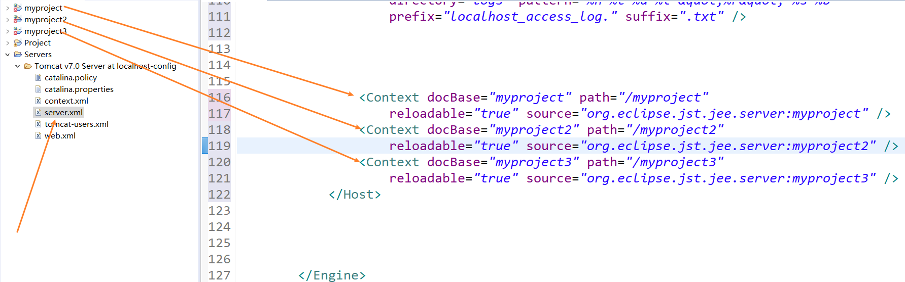

docBase
web应用的文件路径，相对路径，相对的是Server设置的目录

path
URL入口（网页输入的地址）

reloadable
字节码变化服务器是否重新加载web应用
#### tomcat服务器体系结构

1. Server：整个Servlet容器组合，可以包含一个或多个Service标签
2. service：它由一个或者多个Connector组成，以及一个Engine，负责处理所有Connector所获得的客户请求
3. Connector：客户端与程序交互组件，负责接收请求以及向客户端返回响应
4. Engine：处理连接器接收到请求
5. Host：虚拟主机
6. Context：一个Context对应于一个Web Application

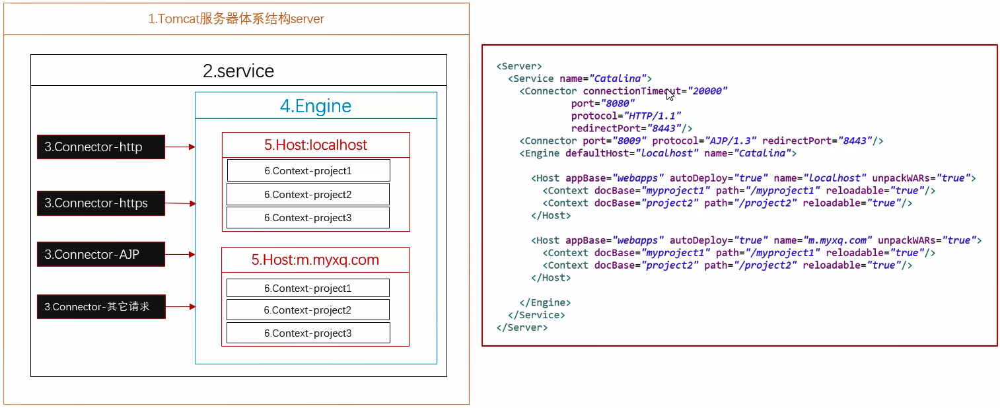

#### 虚拟主机
1. 输入网址时， 就会先到host文件当中查找有没有对应的IP地址，如何有就直接访问该IP地址
2. 如果没有，就会到外网去找DNS服务器进行域名与IP地址的解析，查找
3. **多个域名可以访问同一个IP**
4. 一个IP对应一台电脑

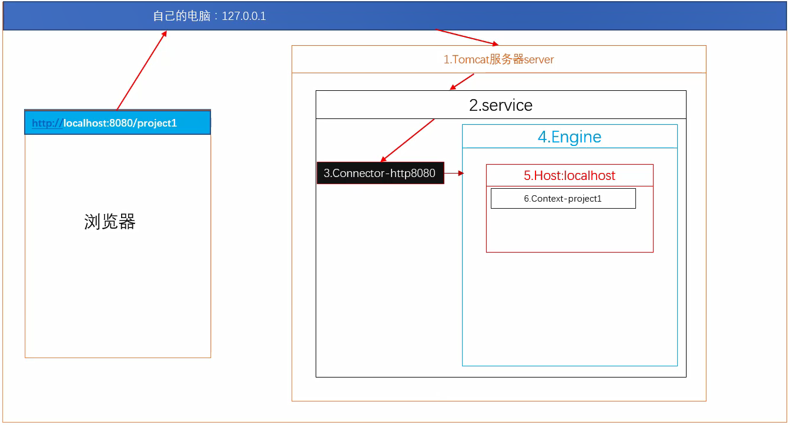

修改本机host文件(C:\Windows\System32\drivers\etc)
Win10不能直接修改，复制到桌面修改，然后覆盖host
```
127.0.0.1          m.myxq.com
```
原来的server.xml
```xml
			<Host appBase="webapps" autoDeploy="true" name="localhost"
				unpackWARs="true">
				<Valve className="org.apache.catalina.valves.AccessLogValve"
					directory="logs" pattern="%h %l %u %t &quot;%r&quot; %s %b"
					prefix="localhost_access_log." suffix=".txt" />

				<Context docBase="myproject2" path="/myp2"
					reloadable="true" source="org.eclipse.jst.jee.server:myproject2" />
				<Context docBase="myproject" path="/myproject"
					reloadable="true" source="org.eclipse.jst.jee.server:myproject" />
			</Host>
```
添加虚拟主机：在Host标签后面再添加一个Host标签
```xml
			<Host appBase="webapps" autoDeploy="true" name="m.myxq.com"
				unpackWARs="true">

				<Context docBase="myproject" path="/myp2"
					reloadable="true" source="org.eclipse.jst.jee.server:myproject" />
			</Host>
```
可以在server.xml修改端口，浏览器默认访问80端口，这样就可以免输入端口
通过 http://m.myxq.com/myp/ 和 http://localhost/myp/ 访问的项目不同，不同域名映射到同一个IP

## Tomcat插件安装
1. [下载插件](https://jaist.dl.sourceforge.net/project/tomcatplugin/net.sf.eclipse.tomcat.updatesite-2018-03-08.zip)
2. 到Eclipse当中找到help->install new software
3. 进入对话框，点击add然后弹出add Repository  选择下载的插件位置，name随便写,点击确定
4. 在列表框中选中tomcat-plugin直接点击下一步
5. 接受许可，然后等待，在eclipse右下角会有安装进度。进度完成时，会弹出要求重新启动eclipse

配置插件与Tomcat关联
1.windon->preferences
2.找到tomcat
3.选择对应版本的服务器
4.找到tomcat服务器存放的根路径

Atl+t 重启服务器        

## 参考资料

[Java零基础到高级JavaWeb与项目](https://study.163.com/course/introduction/1005981003.htm)
				
					
						
							
								
									
