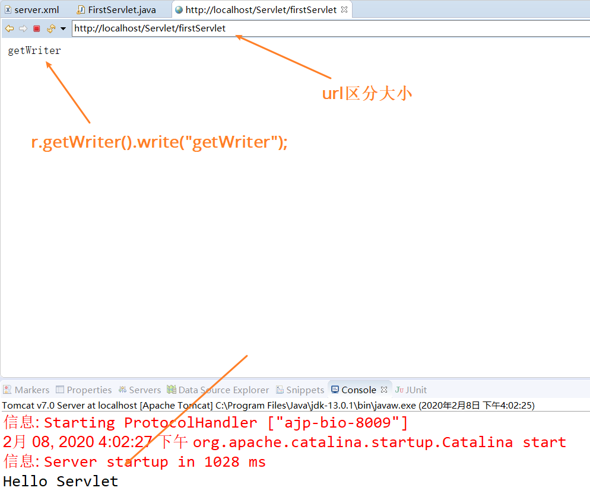
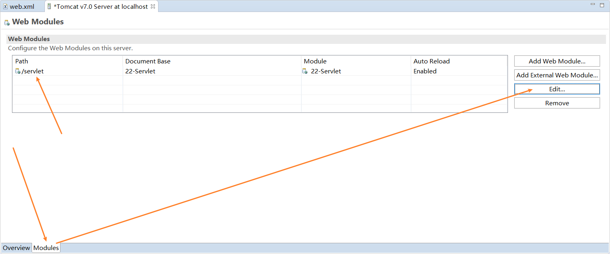
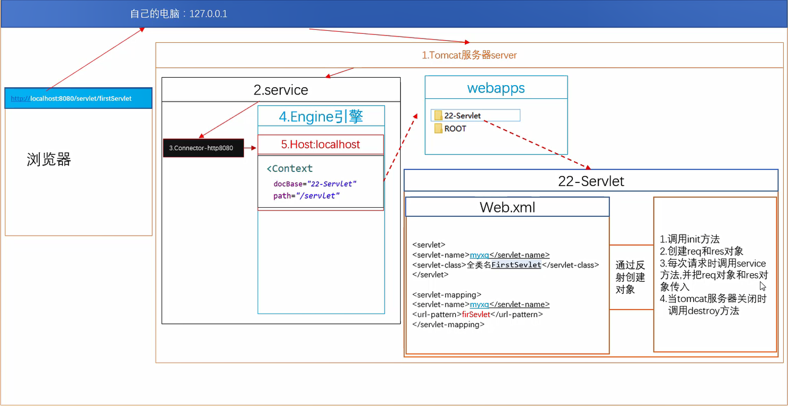
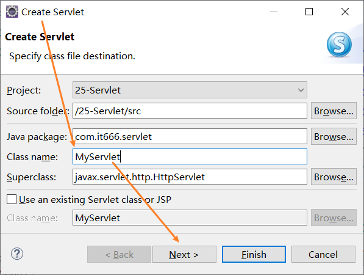
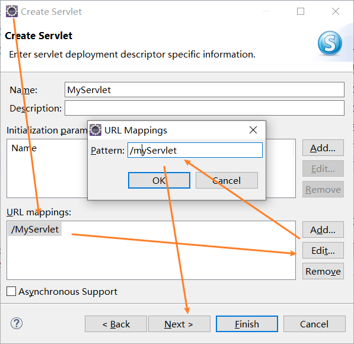
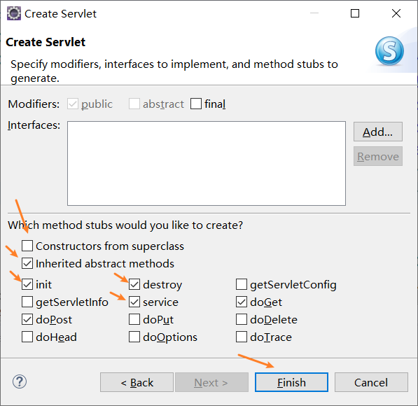
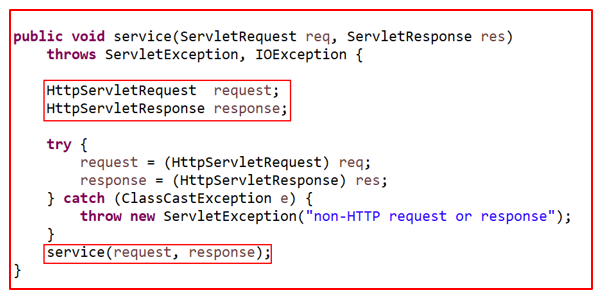
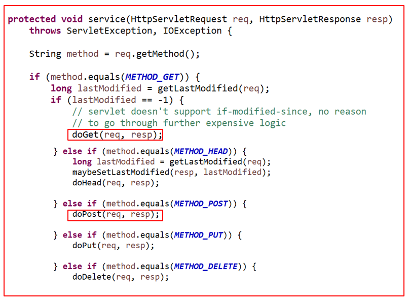

## Servlet
Servlet 运行在服务端的Java小程序，是sun公司提供一套规范（接口）
1. servlet接收响应请求
2. filter过滤器
3. listener监听器

用来处理客户端请求、响应给浏览器的动态资源
servlet的实质就是java代码，通过Java的API动态的向客户端输出内容
以后写的程序就不在是在本地执行了。而是编译成字节码，放到服务器上来去执行。
编写程序时， 不需要有main函数了。因为写完后，就把编写的程序编译成字节码，放到服务器上面。当前发送就一个请求的时候，服务器就会按照一定规则调用编写的代码

## Servlet快速入门
1. 创建一个Web工程
2. 在JavaResource中src下创建一个包名称为com.myxq.servlet
3. 在创建的servlet包当中创建一个class文件起名为FirstServlet
4. 进入该class实现一个Servlet接口，实现它未实现的方法，在service方法中写入一句话输出
5. 在web.xml当中进行配置
```xml
	<display-name>Servlet</display-name>
    <!-- 在display-name 标签后添加servlet 和 servlet-mapping配置-->
	<servlet>
		<servlet-name>myxq</servlet-name>
		<servlet-class>com.it666.servlet.FirstServlet</servlet-class>
	</servlet>
	<servlet-mapping>
		<servlet-name>myxq</servlet-name>
		<url-pattern>/firstServlet</url-pattern>
	</servlet-mapping>
```

```java
package com.it666.servlet;

public class FirstServlet implements Servlet {

	@Override
	public void service(ServletRequest req, ServletResponse res) throws ServletException, IOException {
		System.out.println("Hello Servlet");
		HttpServletResponse r = (HttpServletResponse) res;
		r.getWriter().write("getWriter");
	}
	@Override
	public void destroy() {}

	@Override
	public ServletConfig getServletConfig() {
		return null;
	}

	@Override
	public String getServletInfo() {
		return null;
	}

	@Override
	public void init(ServletConfig config) throws ServletException {}

}
```

执行结果


修改url路径


## 反射
#### 类的加载时机
当程序要使用某个类时，如果该类还未被加载到内存中，系统会通过加载，连接，初始化三步来实现对这个类进行初始化

- 加载 
就是指将class文件读入内存，并为之创建一个Class对象。任何类被使用时系统都会建立一个Class对象
- 连接
验证 是否有正确的内部结构，并和其他类协调一致
准备 负责为类的静态成员分配内存，并设置默认初始化值
- 初始化
初始化成员变量等等

加载时机

- 创建类的实例
- 访问类的静态变量，或者为静态变量赋值
- 调用类的静态方法
- 初始化某个类的子类
- 使用反射方式来强制创建某个类或接口对应的java.lang.Class对象

#### 类加载器 classLoader
负责将.class文件加载到内存中，并为之生成对应的Class对象

类加载器分类
- 根类加载器
也被称为引导类加载器，负责Java核心类的加载
比如System,String等。在JDK中JRE的lib目录下rt.jar文件中
- 扩展类加载器
负责JRE的扩展目录中jar包的加载
在JDK中JRE的lib目录下ext目录
- 系统类加载器
负责在JVM启动时加载来自Java命令的class文件
以及classpath环境变量所指定的jar包和类路径

#### 反射
创建一个对象的三个阶段
1. 源文件阶段 .java的文件
2. 字节码阶段 .class
3. 创建对象阶段  new  对象名称

内省与反射
- 内省
在运行时能够获取JavaBean当中的属性名称和get与set方法
- 反射
JAVA反射机制是在运行状态中，对于任意一个类，都能够知道这个类的**所有属性和方法**
对于任意一个对象，都能够调用它的任意一个方法和属性
这种**动态获取的信息以及动态调用对象的方法的功能称为java语言的反射机制**


获取字节码文件：想要使用反射，就必须得要获取字节码文件
1. Object类的getClass()方法
判断两个对象是否是同一个字节码文件
2. 静态属性class
当作静态方法的锁对象
3. Class类中静态方法forName()
读取配置文件

```java
// 获取字节码
// 1.类的全限定名称 ClassNotFoundException
Class clazz = Class.forName("com.it666.reflect.Person");
// 2.
Class clazz2 = Person.class;
// 3.
Person p = new Person();
Class clazz3 = p.getClass();
```
#### 通过字节码创建对象
``` java
// 1.通过无参构造创建对象
Person p2 = (Person)clazz.newInstance();

// 2.通过有参构造创建对象
// 获取字节码的构造器：
// 因为在反射阶段操作的都是字节码，不知道具体的类型，只有在创建对象的时候才去给实际参数
Constructor c = clazz.getConstructor(String.class, Integer.class);
// 通过构造器创建对象：调用构造器的newInstance方法并传入参数
Person p2 = (Person)c.newInstance("al",20);
```
#### 获取字段
```java
//获取pubic字段(默认修饰符是不可以的获取到的：NoSuchFieldException)
Field f = clazz.getField("name");
f.set(p2,"李白");

//获取private 字段
Field f2 = clazz.getDeclaredField("age");
//private 去除私有权限
f2.setAccessible(true);
f2.set(p2, 11);
```

#### 获取方法
```java
//获取方法
Method m1 = clazz.getMethod("show");
System.out.println(m1.getName());//获取名字 
m1.invoke(p2);

//获取私有方法
Method m2 = clazz.getDeclaredMethod("eat",String.class);
//去除私有权限
m2.setAccessible(true);
m2.invoke(p2, "米饭"); 
```
#### 越过数组泛型检测
数组如果定义好了泛型就不能添加泛型以外的类型
可以通过反射来去实现添加以外的类型
在一个Integer泛型的数组当中添加字符串类型

	

```java
ArrayList<Integer> list = new ArrayList<Integer>();
list.add(20);
// list.add("myxq");
// 错误检测是Eclipse做的，运行的时候会做一个泛型擦除，编译成字节码，泛型都没了

// 获取ArrayList的字节码
Class<?> clazz = Class.forName("java.util.ArrayList"); // <?>  ?代表任意类型
Method m = clazz.getMethod("add",Object.class);
m.invoke(list, "myxq"); 
System.out.println(list); // [20, myxq]

```
## Tomcat反射加载Servlet
模拟实现过程
新建包com.it666.servlet
```java
// 1.创建接口
public interface IServlet {
	public void init();
}

// 2.创建实现类
public class FirstServlet implements IServlet {

	@Override
	public void init() {
		System.out.println("init...");
	}

}
// 3.复制web.xml文件，修改servlet-class标签为：com.it666.servlet.FirstServlet

// 4.测试类模拟Tomcat反射加载Servlet
public class Test {

	public static void main(String[] args) throws DocumentException, ClassNotFoundException, InstantiationException, IllegalAccessException, NoSuchMethodException, SecurityException, IllegalArgumentException, InvocationTargetException {
		//加载web.xml 使用dom4j
		// 1.创建SAXReader
		SAXReader reader = new SAXReader();
		Document doc = reader.read("src/web.xml"); // DocumentException
		// 获取根元素
		Element rootElement = doc.getRootElement();
		System.out.println(rootElement);
		
		List <Element> list = rootElement.elements("servlet");
		for (Element ServEle : list) {
			Element classEle = ServEle.element("servlet-class");
			System.out.println(classEle.getText());
			//
			Class clazz = Class.forName(classEle.getText()); // ClassNotFoundException
			Object obj = clazz.newInstance();// InstantiationException
			
			Method m = clazz.getMethod("init");// NoSuchMethodException
			m.invoke(obj); //IllegalArgumentException
			// 输出：init...
		}
	}

}
```
## Servlet生命周期
Servlet什么时候被创建
1. 默认情况下第一次访问的时候创建
2. 可以通过配置文件设置服务器启动的时候就创建

- init
servlet对象创建的时候调用
默认第一次访问时创建
- service
每次请求都会执行一次
- destroy
servlet对象销毁的时候执行
默认服务器关闭时销毁
- load-on-startup标签
对象在服务器启动时就创建
值为数字代表优先级：数据越小，优先级越高，不能为负数
```xml
<!--load-on-startup在web.xml的servlet标签中-->
	<servlet>
		<servlet-name>myxq</servlet-name>
		<servlet-class>com.it666.servlet.FirstServlet</servlet-class>
		<load-on-startup>3</load-on-startup>
	</servlet>
```

## Servlet访问流程
ServletRequest对象和ServletResponse对象是引擎提前创建好的
每次请求时调用service方法并把这两个对象传入


## Servlet配置信息
init-params标签
```xml
	<servlet>
		<servlet-name>myxq</servlet-name>
		<servlet-class>com.it666.servlet.FirstServlet</servlet-class>
		<load-on-startup>3</load-on-startup>
		<!-- init-params标签 -->
		<init-param>
			<param-name>my</param-name>
			<param-value>1234</param-value>
		</init-param>
	</servlet>
```
```java
@Override
public void init(ServletConfig config) throws ServletException {
	// 1.获取web.xml的Servlet名称
	System.out.println(config.getServletName());// 获取<servlet-name> 输出：myxq
	
	// 2.获取一些初始化参数 web.xml
	String value = config.getInitParameter("my");
	System.out.println(value);// 输出：1234
	// 3.获取ServletContext
	ServletContext sc = config.getServletContext();
}
```
init方法的config参数
1. 该servlert的配置信息
2. 获得web.xml当中参数
3. 初始化参数
4. 获取servletContext对象

url-patten
1. 完全匹配
2. 目录匹配
3. 扩展名匹配
```xml
<servlet-mapping>
	<servlet-name>myxq</servlet-name>
	<url-pattern>/firstServlet</url-pattern>
	<url-pattern>/aaa/bbb/*</url-pattern>
	<url-pattern>*.myxq</url-pattern>

</servlet-mapping>
```

缺省Servlet
访问的资源不存在时，就会找缺省的地址
```xml
<url-patten>/</url-patten>
```

全局Web.xml
对于部署在服务器上的所有应用都有效
先到自己工程当中找web.xml配置
再到全局web.xml当中去找配置
如果两个当中有相同的配置，自己当中配置的内容会生效

静态资源加载过程
在path后面写的静态资源名称index.html或者是其它的.html它都是会找ur-patten当中有没有匹配的内容
如果有，就加载对应的servlet，如果没有就到自己配置当中找缺省的url-patten
如果自己配置文件当中没有缺省的，就会找全局配置缺省的url-patten
在全局配置当中有一个缺省的url-patten 对应的是default的Servlet
defaultServlet内部会到当前访问的工程根目录当中去找对应的名称的静态资源，如果有，就把里面的内容逐行读出。响应给浏览器，如果没有，就会报404错误

欢迎页面 Welcome-file-list
不写任何资源名称的时候，会访问欢迎页面
默认从上往下找
## 使用注解创建Servlet
包名右键-new-Servlet




修改web.xml web-app标签中的 metadata-complete="false"
该属性为true时，web应用将不会加载注解配置的Web组件

从Servlet3.0开始可以直接使用注解的形式来去使用Servlet
在创建好的Servlet上面有会有一个@WebServlet("/myServlet")
这个就是一个注解，就相当于在代码上添加了一个小插件
贴上这个注解后，就不用再去做配置文件，会在内部自动帮你去做
括号当中的内容就是url-patten的内容，要在地址栏当中path后面跟的内容


## HttpServlet
直接new的Servlet它是一个HttpServlet
它是GenericServlet的子类
GenericServlet实现了Servlet接口
HttpServlet是专门负责处理http请求与响应的
以后创建Servlet时，直接使用httpServlet

#### HttpServlet方法
- service
每一次发送请求的时候就会调用
当写了service就会不再调用get或post
- doGet
当发送get请求时调用
- doPost
当发送post请求的时候调用

#### 内部方法调用过程
当接收到一个请求时， tomcat就会找对应的service方法
如果当中servlet当中没有存在service方法，就会到它的父类(HttpServlet)当中去找

在父类当中找到service是参数为ServletRequest，会在内部把参数转为httpServlet
转换完毕后会再继续调用参数为httpServletRequest的service方法

在此方法当中会获取参数的类型，根据不同的参数类型再去调用不同的方法

## 参考资料

[Java零基础到高级JavaWeb与项目](https://study.163.com/course/introduction/1005981003.htm)
