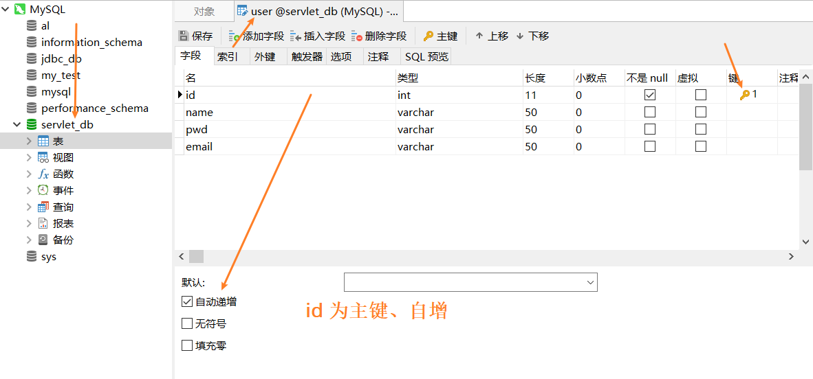
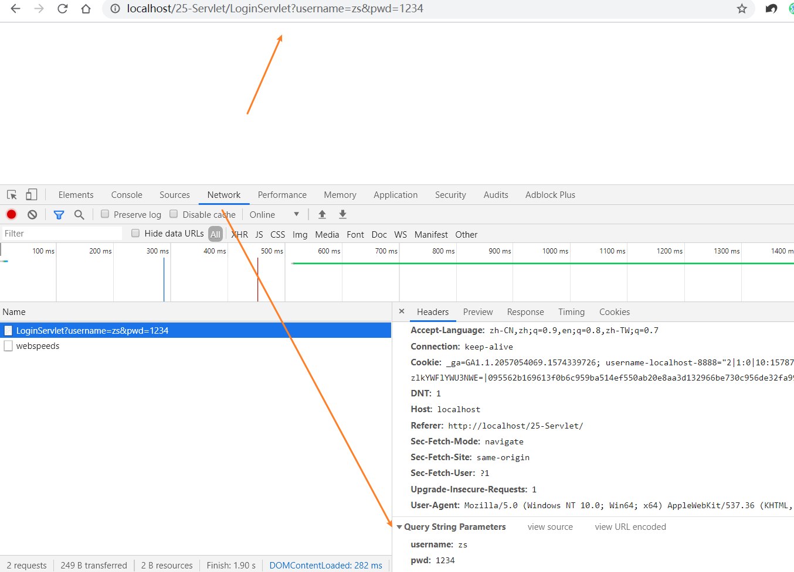

## 实现登录功能
#### 建表

添加数据:
name:zs pwd:1234
#### domian
User类
```java
package com.it666.domain;
public class User {
	Integer id;
	String name;
	String pwd;
	String email;
	public Integer getId() {
		return id;
	}
	public void setId(Integer id) {
		this.id = id;
	}
	public String getName() {
		return name;
	}
	public void setName(String name) {
		this.name = name;
	}
	public String getPwd() {
		return pwd;
	}
	public void setPwd(String pwd) {
		this.pwd = pwd;
	}
	public String getEmail() {
		return email;
	}
	public void setEmail(String email) {
		this.email = email;
	}	
}
```
#### HTML登录界面
在WebContent目录下新建index.html
```html
<body>
	<h1>用户登录</h1>
	<form action="http://localhost/25-Servlet/LoginServlet" method="get">
	用户名：<input type="text" placeholder="请输入用户名..." name="username"> <br/>
	密    码：<input type="text" placeholder="请输入密码..." name="pwd"><br/>
	<input type="submit" value="登录">
	</form>
	
</body>
```
#### 创建Servlet
只需要勾选service方法
```java
package com.it666.login;

import java.io.IOException;
import javax.servlet.ServletException;
import javax.servlet.annotation.WebServlet;
import javax.servlet.http.HttpServlet;
import javax.servlet.http.HttpServletRequest;
import javax.servlet.http.HttpServletResponse;

@WebServlet("/LoginServlet")
public class LoginServlet extends HttpServlet {
	private static final long serialVersionUID = 1L;

	protected void service(HttpServletRequest request, HttpServletResponse response) throws ServletException, IOException {
		System.out.println("LoginServlet"); // 测试
	}

}
```
修改form表的的action为LoginServlet的地址
重启Server，打开index，点击登录命令行是否输出LoginServlet

输入用户名和密码，get请求：


#### 数据库
导入jar包到WebContent/WEB-INF/lib
- commons-dbutils-1.4.jar
- druid-1.0.15.jar
- mysql-connector-java-5.1.40-bin.jar
bulid path

创建resource文件夹，放入db.properties配置文件，记得修改url为刚创建的数据库
写JdbcUtil类

Properties配置文件的位置
resource文件夹会被部署到webapps\25-Servlet\WEB-INF\classes文件里
解决方法：通过字节码目录任意的类获取类加载器，获取到Properties配置文件的路径
```java
package com.it666.utils;
public class JdbcUtil {
	public static DataSource ds = null;
	static {
		try {
			Properties p = new Properties();
            // 获取字节码目录：通过字节码目录任意的类获取类加载器，获取到Properties配置文件的路径
			String path = JdbcUtil.class.getClassLoader().getResource("db.properties").getPath();
			System.out.println("path"+path);
			
			FileInputStream in = new FileInputStream(path);
			p.load(in);
			ds = DruidDataSourceFactory.createDataSource(p);
		} catch (Exception e) {
			e.printStackTrace();
		}
	}

	public static DataSource getDataSource() {
		return ds;
	}	
}
```

修改Servlet
```java
package com.it666.login;

import java.io.IOException;
import java.sql.SQLException;

import javax.servlet.ServletException;
import javax.servlet.annotation.WebServlet;
import javax.servlet.http.HttpServlet;
import javax.servlet.http.HttpServletRequest;
import javax.servlet.http.HttpServletResponse;

import org.apache.commons.dbutils.QueryRunner;
import org.apache.commons.dbutils.handlers.BeanHandler;

import com.it666.domain.User;
import com.it666.utils.JdbcUtil;

@WebServlet("/LoginServlet")
public class LoginServlet extends HttpServlet {
	private static final long serialVersionUID = 1L;

	protected void service(HttpServletRequest request, HttpServletResponse response)
			throws ServletException, IOException {
		System.out.println("LoginServlet");
		// 1.获取请求参数
		String name = request.getParameter("username");
		String pwd = request.getParameter("pwd");
		System.out.println(">"+name+ "<>" + pwd+"<");
		// 2.使用 mbuti1s连接到数据库当中
		QueryRunner qr = new QueryRunner(JdbcUtil.getDataSource());
		String  sql = "select * from user where name=? and pwd=?";
		
		User user = null;
		try {
			user = qr.query(sql, new BeanHandler<User>(User.class),name,pwd);
		} catch (SQLException e) {
			e.printStackTrace();
		}
		// 3.检査用户名与密码是否正确
		if (user != null) {
			// 4.登录成功，显示用户所有信息
			response.getWriter().write("login success:"+name);
		} else {
			// 5.登录失败给一个错误提示
			response.getWriter().write("login fail");
		}
		
	}

}
```
## 参考资料

[Java零基础到高级JavaWeb与项目](https://study.163.com/course/introduction/1005981003.htm)