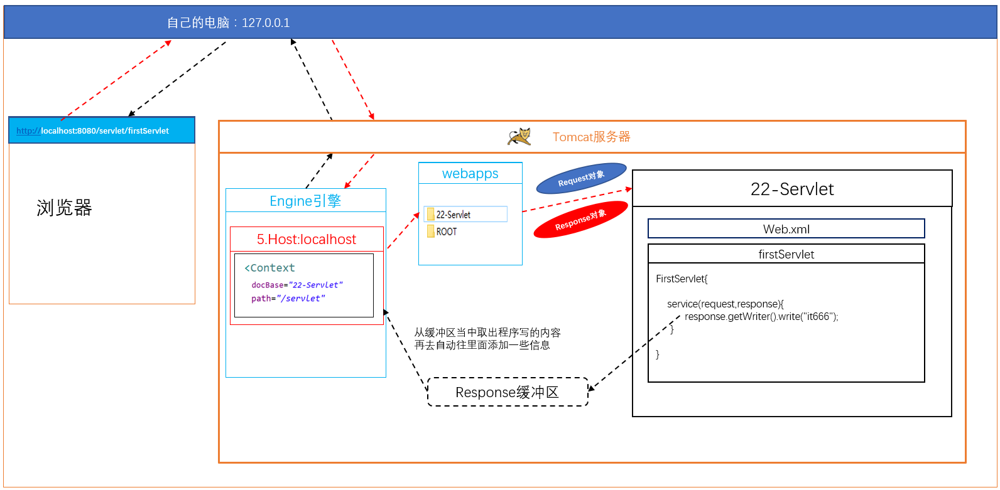

## ServletContext
ServletContext代表是一个web应用的上下文对象（web应用对象）
里面封装的都是web应用信息
一个ServletContext对应一个应用

ServletContext的生命周期
在服务器一启动的时候就会创建
在服务器关闭的时候销毁

如何获得上下文
1.通过init方法当中一个参数ServletConfig来获取
2.直接在HttpServlet当中获取，this.getServletContext，这种方法本质还是通过config来去获取的

子类在覆盖父类init方法的时候最好调用父类的初始化参数super.init(config); 
不传入config，父类就没有config参数
```java
@WebServlet("/OneServlet")
public class OneServlet extends HttpServlet {
	private static final long serialVersionUID = 1L;
	public void init(ServletConfig config) throws ServletException {
		super.init(config);
		ServletContext sc1 = config.getServletContext();
		System.out.println(sc1);
	}
	protected void service(HttpServletRequest request, HttpServletResponse response) throws ServletException, IOException {
		System.out.println("OneServlet");
		ServletContext context = this.getServletContext();
		// 这种方法本质还是通过config获取
		// 重写了init方法，用这种方法调用空指针异常
		// 原因是子类覆盖了父类init方法
		/*
		@Override
    	public void init(ServletConfig config) throws ServletException {
        this.config = config;
        this.init();
    	}
		 */
		// 解决：在init方法添加super.init(config);
	}

}
```
                     
获取全局的初始化参数
初始化参数不能再某一个Servlet当中来去配置。在最外层来去配置
获取全局初始化参数
        
获得Web应用中某一个资源的资源的绝对路径
context.getRealPath("文件")
相对的是web应有根目录
context.getRealPath("index.html")
D:\Java\Tomcat\apache-tomcat-7.0.85\webapps\bei\index.html
在文件名称前面自动拼接上当前工程的绝对地址

```java
String  realPath = context.getRealPath("WEB-INF/a.txt"); // a.txt 在WEB-INF里
System.out.println(realPath);// D:\Tomcat\apache-tomcat-7.0.85\webapps\26-Servlet\WEB-INF\a.txt
System.out.println();

// 通过类加载器，获取字节码路径
String path = OneServlet.class.getClassLoader().getResource("c.txt").getPath(); // c.txt 在src下
System.out.println(path);	// /D:/Tomcat/apache-tomcat-7.0.85/webapps/26-Servlet/WEB-INF/classes/c.txt

// 如果在包内，路径就要加上包路径
```

ServletContext是一个域对象
域：能够存储数据
域对象：能够存取数据数据就的对象

ServletContext域对象的作用范围
整个web应用
所有的web资源都可以进行存取数据
数据是可以共享的
只要是一个域对象上，基本上里面都有这几个方法:
获取完ServletContext之后向里面写数据：context.setAttribute(String name,Object value);
获取完ServletContext之后，通过name取出存放的数据：context.getAttribute(String name);
获取完ServletContext之后，删除指定名称的值：context.removeAttribute(String name);

```java
ServletContext context = config.getServletContext();
sc1.setAttribute("lk", "lks");
String value =(String) context.getAttribute("lk");// 其他Servlet也可以get到
System.out.println(value);
```


## Response响应过程


在去发送一个请求时， 会找到tomcat引擎
引擎会找到对应的web应用，并且会创建request对象和response对象
找到应用后， 会执行应用的web.xml再去根据url-patten的内容创建Servlet对象
并且会调用Servlet对象的service方法，并且把创建的request对象和response对象传入到方法当中
拿到response对象后，  自己可以往响应当中写入一些自己给客户端的内容，通过response.getwrite().wirte("写的内容")方法进行写入
写的内容，是存到一个response缓冲区当中
当方法执行结束之后， tomcat就会从response缓冲区当中取出数据，取出你的数据同时，它自己还会自动的往里面添加一些服务器相关的信息进去，所以响应给浏览器时， 可以看到除了自己写的内容， 还会有一些服务器相关的信息

## response
通过response设置响应行，响应头 ，响应体

#### 设置响应行
response.setState(Int code)
#### 设置响应头 
add：代表添加新的内容
addHeader(String name,String value)
addIntHeader(String name,int value)
addDateHeader(String name,date)
    
set：代表设置，已经存在的内容（可以修改自己add，也可以修改默认的）
setHeader(String name,String value)
setIntHeader(String name,int value)
setDateHeader(String name,Date value)

```java
		response.setStatus(302);
		// add
		response.addHeader("name", "it666");
		response.addIntHeader("age", 10);
		response.addDateHeader("my-Date", new Date().getTime());// 获取当前毫秒值
		// set

```
				
#### 重定向
到服务器当中去找servlet1，servlet1当中没有这个资源，告诉你去找servlet2，再去发送一个请求到servlet2

状态码：302

特点：要访问两次服务器
第一次访问是人为的去访问
第二次是自动的访问
浏览器地址栏已经发生变化

设置重定向
```java
// 1.设置响应码302
response.setStatus(302);
// 2.设置重定向 /项目名/Servlet名
response.setHeader("location", "/26-Servlet/LocationServlet");
```
        
封装的重写向
每次都要写状态码，和location比较麻烦
就给封装了一个方法
response.sendRedirect("/26-Servlet/LocationServlet");
            
定时刷新重定向
response.setHeader("refresh","5;url=http://www.baidu.com")
5代表5秒
url的值为5秒后要去跳转的地址
						
##### 设置响应体
1. 通过write方法来写
response.getwrite().wirte("要写的内容或HTML代码");

默认情况下写的中文内容会乱码
写的内容存到缓存区中使用的是ISO8859，ISO8859不支持中文，所以会乱码

解决中文乱码：
在存之前设置可以设置存放的编码
response.setCharacterEncoding("UTF-8")
告知浏览器使用的是utf-8编码
response.setHeader("Content-Type", "text/html;charset=UTF-8");

只需要设置Content-Type就可以了，Tomcat看到设置了为utf-8的编码，它在存的时候也会使用utf-8的编码
使用封装写法：response.setContentType("text/html;charset=UTF-8");

2. 通过OutPutStream来写

FileInputSteam
read方法读取一个字节
    
read(byte[] b)
    一次读取多个字节,并存放到数组b中
    上面是一次一滴一滴给你，这种是一次装一水桶再给你
        
读取全部的数据
        
FileOutputSteam
write()
    一次性写一个字符
write(buffer)
    一个性写多个字符
write(buffer,0,len)
    一次性写指定个数的字符

response注意点
    getWrite()和getOutputSteam不能同时调用

```java
// read 读一个字符 完毕返回-1
// System.out.println(in.read());
byte[] buffer = new byte[5];
System.out.println(Arrays.toString(buffer));// [0,0,0,0,0]
// 当前读取了几个字符 ，读到最后返回-1
int len = 0;
while ((len = in.read(buffer)) != -1) {
    System.out.println(new String (buffer,0,len));
    
}
// 关闭文件
in.close();
```

写入图片案例
```java
package com.it666.response;

import java.io.FileInputStream;
import java.io.IOException;
import javax.servlet.ServletException;
import javax.servlet.ServletOutputStream;
import javax.servlet.annotation.WebServlet;
import javax.servlet.http.HttpServlet;
import javax.servlet.http.HttpServletRequest;
import javax.servlet.http.HttpServletResponse;

@WebServlet("/ResImgServlet")
public class ResImgServlet extends HttpServlet {
	private static final long serialVersionUID = 1L;

	protected void service(HttpServletRequest request, HttpServletResponse response)
			throws ServletException, IOException {
		// 向浏览器写一张图片
		String path = this.getServletContext().getRealPath("8.png");
		// 加载图片
		FileInputStream in = new FileInputStream(path);

		// 获取输出流
		ServletOutputStream out = response.getOutputStream();
		
		byte[] buffer = new byte[1024];
		int len = 0;
		while ((len = in.read(buffer)) != -1) {
			out.write(buffer,0,len);
		}
	}

}
```

#### 下载功能
把服务器当中的文件直接下载到电脑当中

1.直接使用a标签来去下载
有些内容会浏览器自动解析
浏览器不能解析的文件才会被下载
```html
<body>
    <!-- 8.png路径：WebContent/download -->
	<a href="/26-Servlet/download/8.png">8.png</a>
</body>
```
        
2.通过发送Servlet请求来去下载

通过发送一个Servlet请求，把文件名发送给服务器
发送给服务器后，接收到文件名参数，获取文件的绝对地址
通过流的形式来去写到浏览器
还得要告诉文件是什么类型

浏览器是以MIME的类型来识别类型
this.getServletContext().getMimeType(“文件名称”)

设置响应的类型
res.setContentType("MIME类型")

设置响应头，告诉浏览器不要去解析，是以附件的形式打开，
res.setHeader("Content-Disposition","attachment;filename="+文件名)

步骤
1.接收文件名参数
2.获取mime类型
3.设置浏览器响应类型
4.告诉浏览器以附件形式下载
5.获取文件的绝对路径
6.读取文件流
7.获取输出流
8.把内容写出到输出流

```html
<body>
	<!-- ?后面跟参数，多个参数用&隔开 -->
	<a href="/26-Servlet/DownloadServlet?filename=8.png">8.png</a>
</body>
```

``` java
// 写在service里
String name = request.getParameter("filename");
		System.out.println(name);// 8.png
		
		//根据文件名获取mime类型
		String mimeType = this.getServletContext().getMimeType(name);
		System.out.println("mimeType:"+mimeType);// mimeType:image/png
		
		//设置mimeType
		response.setContentType(mimeType);
		
		// 告诉浏览器以附件形式打开 
		response.setHeader("Content-Disposition", "attachment;filename="+name);
		
		// 拼接文件路径
		String path = this.getServletContext().getRealPath("download/"+name);

		//加载文件
		FileInputStream in =  new FileInputStream(path);
		
		//获取响应的输出
		ServletOutputStream out = response.getOutputStream();
		
		byte [] buffer = new byte[1024];
		int len =0;
		while ((len = in.read(buffer)) != -1) {
			out.write(buffer,0,len);
		}
		
		in.close();

```


获取中文参数报错问题
高版本tomcat中的新特性：就是严格按照 RFC 3986规范进行访问解析，而 RFC 3986规范定义了Url中只允许包含英文字母（a-zA-Z）、数字（0-9）、-_.~4个特殊字符以及所有保留字符(RFC3986中指定了以下字符为保留字符：! * ’ ( ) ; : @ & = + $ , / ? # [ ])

```
.../conf/catalina.properties中，找到最后注释掉的一行 
#tomcat.util.http.parser.HttpParser.requestTargetAllow=| 去掉#，在最后加上 {} 表示把{}放行
tomcat.util.http.parser.HttpParser.requestTargetAllow=|{}
```

1.把获取的字符串参数的字节码获取，再重新使用utf-8编码
2.在设置以附件形式打开时， 不同的浏览器会对默认的名字进行解码
所以根据不同的浏览器，要对名称进行编码之后，再放入文件名
对文件名进行编码
不同的浏览器编码不一样，要先获取agent，取出浏览器的类型，根据不同的浏览器类型进行编码

步骤
	1.接收文件名称
	2.获取mimeType
	3.设置浏览器响应类型
	4.先对传入的参数转成二进制流，再使用UTF-8进行编码
	5.获取浏览器的信息
	6.判断是哪一种浏览器，根据不同的浏览器获取一个编码的文件名
	7.设置以附件形式下载，传的名称是编码过的名称 
	8.获取文件的绝对路径
	9.读取文件流
	10.获取输出流
	11.把文件写到响应当中
```java		
	// 获取客户端信息
	String agent = request.getHeader("User-Agent");
	// 定义一个变量记录编码之后的名字
	String filenameEncoder = "";
	if (agent.contains("MSIE")) {
		// IE编码
		filenameEncoder = URLEncoder.encode(filename, "utf-8");
		filenameEncoder = filenameEncoder.replace("+", " ");
	} else if (agent.contains("Firefox")) {
		// 火狐编码
		BASE64Encoder base64Encoder = new BASE64Encoder();
		filenameEncoder = "=?utf-8?B?" + base64Encoder.encode(filename.getBytes("utf-8")) + "?=";
	} else {
		// 浏览器编码
		filenameEncoder = URLEncoder.encode(filename, "utf-8");
	}

```
```java
// DK中的/lib/tool.jar和/lib/rt.jar已经从Java SE 9中删除
// JDK9 及以后要用下面的方式导包和创建对象
import java.util.Base64;
import java.util.Base64.Encoder;
// 修改代码
Encoder base64Encoder = Base64.getEncoder();
```


#### 注册验证码功能
验证码可以防止：恶意批量注册、恶意破解密码、刷票、论坛灌水
有效防止某个黑客对某一个特定注册用户用特定程序暴力破解方式进行不断的登陆尝试
确保当前访问是来自一个人而非机器

1. 把别人写好的验证码Servlet拿到程序当中

```java
package com.it666.code;

import java.awt.Color;
import java.awt.Font;
import java.awt.Graphics;
import java.awt.Graphics2D;
import java.awt.image.BufferedImage;
import java.io.BufferedReader;
import java.io.FileReader;
import java.io.IOException;
import java.util.ArrayList;
import java.util.List;
import java.util.Random;

import javax.imageio.ImageIO;
import javax.servlet.ServletException;
import javax.servlet.annotation.WebServlet;
import javax.servlet.http.HttpServlet;
import javax.servlet.http.HttpServletRequest;
import javax.servlet.http.HttpServletResponse;


@WebServlet("/CheckCodeServlet")
public class CheckCodeServlet extends HttpServlet {
	private static final long serialVersionUID = 1L;

	// 集合中保存所有成语
	private List<String> words = new ArrayList<String>();

	@Override
	public void init() throws ServletException {
		// 初始化阶段，读取new_words.txt
		// web工程中读取 文件,必须使用绝对磁盘路径
		String path = getServletContext().getRealPath("/WEB-INF/words.txt");
		try {
			BufferedReader reader = new BufferedReader(new FileReader(path));
			String line;
			//把读的成语全部添加到一个集合当中
			while ((line = reader.readLine()) != null) {
				words.add(line);
			}
			reader.close();
		} catch (IOException e) {
			e.printStackTrace();
		}
	}

	public void doGet(HttpServletRequest request, HttpServletResponse response)
			throws ServletException, IOException {
		// 禁止缓存
		int width = 120;
		int height = 30;
		// 步骤一 绘制一张内存中图片
		BufferedImage bufferedImage = new BufferedImage(width, height,
				BufferedImage.TYPE_INT_RGB);
		// 步骤二 图片绘制背景颜色 ---通过绘图对象
		Graphics graphics = bufferedImage.getGraphics();// 得到画图对象 --- 画笔
		// 绘制任何图形之前 都必须指定一个颜色
		graphics.setColor(getRandColor(200, 250));
		graphics.fillRect(0, 0, width, height);
		// 步骤三 绘制边框
		graphics.setColor(Color.WHITE);
		graphics.drawRect(0, 0, width - 1, height - 1);
		// 步骤四 四个随机数字
		Graphics2D graphics2d = (Graphics2D) graphics;
		// 设置输出字体
		graphics2d.setFont(new Font("宋体", Font.BOLD, 18));
		Random random = new Random();// 生成随机数
		int index = random.nextInt(words.size());
		String word = words.get(index);// 获得成语
		// 定义x坐标
		int x = 10;
		for (int i = 0; i < word.length(); i++) {
			// 随机颜色
			graphics2d.setColor(new Color(20 + random.nextInt(110), 20 + random
					.nextInt(110), 20 + random.nextInt(110)));
			// 旋转 -30 --- 30度
			int jiaodu = random.nextInt(60) - 30;
			// 换算弧度
			double theta = jiaodu * Math.PI / 180;

			// 获得字母数字
			char c = word.charAt(i);

			// 将c 输出到图片
			graphics2d.rotate(theta, x, 20);
			graphics2d.drawString(String.valueOf(c), x, 20);
			graphics2d.rotate(-theta, x, 20);
			x += 30;
		}

		// 将验证码内容保存session
		request.getSession().setAttribute("checkcode_session", word);
		//把生成的验证码存放到全局域对象当中
		this.getServletContext().setAttribute("checkCode", word);
		// 步骤五 绘制干扰线
		graphics.setColor(getRandColor(160, 200));
		int x1;
		int x2;
		int y1;
		int y2;
		for (int i = 0; i < 30; i++) {
			x1 = random.nextInt(width);
			x2 = random.nextInt(12);
			y1 = random.nextInt(height);
			y2 = random.nextInt(12);
			graphics.drawLine(x1, y1, x1 + x2, x2 + y2);
		}
		// 将上面图片输出到浏览器 ImageIO
		graphics.dispose();// 释放资源
		//将图片写到response.getOutputStream()中
		ImageIO.write(bufferedImage, "jpg", response.getOutputStream());
	}

	public void doPost(HttpServletRequest request, HttpServletResponse response)
			throws ServletException, IOException {
		doGet(request, response);
	}

	/**
	 * 取其某一范围的color
	 * 
	 * @param fc
	 *            int 范围参数1
	 * @param bc
	 *            int 范围参数2
	 * @return Color
	 */
	private Color getRandColor(int fc, int bc) {
		// 取其随机颜色
		Random random = new Random();
		if (fc > 255) {
			fc = 255;
		}
		if (bc > 255) {
			bc = 255;
		}
		int r = fc + random.nextInt(bc - fc);
		int g = fc + random.nextInt(bc - fc);
		int b = fc + random.nextInt(bc - fc);
		return new Color(r, g, b);
	}

}
```

2. 编写静态页面

```html
<script type="text/javascript">
	function change(obj){
		// alert(obj);
		// 浏览器加载同样地址使用的是缓存
		obj.src = "/26-Servlet/CheckCodeServlet?time"+new Date().getTime();
	}
</script>

</head>
<body>
	<form action="/26-Servlet/RegisterServlet">
			<br/>
		<!-- this 指的就是这个img -->
		<input type="text" placeholder="请输入验证码..." name="code"><br/>
		<input type="submit" value="注册">
	</form>
</body>
```
3. 编写判断验证码是否正确Servlet

```java
package com.it666.code;

import java.io.IOException;
import javax.servlet.ServletException;
import javax.servlet.annotation.WebServlet;
import javax.servlet.http.HttpServlet;
import javax.servlet.http.HttpServletRequest;
import javax.servlet.http.HttpServletResponse;

@WebServlet("/RegisterServlet")
public class RegisterServlet extends HttpServlet {
	private static final long serialVersionUID = 1L;

	protected void service(HttpServletRequest request, HttpServletResponse response) throws ServletException, IOException {
		String code = request.getParameter("code");
		System.out.println(code); // 中文乱码
		
		byte[] bytes = code.getBytes("ISO8859-1");
		code = new String (bytes,"UTF-8");
		System.out.println(code);
		
		// 取出生成的字符串
		String  word = (String) this.getServletContext().getAttribute("checkCode");
		
		// 设置字符集，不然 下面的字会乱码
		response.setContentType("text/html;charset=UTF-8");
		
		if (code.equals(word)) {
			response.getWriter().write("注册成功");
		}else {
			response.getWriter().write("验证码错误");
			// 重新跳转到原界面
			response.setHeader("refresh", "1;url=/26-Servlet/code.html");
		}
		
	}

}

```
1.设置响应编码
2.从ServletContext当中获取验证码
3.获取传入的请求参数
4.从servletContext当中取出存放的验证码
5.把接收的验证码与取出的验证码时行比较
6.相同时，显示成功
7.不同时， 显示失败，隔3秒钟跳转到输入验证码界面

					

## 参考资料

[Java零基础到高级JavaWeb与项目](https://study.163.com/course/introduction/1005981003.htm)
[Java 9版本之后Base64Encoder和Base64Decoder无法继续使用解决办法](https://blog.csdn.net/xie_sining/article/details/80777164)