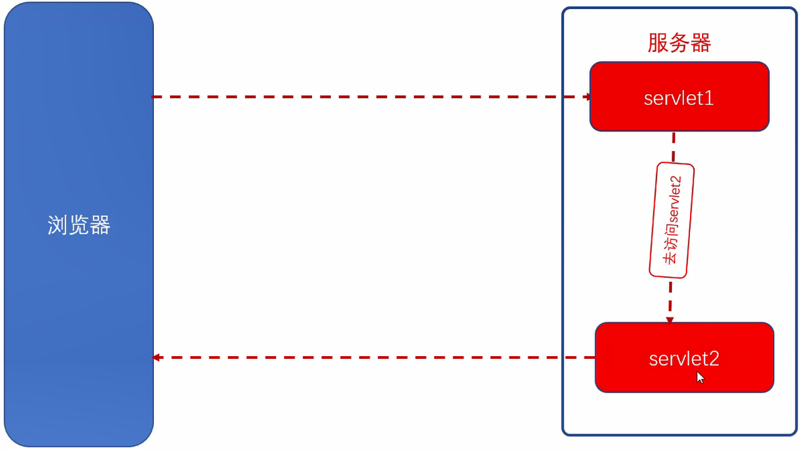

## 获取请求行、请求头、请求体

```html
<!DOCTYPE html>
<html>
<head>
<meta charset="UTF-8">
<title>Insert title here</title>
</head>
<body>
	<form action="/27-Request/RequestServlet" method="get">
	
	<input type="text" placeholder="请输入一些信息..." name="username">
	<input type="text" placeholder="请输入一些信息..." name="pwd">
	
	性别：
	<input type="radio" value="man" name="gender">男
	<input type="radio" value="woman" name="gender">女 <br/>
	爱好：
	<input type="checkbox" value="running" name="hobby" > 跑步
	<input type="checkbox" value="swimming" name="hobby"> 游泳
	<input type="checkbox" value="singing" name="hobby"> 唱歌 <br/>
	
	<input type="submit" value="提交">
	
	</form>
</body>
</html>
```

```java
package com.it666.request;

@WebServlet("/RequestServlet")
public class RequestServlet extends HttpServlet {
	private static final long serialVersionUID = 1L;

	protected void service(HttpServletRequest request, HttpServletResponse response)
			throws ServletException, IOException {
		System.out.println("RequestServlet");

		// 获取请求行
		// 1.获取请求方法
		System.out.println(request.getMethod()); // GET POST
		// 2. 获取请求资源
		StringBuffer requestURL = request.getRequestURL();
		String requestURI = request.getRequestURI();
		System.out.println(requestURL); // http://localhost/27-Request/RequestServlet
		System.out.println(requestURI); // /27-Request/RequestServlet
		// 3.获取get查询参数
		System.out.println(request.getQueryString()); // username=1111&pwd=1111
		// 4.获取应用名称
		String contextPath = request.getContextPath();
		System.out.println(contextPath); // /27-Request

		// 获取请求头
		// 1.获取所有的请求头名称
		Enumeration<String> headerNames = request.getHeaderNames();
		while (headerNames.hasMoreElements()) {
			System.out.println(headerNames.nextElement());
		}
		/*
		 * accept 
		 * referer 
		 * accept-language 
		 * ua-cpu 
		 * accept-encoding 
		 * user-agent 
		 * host
		 * connection
		 */

		// 2.获取指定的头信息
		System.out.println(request.getHeader("referer")); // http://localhost/27-Request/

		// 3.打印所有的请求头和请求头内容
		Enumeration<String> headerNames2 = request.getHeaderNames();
		while (headerNames2.hasMoreElements()) {
			String name = headerNames2.nextElement();
			System.out.println(request.getHeader(name));
		}

		// 获取请求体
		// 1.获取一个值
			System.out.println(request.getParameter("username"));
		
		// 2. 获取多个值
			String[] parameterValues = request.getParameterValues("hobby");
			System.out.println(Arrays.toString(parameterValues));
			
		// 3.获取所有请求参数名称 返回的是一个枚举 (一般用下面4的方法)
			Enumeration<String> parameterNames = request.getParameterNames();
			while (parameterNames.hasMoreElements()) {
				String string = parameterNames.nextElement();
				System.out.println(string);
			}
						
		// 4.获取所有请求参数
			Map<String, String[]> parameterMap = request.getParameterMap();
			for (Map.Entry<String, String[]> entry:parameterMap.entrySet()) {
				System.out.println(entry.getKey()+" "+Arrays.toString(entry.getValue()));
			}		
	}
}
```
					
请求头referer参数：告诉服务器我是从哪个页面链接过来的
- 通过以下方式发送请求才会获取
```html
直接用<a href="">
用Submit或<input type="image">提交的表单(POST或GET)
```
用JavaScript提交的表单(POST或GET)

- 通过以下方式不会有referer
从收藏夹链接
单击主页或自定义的地址
在浏览器中直接输地址


什么时候使用get方式与post方式
1.发送的参数不需要写到数据库当中使用get
2.发送的参数需要保存到数据库当中使用post
form一般提交数据的数据为post

中文乱码的原因
发送请求时， 会对参数进行编码，编码使用的是ISO8859-1  不支持中文，所以乱码
获取对应的参数，通过iso8859-1转回二进制位，再以utf-8的形式转成字符串
存在的问题：每一个参数都必须得要转回二进制位，再转为字符串

request方法解决中文乱码
只适用于post
```java
request.setCharacterEncoding("UTF-8"); 
```

使用BeanUtils把参数封装成对象

```html
<body>
	<form action="/27-Request/RequestServlet2" method="post">
	
	<input type="text" placeholder="请输入一些信息..." name="username">
	<input type="text" placeholder="请输入一些信息..." name="pwd">
	
	性别：
	<input type="radio" value="男" name="gender">男
	<input type="radio" value="女" name="gender">女 <br/>
	爱好：
	<input type="checkbox" value="跑步" name="hobby" > 跑步
	<input type="checkbox" value="游泳" name="hobby"> 游泳
	<input type="checkbox" value="唱歌" name="hobby"> 唱歌 <br/>
	
	<input type="submit" value="提交">
	
	</form>
</body>
``` 
User类：
```java
package com.it666.request;

public class User {
	private String username;
	private String pwd;
	private String gender;
	private String [] hobby;
	public String getUsername() {
		return username;
	}
	public void setUsername(String username) {
		this.username = username;
	}
	public String getPwd() {
		return pwd;
	}
	public void setPwd(String pwd) {
		this.pwd = pwd;
	}
	public String getGender() {
		return gender;
	}
	public void setGender(String gender) {
		this.gender = gender;
	}
	public String[] getHobby() {
		return hobby;
	}
	public void setHobby(String[] hobby) {
		this.hobby = hobby;
	}
	@Override
	public String toString() {
		return "User [username=" + username + ", pwd=" + pwd + ", gender=" + gender + ", hobby="
				+ Arrays.toString(hobby) + "]";
	}
	
}
```

RequestServlet2类：
```java
package com.it666.request;
import org.apache.commons.beanutils.BeanUtils;


@WebServlet("/RequestServlet2")
public class RequestServlet2 extends HttpServlet {
	private static final long serialVersionUID = 1L;

	protected void service(HttpServletRequest request, HttpServletResponse response)
			throws ServletException, IOException {
		request.setCharacterEncoding("UTF-8"); // 只能用于post
		String parameter = request.getParameter("username");
		System.out.println(parameter);

		/*	转二进制流方式处理中文乱码
		byte[] bytes = parameter.getBytes("ISO8859-1");
		String string = new String(bytes,"UTF-8");
		System.out.println(string);
		*/
		
		Map<String, String[]> parameterMap = request.getParameterMap();
		
		/* 遍历方式：
		for (Map.Entry<String, String[]> entry  : parameterMap.entrySet()) {
			System.out.println(entry.getKey()+" " +Arrays.toString(entry.getValue()));
		}
		*/
		
		// 导入beanutils的jar包 build path: commons-beanutils-1.8.3.jar commons-logging-1.1.1.jar
		User u = new User();
		try {
			BeanUtils.populate(u, parameterMap);
			System.out.println(u);
		} catch (IllegalAccessException e) {
			e.printStackTrace();
		} catch (InvocationTargetException e) {
			e.printStackTrace();
		}
	}

}
```
## 请求转发
重定向与请求转发的区别
- 重定向

找servlet1，通过设置响应，告诉浏览器，再让浏览器发送请求到servlet2
发两次请求，地址栏会发生变化

- 请求转发

请求转发只需要发送一次直接，找servlet1，在servlet1当中直接转发给servlet2，不要再告诉浏览器
只发送一次请求，浏览器地址栏当中还是servlet1，不会发生变化



#### 实现转发

Servlet1:

```java
package com.it666.dispatcher;

@WebServlet("/Servlet1")
public class Servlet1 extends HttpServlet {
	private static final long serialVersionUID = 1L;
	protected void service(HttpServletRequest request, HttpServletResponse response) throws ServletException, IOException {
		// 请求转发
		// 1.通过请求对象获取一个转发器
		RequestDispatcher disp = request.getRequestDispatcher("/Servlet2");
		// 2.通过转发器进行转发
		disp.forward(request, response);
		
	}

}
```

Servlet2
```java
package com.it666.dispatcher;

@WebServlet("/Servlet2")
public class Servlet2 extends HttpServlet {
	private static final long serialVersionUID = 1L;

	protected void service(HttpServletRequest request, HttpServletResponse response) throws ServletException, IOException {
		System.out.println("Servlet2");
	}

}
```


#### request域对象
在一次请求过程当中
request是共享的。在一个servlet当中设置的参数，转发到另外一个servlet，取出来的是同一个

生命周期
- 创建：发送一个请求时创建一个request对象
- 销毁：请求结束，浏览器给出响应时，销毁
- 作用范围：一次请求当中(如果经历多个Servlet，最后一个也是能获取到设置的参数的)

注意两个Servlet的request不是同一个对象

Servlet1
```java
package com.it666.dispatcher;

@WebServlet("/Servlet1")
public class Servlet1 extends HttpServlet {
	private static final long serialVersionUID = 1L;
	protected void service(HttpServletRequest request, HttpServletResponse response) throws ServletException, IOException {
		// 请求转发
		// 1.通过请求对象获取一个转发器
		RequestDispatcher disp = request.getRequestDispatcher("/Servlet2");
		// 域 存储数据
		request.setAttribute("lk", "it666");
		
		// 2.通过转发器进行转发
		disp.forward(request, response);
		
	}

}
```

Servlet2
```java
package com.it666.dispatcher;

@WebServlet("/Servlet2")
public class Servlet2 extends HttpServlet {
	private static final long serialVersionUID = 1L;

	protected void service(HttpServletRequest request, HttpServletResponse response) throws ServletException, IOException {
		System.out.println("Servlet2");
		// 读取 域的数据
		System.out.println(request.getAttribute("lk"));
	}

}
```

#### 客户端地址与服务器端地址
- 客户端地址
客户端访问服务器使用的地址
服务器外部地址
在写的时候要写上web应用的名称/应用名称/资源
```html
<form action="/27-Request/RequestServlet" method="get">
```
- 服务器地址
在服务内部当中使用的地址
不需要写web应用名称/资源名称
```java
RequestDispatcher disp = request.getRequestDispatcher("/Servlet2");
```

## 参考资料

[Java零基础到高级JavaWeb与项目](https://study.163.com/course/introduction/1005981003.htm)