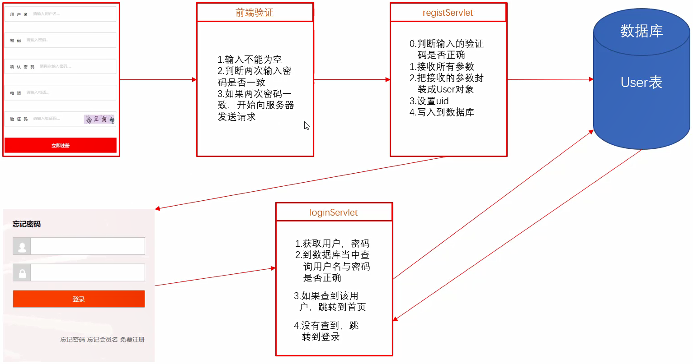
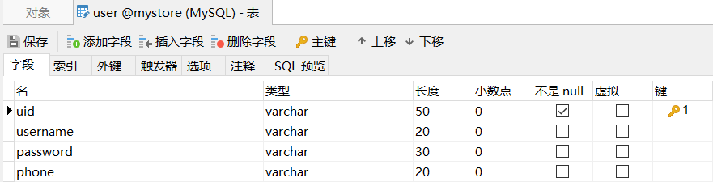

## lombok
是一款小巧的代码生成工具
自动生成getter与setter方法
提高开发效率，代码简洁，直观，减少大量冗余代码，减少后期的维护成本

#### 安装
[lombok下载地址](https://projectlombok.org/download)
1. 让eclipse认识lombok语法
在lombok.jar所在位置，按住Shift右键运行命令行，运行命令：java -jar lombok.jar
在弹出的程序中选择指定的Eclipse(没有自动识别就手动选择Eclipse路径)
选择Install/Update，（Win10可能报错，需要管理员权限，我的解决办法是：右键管理员权限运行Git Bash然后执行命令）
最好重启一下Eclipse

安装jar包原理
把jar拷贝到eclipse当中
在eclipse.ini文件当中做了两行配置

2. lombok导入jar包
快捷键：Ctrl + O 查看该类所有字段和方法

方式1
1.直接把lombok.jar拷贝到工程当中
2.buildPath
弊端：每一个工程都要拷贝这个jar包

方式2
把**经常用**的jar放到某一个地方，每一次要用，直接引用就行
1.右键工程 - Buildd Path - Config Build Path - (如果又Classpath就选这个) - Add Libraries
2.在弹出的对话框当中选择User Library用户自己的库
3.进入到添加界面，点击右侧添加，新建一个仓库，给仓库起一个名称
4.选择刚新建的仓库，点击右侧Add External JARs，找到lombok对应的jar包地址
以后每次使用只需要 添加User Library中定义好的jar包即可

在类上添加注解
常用注解
@Data ：该注解相当于同时加上以下注解@Setter @Getter @ToString @EqualsAndHashCode，作用于类中

@Setter @Getter
作用于属性上,自动生成get,set方法.
也可直接作用于类上，全部属性都添加

@ToString
生成toString方法，默认情况下，会输出类名、所有属性，属性会按照顺序输出，以逗号分割
@EqualsAndHashCode ： 生成equals和hascode方法
@NoArgsConstructor ：无参构造器
@AllArgsConstructor ： 全参构造器


## 登录注册功能
#### 准备

1. 新建Dynamic Web Project：Mystore
2. 建表mystore，字符集：utf8
3. 建表

4. domain
```java
package com.it666.domain;

import lombok.Getter;
import lombok.Setter;

@Setter@Getter
public class User {
	private String uid; 
	private String username;
	private String password;
    private String phone;
    @Override
	public String toString() {
		return "User [uid=" + uid + ", username=" + username + ", password=" + password + ", phone=" + phone + "]";
	}
}

```
5. 把前端代码拿到WebContent里，运行项目测试index打开是否正常
#### 验证码
复制CheckCodeServlet到com.it666.servlet
复制word.txt到WEB-INF
修改regist.html
```html
<div class="check_box">
    <label >验证码</label>
    <input type="text" placeholder="请输入">

    
</div>
```
开发中如果JS不独立，一般把script标签放在最后（还在body内），HTML加载完，再加载JS
添加JS：
```html
<script type="text/javascript">
    function change(obj){
        obj.src="/28-Mystore/CheckCodeServlet?time="+new Date().getTime();
    }
</script>
```

#### 前端验证
修改submit为buttom，css样式也需要修改，增加conclick
```html
<div class="submit_button">
    
    <input type="button" value="立即注册" onclick="checkDate()">
</div>
```

安装Eclipse插件（对网络有要求）：
Help - Eclipse Marketplace... - 搜索
Vue.js(真的好用，但是收费)
选择Angular IDE CI - Install - 选择前三个 - 一路都Confirm - 安装结束（右下角可以看到安装进度）后重启Eclipse
可能安装不了（这个插件仅用与自动补全代码）

写JS验证

```html

<!-- 表单内容 -->
    <form action="/28-Mystore/RegistServlet" id=reg_form method="post">

        <div class="userName">
            <label>用户名</label> <input id="username" type="text" 
                placeholder="请输入" name = "username" >
        </div>
        <div>
            <label>密码</label> <input id="pwd" type="password" placeholder="请输入" name = "password">
        </div>
        <div>
            <label>确认密码</label> <input id="pwd2" type="password"
                placeholder="请输入">
        </div>
        <div>
            <label>电话</label> <input type="text" placeholder="请输入" name = "phone">
        </div>
        <div class="check_box">
            <label>验证码</label> <input type="text" placeholder="请输入" name = "code"> 
        </div>
        <div class="submit_button">

            <input type="button" value="立即注册" onclick="checkDate()">
        </div>
    </form>
</div>

<!--JS部分-->
<script type="text/javascript">
    function change(obj) {
        obj.src = "/28-Mystore/CheckCodeServlet?time="
                + new Date().getTime();
    }

    function checkDate() {
        // 1.获取用户名、密码、确认密码
        var username = document.getElementById("username");
        var pwd = document.getElementById("pwd");
        var pwd2 = document.getElementById("pwd2");
        // 2.判读输入合法性
        if (username.value == "") {
            alert("请输入用户名");
            return;
        }
        if (pwd.value == "") {
            alert("请输入密码");
            return;
        }
        if (pwd.value == "") {
            alert("请输入密码");
            return;
        }
        if (pwd.value == "") {
            alert("请再次输入密码");
            return;
        }
        if (pwd.value == pwd2.value) {
            // 1.获取form表单
            var form = document.getElementById("reg_form");
            form.submit();												
        } else {
            alert("两次输入的密码不一样");
        }
    }
</script>
```

RegistServlet类

```java
package com.it666.servlet;
@WebServlet("/RegistServlet")
public class RegistServlet extends HttpServlet {
	private static final long serialVersionUID = 1L;

	public RegistServlet() {
		super();
	}

	protected void service(HttpServletRequest request, HttpServletResponse response)
			throws ServletException, IOException {
		System.out.println("RegistServlet");

		// 设置请求编码和响应编码
		request.setCharacterEncoding("utf-8");
		response.setContentType("text/html;charset=utf-8");
		// 1.判断输入的验证码是否正确
		String code = request.getParameter("code");
		System.out.println(code);

		// 2.接收所有参数
		Object word = (String) this.getServletContext().getAttribute("checkCode");
		if (code.equals(word)) {
			response.getWriter().write("验证码正确");
			
			// 2.把接收的参数封 装成User对象(导入jar包到lib)
			User u = new User();
			Map<String, String[]> parameterMap = request.getParameterMap();
			try {
				BeanUtils.populate(u, parameterMap);
			} catch (IllegalAccessException e) {
				// TODO Auto-generated catch block
				e.printStackTrace();
			} catch (InvocationTargetException e) {
				// TODO Auto-generated catch block
				e.printStackTrace();
			}
			System.out.println(u);
			// 3.设置uid 
			u.setUid(UUID.randomUUID().toString());
			// 4.写入到数据库 导入相关Jar包
			// db.properties 修改数据库 放src里， 写JdbcUtil，修改path
			// String path = JDBCUtil.class.getClassLoader().getResource("db.properties").getPath();
			// FileInputStream in = new FileInputStream(path);
			// p.load(in);
			QueryRunner qr = new QueryRunner(JDBCUtil.getDataSource());
			String sql = "insert into user value(?,?,?,?)";
			try {
				qr.update(sql,u.getUid(),u.getUsername(),u.getPassword(),u.getPhone());
			} catch (SQLException e) {
				e.printStackTrace();
			}
			
			response.setHeader("refresh", "3;url=/28-Mystore/login.html");
		} else {
			response.getWriter().write("验证码错误");
			response.setHeader("refresh", "3;url=/28-Mystore/regist.html");
		}
	}
}
```
## 
```html
<!-- 可以补充前端验证 -->
<form action="/28-Mystore/LoginServlet" id="login" method="post">
    <!-- 用户名 -->
    <div class="userName" > 
        <span></span>
        <input type="text" name="username">
    </div>
    <!-- 密码 -->
    <div class="password" >
        <span></span>
        <input type="password" name="password">
    </div>
    <!-- 登录 -->
    <div class="login_btn">
        <input type="submit">
    </div>
    <div class="forgot_pwd">
        <a href="#">忘记密码</a>
        <a href="#">忘记会员名</a>
        <a href="#">免费注册</a>
    </div>
</form>
```

LoginServlet 类
```java
package com.it666.servlet;

@WebServlet("/LoginServlet")
public class LoginServlet extends HttpServlet {
	private static final long serialVersionUID = 1L;

	protected void service(HttpServletRequest request, HttpServletResponse response)
			throws ServletException, IOException {
		// 获取用户名和密码
		String name = request.getParameter("username");
		String pwd = request.getParameter("password");
		System.out.println(name + " " + pwd);
		// 查询数据库
		QueryRunner qr = new QueryRunner(JDBCUtil.getDataSource());
		String sql = "select * from user where username = ? and password = ?";
		User u = null;
		try {
			u = qr.query(sql, new BeanHandler<User>(User.class), name, pwd);
		} catch (SQLException e) {
			e.printStackTrace();
		}
		
		response.setContentType("text/html;charset=utf-8");
		
		System.out.println(u);
		if (u != null) {
			response.getWriter().write("登录成功");
			response.setHeader("refresh", "2;url=/28-Mystore/index.html");
		} else {
			response.getWriter().write("登录失败");
			response.setHeader("refresh", "2;url=/28-Mystore/login.html");
		}
	}
}
```

## 参考资料

[Java零基础到高级JavaWeb与项目](https://study.163.com/course/introduction/1005981003.htm)
[小白求教：java中modulepath与classpath区别是什么？](https://bbs.csdn.net/topics/392628907)