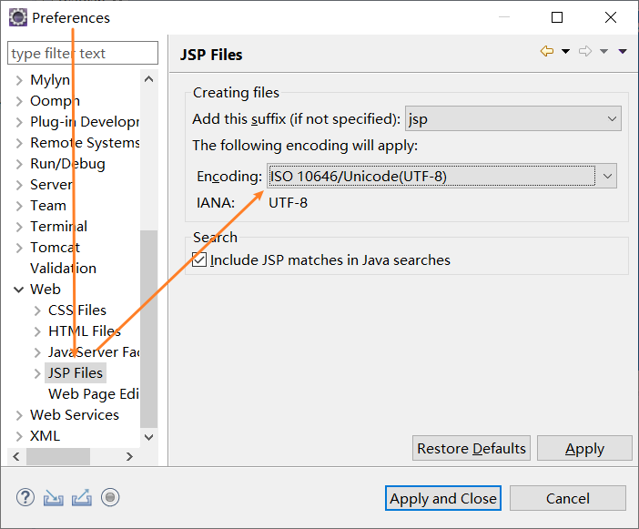
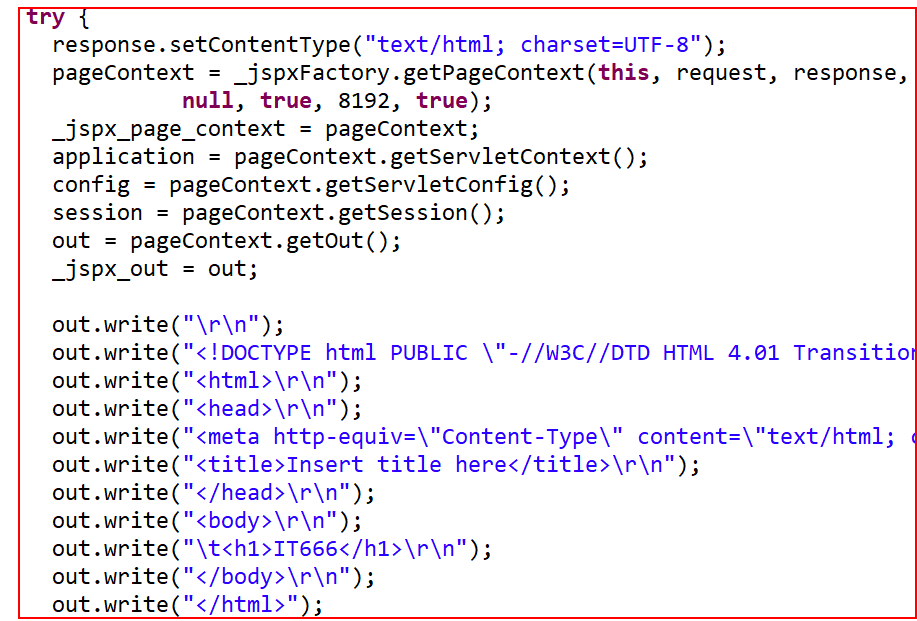
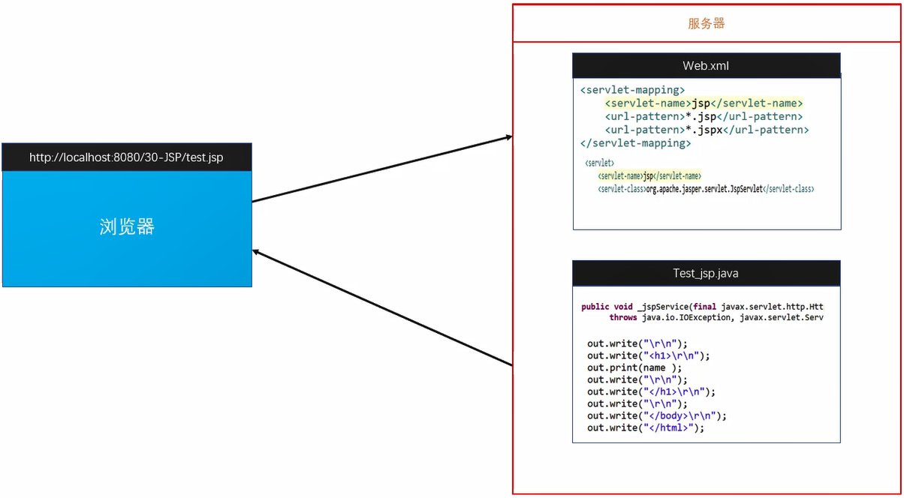
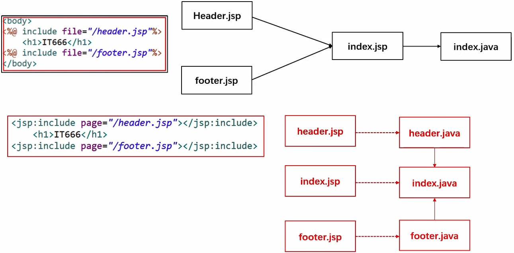
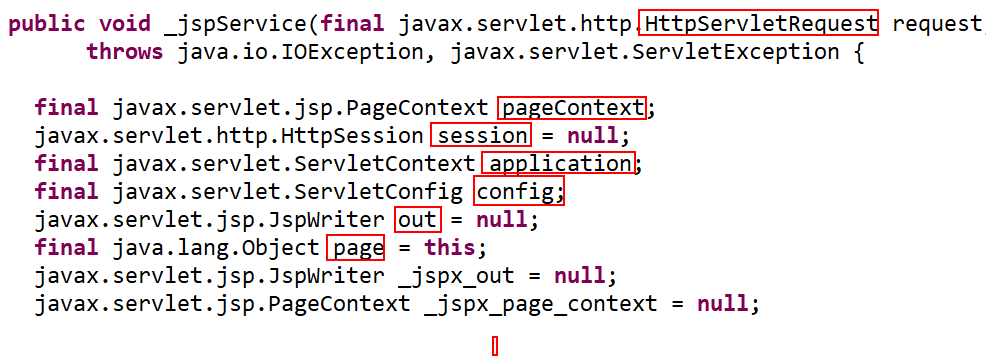
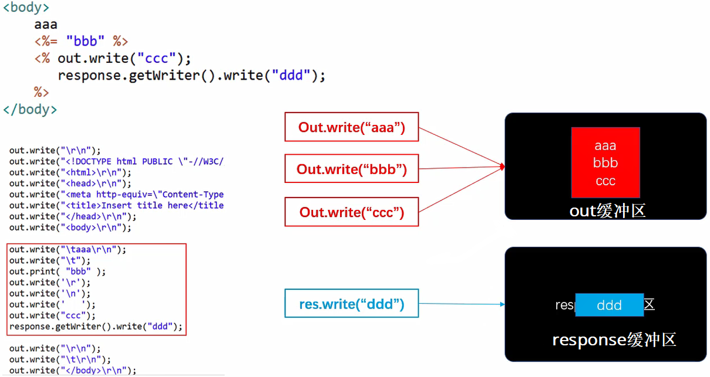

#### Java Server Pages  (Java服务器页面)
在传统的网页HTML文件(*.htm,*.html)中插入Java程序段和JSP标记，后缀名为(*.jsp)
其根本是一个简化的Servlet设计

为什么要有JSP
直接使用html文件是没有办法输出Java当中的信息
使用Servlet来去输出一个网页非常的麻烦
于是就出现了JSP，又能写html，又能写Java代码

修改JSP编码


```jsp
<%@ page language="java" contentType="text/html; charset=UTF-8"
    pageEncoding="UTF-8"%>
<!DOCTYPE html>
<html>
<head>
<meta charset="ISO-8859-1">
<title>Insert title here</title>
</head>
<body>
<%
	String name = "蚂蚁小强";
%>
<h1>
<%=name %>
</h1>

</body>
</html>
```


#### JSP的工作原理
本质就是一个servlet

JSP在第一次被访问时会被Web容器翻译成Servlet
- 第一次访问index.jsp，自动翻译成index_jsp.java（本质就是把标签一行一行write出来）



- 编译成index_jsp.class运行
- 可以在Tomcat的work目录中可以找到(test_jsp.class和test_jsp.java)
- 下次一次访问时， 会看一下里面的内容有没有发生变化，如果变化了， 重新翻译加载



全局web.xml中有一个配置，所有JSP的翻译由JspServlet来做

## JSP的组成部分
- 静态数据，如HTML
- JSP脚本元素和变量
- JSP指令，如include指令
- JSP标签动作
- 用户自定义标签

## JSP脚本元素和变量
<%java代码%>
内部的java代码翻译到Service方法的内部

<%=java变量或表达式>
会被翻译成Service方法内部out.print()

<%!java代码%>
会被翻译成Servlet的**成员**

JSP注释
HTML注释：
```html
<!--注释内容-->
```
可见范围JSP源码、翻译后的Servlet、页面

Java注释
//单行注释  /*多行注释*/
可见范围JSP源码、翻译后的Servlet，页面中看不到

JSP注释
<%--注释内容--%>
仅JSP源码可见

## JSP指令
用于设置整个JSP页面的相关信息
以及用于JSP页面与其它容器之间的通信

#### include指令
表示在JSP编译时插入一个包含文件或者代码的文件
include指令所包含的文件名不能是一个变量url，只能是静态的文件名
静态包含：将两个JSP页面接着到一起，然后再翻译成Servlet

```jsp
<%@ page language="java" contentType="text/html; charset=UTF-8"
    pageEncoding="UTF-8"%>
<!DOCTYPE html>
<html>
<head>
<meta charset="UTF-8">
<title>Insert title here</title>
</head>
<body>

	<%@ include file="/header.jsp" %>
	<h1>主体</h1>
	<%@ include file="/footer.jsp" %>
	
</body>
</html>
```

#### page指令
用于设定整个JSP页面的属性和相关功能，多个属性之间使用空格隔开
page指令共有11个属性

- contentType
指定JSP页面的MIME和编码格式
- pageEncoding
指定JSP文件的编码格式
- import
在JSP中引入Java的包和类，多个包之间以逗号隔开
（Ctrl+Shift+O 导包无效，写java.util. 再Alt+/导包）
- session
指定当前页面是否能获得当前用户的session对象，缺省是true
如果指定为false，那么在该页面中无法使用session，使用的话会提示500错误
- errorPage
如果当前页面发生异常
网页会重定向到errorPage所指定的页面进行处理
- isErrorPage
允许指定的JSP页面为错误处理页面
- language属性
指定页面中使用的脚本语言种类
目前只支持Java
- extends
用于指定该JSP生成的Servlet继承自哪个父类
必须指定包名加类名
- buffer
用来设置输出流缓冲区
缓冲区的作用就是为了提高IO性能
也就是说减少write的次数
- autoFlush
用来指定当输出流缓冲区满了的时候，是否自动刷新缓冲区
- isThreadSafe
缺省值为true
指定该JSP文件是否支持多线程访问
- info
用来设置该JSP文件的介绍信息
- isELIgnored
用来标示是否支持EL表达式

#### taglib指令
声明JSP文件使用哪些标签库

有哪些标签库
- JSP标准标签库
- 第三方标签库
- 自定义标签库

## 标签动作

页面包含
```jsp
<jsp:include page="被包含的页面"></jsp:include>
<jsp:include page="/header.jsp"></jsp:include>
```
动态包含：各自翻译自己的页面，然后再引入
与include对比


请求转发（地址栏不会发生变化）
<jsp:forward page="要转发的资源"></jsp:forward>
<jsp:forward page="/test.jsp"></jsp:forward>


## 隐式对象
JSP被翻译成servlet之后，service方法中有9个对象定义并初始化完毕

还有一个是异常的对象

#### 可以直接使用这9个对象

- request
得到用户请求信息对象
- response
服务器向客户端的响应对象
- config
服务器配置，可以取得初始化参数
- session
用来保存用户会话的信息
- application
所有用户的共享信息，就是servletContext
- page
指当前页面转换后的Servlet类的实例
- out
```jsp
aaa
<%="bbb" %>
<%
	out.write("ccc");
	response.getWriter().write("ddd");
	
%>
打印顺序：ddd aaa bbb ccc 
```
out的类型：JspWriter
out作用就是向客户端输出内容 out.write()
out缓冲区默认8kb
可以设置成0 代表关闭out缓冲区内容直接写到respons缓冲区
out写的内容写到out缓冲区当中
最后再把out缓冲区当中的内容合并到response缓冲区中（拼接到后面）

- pageContext
JSP页面的上下文对象
是一个域对象
```java
setAttribute(String name,Object obj)
getAttribute(String name)
removeAttrbute(String name)
```
可以向指定的其他域中存取数据
自动到所有的域当中找数据
从小到大的范围搜索数据
依次从pageContext域，request域，session域，application域中获取属性
在某个域中获取后将不在向后寻找
```java
setAttribute(String name,Object obj,int scope)
setAttribute(“name”,"lk",PageContext.REQUEST_SCOPE);
getAttribute(String name,int scope)
getAttribute("lk",PageContext.REQUEST_SCOPE)
removeAttrbute(String name,int scope)
findAttribute(String name)
```

可以获得其他8大隐式对象
```java
pageContext.getRequest()
pageContext.getSession()
```
- exception
表示JSP页面所发生的异常，在错误页中才起作用
只有是错误页面的时候，才会有该对象

## 参考资料

[Java零基础到高级JavaWeb与项目](https://study.163.com/course/introduction/1005981003.htm)